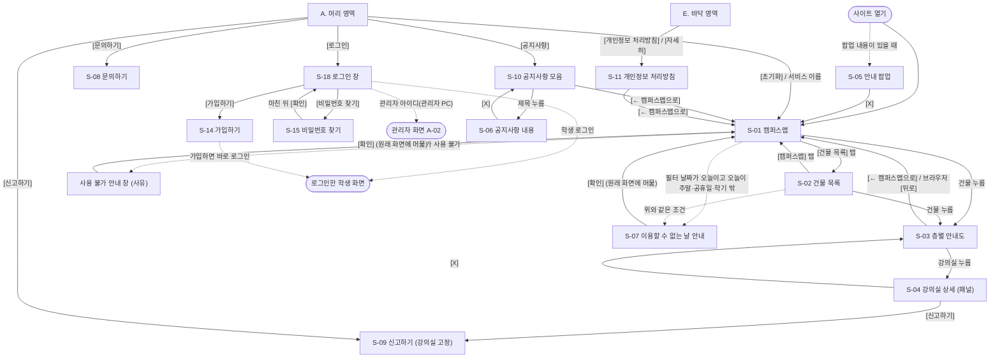
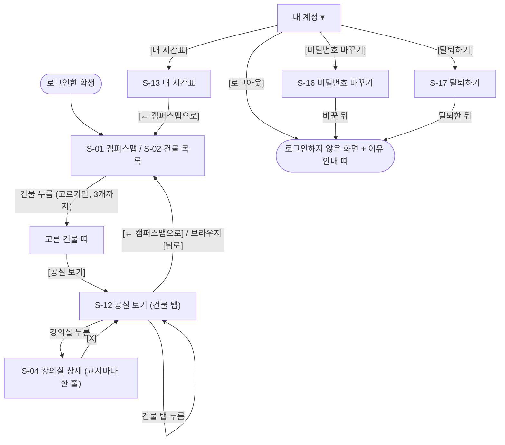
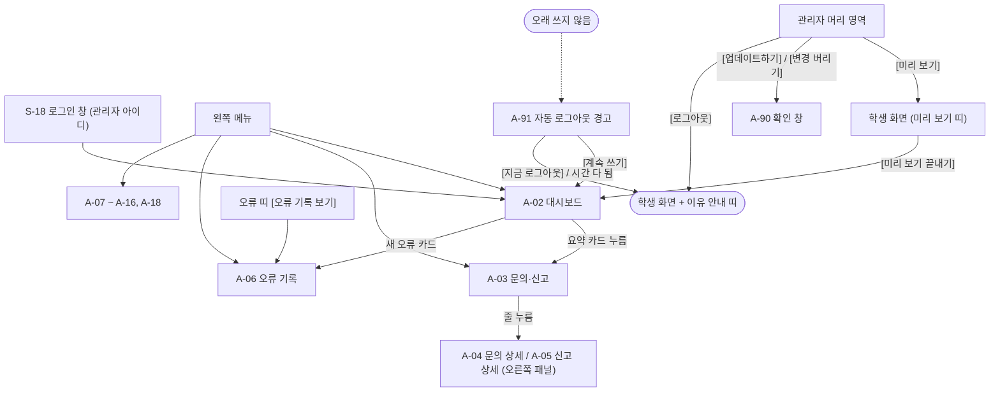

# 05 UI 디자인시스템 / IA

| 항목 | 내용 |
|---|---|
| 문서 유형 | UI 디자인시스템 / IA |
| 버전 | v0.3 |
| 작성일 | 2026-09-30 |
| 작성방식 | 신규 |
| 근거 문서 | `mockup/index.html`(2026-10-05 확정본, 결정 기록 G-51~G-171), `02_기획서.md` v0.17, `04_화면설계서.md` v0.4, `03_기능명세서.md` v0.9 + 고치는 중인 03 v0.10의 FR 대응표(FR-031~FR-056) |

> 이 문서는 사이트의 **모양 규칙**과 **정보 구조**를 적습니다.
> - 모양 규칙: 색·글꼴·간격 같은 기본값과, 단추·달력 같은 공통 부품의 모양입니다.
> - 정보 구조(IA, Information Architecture): 메뉴와 화면을 어떻게 나누고 잇는지입니다.
> - 화면에 무엇이 있고 누르면 어떻게 되는지는 `04_화면설계서.md`가 정합니다. 이 문서는 그 화면이 **어떤 모양으로** 보이는지를 정합니다.
> - v0.3은 **사용자가 확정한 목업**(`mockup/index.html`, 2026-10-05)에 맞춰 다시 썼습니다. 목업에서 바뀐 것을 문서에 거꾸로 넣는 일(역정합)입니다. 목업과 이 문서가 어긋나면 목업이 맞습니다.
> - 서비스는 학생 화면·관리자 화면·서버·데이터베이스로 이루어집니다(02 v0.17). 이 문서는 학생 화면과 관리자 화면의 모양을 함께 다룹니다.
> - 화면은 화면 번호로 가리킵니다. 학생 화면은 S-01~S-18, 관리자 화면은 A-02~A-18과 A-90~A-92입니다(목업 맨 위 화면 목록). A-01(관리자 로그인 화면)은 없습니다. 학생 화면의 로그인 창(S-18)으로 합쳤습니다.
> - 04의 절은 2.0~2.10(S-01~S-10)만 가리킵니다. 그 밖의 화면은 화면 번호로만 가리킵니다. 04 v0.5(2026-10-05)와 교차 검토로 대조했습니다.
> - 기능은 03의 FR(기능 요구사항) 번호로 가리킵니다. FR-001~FR-030은 번호 그대로입니다. 새 기능은 03 v0.10이 새로 붙인 FR-031~FR-056을 씁니다. 03 v0.10 본문과 번호·이름이 같은지 대조했습니다(6.2).
> - 근거로 목업 맨 위 결정 기록의 번호를 적습니다. 예: "(G-167)". 번호가 없는 목업 규칙은 "(목업)"으로 적습니다.
> - "목업 전용" 표시가 붙은 것은 사이트 부품이 아니어서 넣지 않았습니다. 목업 조정판, 목업 계정, 점선 "목업 전용" 표시, 예시 데이터가 그렇습니다.
> - 04와 맞춰야 할 곳은 6.3에 모았습니다. 이 문서에서 04는 고치지 않습니다.
> - 이 문서에 쓰는 표시의 뜻은 아래와 같습니다. 한 항목에는 표시를 하나만 씁니다.
>   - **확정**: 사용자가 정한 것입니다. 02·03·04에서 정했거나, 사용자가 목업을 보고 정했습니다. 목업에서 정한 것은 G 번호를 함께 적습니다. 예: "확정(G-167)".
>   - **(확인 필요)**: 아직 정하지 않았거나 사실 확인이 안 된 것입니다.
>   - **보류(03 NFR-013)**: 03 NFR-013(NFR: 비기능 요구)에서 이번 범위 밖으로 둔 접근성 항목입니다(02 3.2). 이 문서에서는 "보류"로 적습니다.
>   - **"○○에서 정함"**: 뒤 문서(06·08·09·10 등)에서 정하기로 넘긴 것입니다.
> - v0.2까지 쓰던 "제안값 — 사용자 확인 필요"·"제안 — 목업에서 확인"·"보류 — 목업에서 결정"은 v0.3에서 모두 목업으로 정했습니다. 그래서 더 쓰지 않습니다.
> - **표시가 따로 없는 값과 규칙은 확정 목업과 같은 것**입니다. 사용자가 목업을 확정했으므로 확정입니다.

> **사용자가 정한 것 (확정)**
> 1. 대표색은 **차분한 파랑 A `#2B5C8A`**입니다(G-167). 공실·수업중 같은 상태 색은 대표색과 헷갈리지 않게 따로 둡니다.
> 2. 공실 / 수업중은 **초록 / 주황빛 갈색**이고, **색 칸 + 글자** 모양으로 보입니다(G-167).
> 3. 테마는 **밝은 화면(라이트)만** 씁니다. 다크 모드는 범위 밖입니다. 관리자 화면도 늘 라이트입니다.
> 4. 글꼴은 **Pretendard**(무료 한글 웹 글꼴)입니다.
> 5. 접근성은 **눈으로 보는 기본 기준**을 넣습니다. 키보드 전체 조작·화면 읽기 프로그램 대응은 보류입니다(03 NFR-013). 목업에서 정한 키보드 규칙 몇 가지는 5.7에 적었습니다.
> 6. 학생 화면 머리 영역에 [로그인]과 [신고하기]가 있습니다(G-51). 로그인·가입·문의·신고는 모두 사이트 안 팝업입니다.
> 7. 관리자 화면은 **PC만** 지원합니다(02 v0.17).
> 8. 캠퍼스맵은 **오픈스트리트맵(OSM) 자료로 그린 지도**입니다(G-169).

> **이 문서에 나오는 말**
> - **디자인 토큰**: 색·글자 크기·간격 같은 기본값에 붙인 이름입니다. 예: `color-primary` = 대표색 `#2B5C8A`. 화면을 만들 때 값 대신 이름을 쓰면, 값을 한 곳에서만 바꿔도 사이트 전체가 함께 바뀝니다.
> - **CSS 변수**(CSS 사용자 정의 속성): 웹 화면의 모양을 적는 언어(CSS)에서 값에 이름을 붙여 여러 곳에 쓰는 기능입니다. 목업은 토큰 이름 앞에 `--`를 붙여 씁니다. 예: `--color-primary`.
> - **색 값(#2B5C8A 등)**: 색을 빨강·초록·파랑의 양으로 적은 번호입니다. 웹에서 색을 적는 기본 방법입니다.
> - **px(픽셀)**: 화면을 이루는 가장 작은 점 하나입니다. 크기를 잴 때 씁니다.
> - **rem**: 브라우저 기본 글자 크기(보통 16px)의 몇 배인지로 적는 크기 단위입니다. 1rem = 16px입니다. 학생이 브라우저 글자 크기를 키우면 rem으로 적은 글자도 함께 커집니다.
> - **반응형**: 화면 너비(PC·휴대폰)에 맞춰 배치가 알아서 바뀌는 것입니다.
> - **브레이크포인트**: 화면 너비가 이 값을 넘거나 밑돌 때 배치가 바뀌는 기준점입니다.
> - **WCAG**(Web Content Accessibility Guidelines, 웹 콘텐츠 접근성 지침): 장애가 있는 사람도 웹을 쓸 수 있게 국제 웹 표준 단체(W3C)가 만든 기준입니다. 이 문서는 2.2판의 **AA 등급**(여러 나라와 기관이 보통 목표로 삼는 중간 단계)을 목표로 합니다.
> - **대비율**: 글자 색과 바탕 색의 밝기 차이를 숫자로 나타낸 것입니다. 1:1(차이 없음)부터 21:1(검정 글자와 흰 바탕)까지입니다. 클수록 잘 읽힙니다.
> - **부품**: 여러 화면에서 되풀이해 쓰는 조각입니다. 예: 단추, 달력, 팝업.
> - **상태**: 같은 부품이 때에 따라 달라 보이는 모양입니다. 이 문서는 다섯 가지 이름을 씁니다.
>   - **평소**: 아무 일도 없을 때의 모양입니다.
>   - **마우스 올림**: 마우스 화살표를 부품 위에 올렸을 때입니다(PC만).
>   - **누름**: 마우스 단추나 손가락으로 누르고 있는 순간입니다.
>   - **고름**: 골라져 있는 상태입니다(예: 고른 날짜, 고른 탭).
>   - **못 누름**: 눌러도 반응하지 않는 상태입니다(예: 흐린 날짜).
> - **가림막**: 팝업 뒤 화면을 반쯤 어둡게 덮는 막입니다. 뒤 화면을 누를 수 없음을 알려 줍니다.
> - **배지**: 짧은 글자를 둥근 칸에 넣어 상태를 알리는 작은 표시입니다. 예: "사용 불가", "추가 예정".
> - **칩**: 고른 것을 둥근 칸으로 보이고, 칸 안의 [X]로 뺄 수 있는 부품입니다. 예: 고른 건물.
> - **스위치**: 누를 때마다 켜짐·꺼짐이 바뀌는 단추입니다. 전등 스위치와 같습니다.
> - **범례**: 그림이나 색이 무슨 뜻인지 알려 주는 짧은 설명 줄입니다.
> - **빗금**: 비스듬한 줄무늬입니다. 이 문서에서는 "사용 불가"를 뜻합니다.
> - **초점(포커스)**: 키보드로 지금 고른 곳입니다. Tab 키로 옮기고, Enter·Space 키로 누릅니다.
> - **읽어 주는 이름**: 화면 읽기 프로그램(화면 글자를 소리로 읽어 주는 프로그램)이 부품을 읽을 때 쓰는 이름입니다. 화면에는 보이지 않을 수 있습니다.
> - **오픈스트리트맵(OSM, OpenStreetMap)**: 누구나 함께 만들고 무료로 쓰는 지도 자료입니다. 쓸 때 출처("© OpenStreetMap 기여자")를 밝혀야 합니다.
> - **[업데이트하기]**: 관리자가 저장한 변경을 학생 화면에 내보내는 단추입니다(A-17). 02 v0.17의 [공개하기]와 같은 일입니다. 목업의 이름을 따릅니다.
> - 화면·패널·팝업·모달·안내 창·탭의 뜻은 04 머리말과 같습니다.

## 1. 디자인 토큰

### 1.0 토큰 이름 규칙

- 토큰 이름은 영문 소문자와 `-`로 씁니다. 맨 앞 낱말이 종류입니다.
- 목업 CSS 변수 이름은 토큰 이름 앞에 `--`만 붙인 것입니다. 예: `--color-primary`.

| 앞머리 | 종류 | 예 |
|---|---|---|
| `color-` | 색 | `color-primary` |
| `font-` | 글꼴(글꼴 이름·크기·굵기·줄 간격) | `font-size-md` |
| `space-` | 간격(부품 안팎의 빈 공간) | `space-4` |
| `size-` | 부품 크기(높이·너비·누르는 영역) | `size-target-touch` |
| `radius-` | 모서리 둥글기 | `radius-md` |
| `shadow-` | 그림자 | `shadow-2` |
| `z-` | 층(화면 위에 겹치는 순서) | `z-modal` |
| `motion-` | 움직임 시간 | `motion-normal` |
| `bp-` | 브레이크포인트 | `bp-desktop` |

- 이 장의 **값**은 모두 확정 목업 CSS의 `:root`(문서 전체에 쓰는 기본값 자리) 값과 같습니다. 대조한 결과는 6.4에 적었습니다.
- "(새로)"를 붙인 토큰은 v0.3에서 목업을 따라 새로 넣은 것입니다.
- v0.3에서 두 토큰의 이름을 목업 CSS에 맞춰 둘로 나눴습니다.
  - `size-room-cell` → `size-room-cell-w`(너비) · `size-room-cell-h`(높이)
  - `size-period-button` → `size-period-button-pc` · `size-period-button-mobile`
- 목업에는 다크 색 묶음도 있습니다. 비교용 임시 색이어서 이 문서에는 넣지 않습니다(4.5).
- 값을 바꾸면 5.3 대비율 계산을 다시 합니다.

### 1.1 색

#### 1.1.1 대표색

- 대표색은 **A `#2B5C8A`**로 확정했습니다(G-167). 채도가 낮은 차분한 파랑입니다. 흰 글자와 7.00:1이라 작은 글자 기준(4.5:1)을 넉넉히 넘습니다(5.3 C-08).
- 후보 B(`#1F4E79`)와 C(`#3A6EA5`)는 고르지 않았습니다(G-167).

| 토큰 | 쉬운 설명 | 값 | 쓰는 곳 |
|---|---|---|---|
| `color-primary` | 대표색 | `#2B5C8A` | 고른 날짜·고른 교시·고른 보기 단추 채움, 주 단추, 고른 탭 글자·밑줄, 오늘 테두리, 글자형 단추 글자, 입력칸 초점 테두리, 켜진 스위치, 관리자 메뉴의 고른 줄, 내 시간표의 수업 칸 |
| `color-primary-hover` | 대표색(마우스 올림) | `#234D74` | 주 단추·대시보드 막대에 마우스를 올렸을 때 |
| `color-primary-pressed` | 대표색(누름) | `#1B3D5D` | 주 단추를 누르는 순간, 헤드 배너 글자 |
| `color-primary-soft` | 옅은 대표색 | `#E7EEF6` | 달력 칸·교시 단추의 마우스 올림 바탕, 헤드 배너 바탕, 고른 건물 띠 바탕, 고른 목록 줄 바탕, 관리자 메뉴·표의 고른 줄 바탕, A-11 도구 띠 바탕 |
| `color-text-on-primary` | 대표색 위 글자 | `#FFFFFF` | 고른 날짜·고른 교시·주 단추·고른 보기 단추의 글자 |

#### 1.1.2 바탕·글자·선

| 토큰 | 쉬운 설명 | 값 | 쓰는 곳 |
|---|---|---|---|
| `color-bg` | 기본 바탕 | `#FFFFFF` | 가운데 구역, 팝업, 패널, 목록 줄, 입력칸, 관리자 메뉴·카드·표·오른쪽 패널 |
| `color-bg-subtle` | 옅은 회색 바탕 | `#F4F6F9` | C. 필터 영역, E. 바닥 영역, 층별 안내도 복도, 비밀번호 규칙 상자, 못 쓰는 입력칸, 관리자 화면 바탕·표 머리 줄, 내 시간표 머리 칸 |
| `color-text` | 기본 글자 | `#1F2933` | 본문, 건물 이름, 날짜 숫자, 호실 번호, 입력칸 글자, 결과 알림(A-92) 바탕 |
| `color-text-secondary` | 보조 글자 | `#52606D` | 교시 시작 시각, 요일 줄, 기준 표시, 바닥 영역, 목록 줄의 `>` 기호, 도움말·글자 수·"선택" 표시, 표 머리 글자, 관리자 메뉴 묶음 제목, 범례, 문 자리 점 |
| `color-text-disabled` | 흐린 글자 | `#A3ACB6` | 흐린 날짜(주말·공휴일·학기 밖), 못 누르는 [+] [-], 못 쓰는 입력칸 글자 |
| `color-border` | 옅은 선 | `#D5DBE2` | 목록 줄 구분선, 교시 단추 테두리, 구역 사이 선, 팝업 바닥 선, 관리자 카드·표 테두리 |
| `color-border-strong` | 진한 선 | `#7B8794` | 보조 단추·체크 칸·입력칸 테두리, 보기 고르기 단추 묶음 테두리, 꺼진 스위치 바탕, 층별 안내도 건물 외곽선(벽), 사용 불가 강의실 점선 테두리 |
| `color-hover-bg` | 마우스 올림 바탕 | `#EEF2F6` | 목록 줄·보조 단추·글자형 단추·아이콘 단추·관리자 메뉴·누를 수 있는 표 줄에 마우스를 올렸을 때 |
| `color-pressed-bg` | 누름 바탕 | `#DCE4EE` | 위 부품과 달력 칸·교시 단추를 누르는 순간 |
| `color-scrim` | 가림막 | 검은 남색 `#0F172A`를 50% 투명하게 | 학생 화면의 팝업·안내 창 뒤, 관리자 확인 창(A-90)·자동 로그아웃 경고(A-91) 뒤 |

#### 1.1.3 상태 색

- **상태 색은 대표색(파랑)과 다른 색 계열을 씁니다**(확정). 파랑은 "고름"에 쓰기 때문입니다.
- 공실 / 수업중은 **① 초록 / 주황빛 갈색**으로 확정했습니다(G-167). 모양은 **① 색 칸 + 글자**입니다(2.10).
- ①을 고른 까닭: 초록은 "써도 됨", 주황은 "사용 중"으로 읽힙니다. 대표색(파랑)·오류(빨강)와 겹치지 않습니다.
- 초록과 빨강을 잘 구별하지 못하는 사람(적록 색각 이상)에게는 두 색이 비슷해 보일 수 있습니다. 그래서 글자를 늘 함께 씁니다(5.4).
- 후보 ②(초록 / 회색)와 ③(초록 / 빨강)은 고르지 않았습니다(G-167).

| 토큰 | 쉬운 설명 | 값 | 쓰는 곳 |
|---|---|---|---|
| `color-free-text` | 공실 글자 | `#1B6B3A` (초록) | "공실" 글자, 교시 작은 칸의 ○, "저장했습니다", 맞은 비밀번호 규칙, 추가 예정 배지 바탕 |
| `color-free-bg` | 공실 칸 바탕 | `#E5F4EA` (옅은 초록) | 공실 강의실 칸 바탕, 확인 번호를 보냈다는 안내 상자, 추가 예정 줄 바탕 |
| `color-free-border` | 공실 칸 테두리 | `#3D9A62` | 공실 강의실 칸 테두리, 추가 예정 줄 왼쪽 띠 |
| `color-busy-text` | 수업중 글자 | `#8A4510` (주황빛 갈색) | "수업중" 글자, 교시 작은 칸의 ● |
| `color-busy-bg` | 수업중 칸 바탕 | `#FCEEDF` (옅은 살구색) | 수업중 강의실 칸 바탕 |
| `color-busy-border` | 수업중 칸 테두리 | `#C97A36` | 수업중 강의실 칸 테두리 |
| (흐린 날짜) | 주말·공휴일·학기 밖 날짜 | `color-text-disabled` 글자, 바탕 없음 | 달력(2.3) |
| (고른 날짜) | 고른 날짜 | `color-primary` 채움 + `color-text-on-primary` 글자 | 달력(2.3) |
| (오늘) | 오늘 날짜 | `color-primary` 2px 테두리 | 달력(2.3) |
| `color-danger-text` | 오류 글자 | `#B42318` (빨강) | 오류 글자, 입력칸 오류 문구, "필수" 표시, 빨강 단추 바탕, 빨강 글자 단추, 삭제 예정 배지 바탕·줄 왼쪽 띠 |
| `color-danger-bg` | 오류 칸 바탕 | `#FDECEA` | E-02 문구 칸, 실패 상자, 관리자 오류 띠, 삭제 예정 줄 바탕 |
| `color-danger-hover` | 빨강 단추(마우스 올림) (새로) | `#912018` | 빨강 단추에 마우스를 올렸을 때 |
| `color-notice-text` | 안내 글자 | `#243B53` (진한 회청색) | 필터 안내 문구, S-03·S-04·S-12 안내 칸, 이유 안내 띠(G-55), 잠깐 안내 띠, 신고 도움 안내 |
| `color-notice-bg` | 안내 칸 바탕 | `#EEF2F7` | 위와 같음 |
| `color-notice-border` | 안내 칸 왼쪽 띠 | `#6B869F` | 위와 같음 |
| `color-warn-text` | 경고 글자 (새로) | `#7A4E00` (진한 황갈색) | 관리자 경고 상자, 문의 개인정보 경고, Caps Lock 안내, 정지 안내(G-54), "0:42 뒤에 다시 보낼 수 있습니다", "업데이트 전" 배지, 수정 예정 배지 바탕 |
| `color-warn-bg` | 경고 칸 바탕 (새로) | `#FFF4D6` (옅은 노랑) | 위 경고 칸, 수정 예정 줄 바탕(G-148), 오류 기록에서 찾아간 줄(G-79) |
| `color-warn-border` | 경고 칸 테두리 (새로) | `#D9A400` | 경고 칸 왼쪽 띠·테두리, 수정 예정 줄 왼쪽 띠 |
| `color-na-text` | 사용 불가 글자 (새로) | `#4B5563` (진한 회색) | "사용 불가" 글자·배지, 층 사용 불가 사유 줄(G-59) |
| `color-na-bg` | 사용 불가 바탕 (새로) | `#EEF0F3` (옅은 회색) | 사용 불가 빗금의 바탕 줄, 사용 불가 배지·사유 줄 바탕 |
| `color-na-line` | 사용 불가 빗금 (새로) | `#B8BFC8` | 지도 빗금 줄, 사용 불가 배지 테두리, 사유 줄 왼쪽 띠 |
| `color-banner-text` | 헤드 배너 글자 | `#1B3D5D` (`color-primary-pressed`와 같은 값) | B. 헤드 배너 |
| `color-banner-bg` | 헤드 배너 바탕 | `#E7EEF6` (`color-primary-soft`와 같은 값) | B. 헤드 배너 |

#### 1.1.4 캠퍼스맵·층별 안내도 색

- 캠퍼스맵은 **오픈스트리트맵(OSM) 자료로 그린 지도**로 확정했습니다(G-169). 그래서 v0.2에서 "직접 만든 지도일 때만" 쓰던 땅·건물·길 색을 모두 씁니다.
- 지도 방향과 건물 번호·이름은 학교 캠퍼스맵을 참고합니다. 정문이 아래쪽입니다(목업).

| 토큰 | 쉬운 설명 | 값 | 쓰는 곳 |
|---|---|---|---|
| `color-map-label-text` | 건물 이름 글자 | `color-text`와 같음 | 지도 위 "공과대학 1호관(D2)" |
| `color-map-label-halo` | 건물 이름 둘레 흰 테두리 | `#FFFFFF`. 선 두께 6px로 그려 글자 바깥으로 3px가 보임 | 지도 그림 위에서도 글자가 읽히게 합니다. |
| `color-map-highlight` | 건물 강조(마우스 올림) | `color-primary`와 같음. 2px 테두리 + 25% 채움 | 누를 수 있는 건물에 마우스를 올렸을 때(PC) |
| `color-map-ground` | 땅 | `#EEF1EC` | 캠퍼스 땅 |
| `color-map-building-off` | 누를 수 없는 건물 | `#D5DBE2` | 꺼진 건물, 이름 없는 바탕 건물, 시간표 미등록(E-04)일 때 모든 건물 |
| `color-map-building-on` | 누를 수 있는 건물 | `#C9D6E6` | 학생이 누를 수 있게 켜 둔 건물(G-116) |
| `color-map-road` | 길 | `#FFFFFF` | 도로. 보행 광장은 55%, 산책로·운동장 선은 85%로 옅게 |
| `color-map-road-edge` | 도로 테두리 (새로) | `#D3D9E0` | 도로 둘레 선 |
| `color-map-green` | 잔디 (새로) | `#DDE9D7` | 잔디·공원, 운동장 안쪽, 농구장 |
| `color-map-track` | 트랙 (새로) | `#E8DDCF` | 운동장 트랙, 테니스장 |
| `color-map-lot` | 주차장 (새로) | `#E3E7EB` | 주차장 |
| `color-map-edge` | 건물 윤곽선 (새로) | `#AEB8C3` | 건물 둘레 1px 선 |
| `color-map-pick` | 고른 건물 (새로) | `#A9C1DC` | 로그인한 학생이 고른 건물(S-01), 관리자가 고른 건물(A-11). `color-primary` 3px 테두리와 함께 씀 |
| (사용 불가 빗금) | 사용 불가 건물 | `color-na-bg` 바탕에 `color-na-line` 4px 줄을 12px마다 45°로 | 고른 날짜에 건물 전체가 사용 불가일 때(G-59) |
| (문 자리 점) | 정문·남문·북문 | `color-text-secondary` 동그라미 | 문 자리 |
| (불러오는 중 덮개) | 지도 위 덮개 | `color-bg`를 70% 비치게 | 불러오는 중(E-01) |

**층별 안내도 그림 색** (S-03 [건물 모양] 보기, G-136)

| 이름 | 쉬운 설명 | 값 |
|---|---|---|
| 건물 바닥 | 캠퍼스맵의 누를 수 있는 건물 색을 옅게 | `color-map-building-on` 60% + `color-bg` 40% (= `#DFE6F0`) |
| 벽(외곽선) | 건물 둘레 선 | `color-border-strong`, 두께 2px |
| 복도 | 바닥보다 밝은 띠 | `color-bg-subtle` |

- 목업 CSS에서는 이 셋을 그림 안에서만 쓰는 지역 이름(`--fp-bld`·`--fp-wall`·`--fp-corr`)으로 적었습니다.

#### 1.1.5 관리자 화면 색과 표시 조합

| 토큰 | 쉬운 설명 | 값 | 쓰는 곳 |
|---|---|---|---|
| `color-admin-band` | 관리자 띠 (새로) | `#243B53` (진한 남색), 흰 글자 | "관리자 화면" 띠, 학생 화면의 미리 보기 띠(G-69) |
| `color-row-edit-bg` | 고치는 줄 바탕 (새로) | `#FFFCF0` | 관리자 표의 줄 안에서 값을 고치는 중일 때. 목업 CSS에는 이름 없이 값만 적혀 있어 이 문서에서 이름을 붙였습니다. |

**업데이트 전 변경 줄** (G-148~G-152)

- [업데이트하기] 전에 바뀐 줄은 **색과 글자로 함께** 알립니다(G-148).
- 새 토큰을 만들지 않고 상태 색 토큰을 다시 씁니다(G-148).

| 줄 종류 | 줄 바탕 | 줄 왼쪽 띠(4px) | 배지 바탕(흰 글자) | 글자 |
|---|---|---|---|---|
| 추가 예정 | `color-free-bg` | `color-free-border` | `color-free-text` | 평소 그대로 |
| 수정 예정 | `color-warn-bg` | `color-warn-border` | `color-warn-text` | 평소 그대로 |
| 삭제 예정 | `color-danger-bg` | `color-danger-text` | `color-danger-text` | `color-text-secondary` + 가운데 줄 |

- 배지 색 조합 전체는 2.31에 적었습니다.

### 1.2 글꼴

#### 1.2.1 글꼴 이름과 대신 글꼴 순서

| 토큰 | 값 | 표시 |
|---|---|---|
| `font-family-base` | `"Pretendard"` | 확정 |
| (대신 글꼴 순서) | `"Pretendard", -apple-system, BlinkMacSystemFont, "Apple SD Gothic Neo", "Malgun Gothic", "맑은 고딕", "Noto Sans KR", sans-serif` | 확정(목업) |

- 대신 글꼴은 Pretendard를 받지 못했을 때 **앞에서부터 차례로** 찾아 씁니다.
  1. `-apple-system`, `BlinkMacSystemFont`: 아이폰·맥의 기본 글꼴입니다.
  2. `Apple SD Gothic Neo`: 아이폰·맥의 기본 한글 글꼴입니다.
  3. `Malgun Gothic`, `맑은 고딕`: 윈도우의 기본 한글 글꼴입니다. 이름을 영문·한글 두 가지로 적습니다.
  4. `Noto Sans KR`: 기기에 깔려 있으면 씁니다.
  5. `sans-serif`: 위가 모두 없으면 기기의 기본 고딕체를 씁니다(안드로이드 기본 한글 글꼴 포함).
- 글꼴 파일을 받는 동안에는 대신 글꼴로 먼저 보여 줍니다. 다 받으면 Pretendard로 바뀝니다. 글자가 안 보이는 빈 시간을 없애기 위해서입니다.
- Pretendard는 무료로 쓰고 함께 배포할 수 있는 글꼴 사용 허락(SIL 오픈 폰트 라이선스)을 따릅니다.
- 글꼴 파일을 사이트에 함께 넣을지, 외부 무료 배포 서버(CDN: 파일을 대신 전해 주는 서버)에서 받을지는 **08에서 정함**입니다. 목업은 CDN에서 받습니다.

#### 1.2.2 글자 크기 단계

| 토큰 | rem | px | 쓰는 곳 |
|---|---|---|---|
| `font-size-xs` | 0.75rem | 12px | 교시 시작 시각("11:00"), E. 바닥 영역, 휴대폰의 기준 표시, 교시 작은 칸, 배지, "필수"·"선택" 표시, 도움말, 글자 수, Caps Lock 안내, 지도 범례, 운동장·문 이름, 층별 안내도 설명 줄과 "복도" 글자, 관리자 메뉴 묶음 제목 |
| `font-size-sm` | 0.875rem | 14px | 기준 표시(PC), 달력 날짜·요일, 안내 문구, "공실"·"수업중" 글자, 헤드 배너, 이유 안내 띠, 건물 이름 글자(지도 위), 이름·값 표의 이름 칸, 체크 칸 글자, 입력칸 이름, 오류 문구, 작은 단추, 보기 고르기 단추, 관리자 표·결과 알림, 휴대폰 머리 줄 단추(G-95) |
| `font-size-md` | 1rem | 16px | 본문, 단추 글자, 목록 줄, 교시 이름("3교시"), 호실 번호, 팝업 내용, 이름·값 표의 값 칸, 입력칸 글자, 관리자 메뉴, 휴대폰 머리 줄 서비스 이름(G-95) |
| `font-size-lg` | 1.125rem | 18px | 서비스 이름(PC), 달 이름("2026년 10월"), 층 이름("3층"), 완료 문구("문의를 보냈습니다."), 관리자 카드 제목 |
| `font-size-xl` | 1.25rem | 20px | 팝업 제목, S-04 건물 이름, S-10·S-11·S-13 제목, 휴대폰의 S-03·S-12 머리 제목, S-12 건물 이름(건물 1곳일 때), 관리자 화면 제목, 확인 창 제목 |
| `font-size-2xl` | 1.5rem | 24px | S-03 건물 이름·S-12 "공실 보기" 제목(PC) |

- 휴대폰에서도 글자를 PC보다 작게 줄이지 않는 것이 기본입니다. 다만 아래 셋은 줄입니다.
  1. S-03·S-12 머리 제목: 24px → 20px.
  2. 머리 줄 서비스 이름: 18px → 16px(G-95).
  3. 머리 줄 [초기화]·[로그인]·"내 계정 ▾" 글자: 16px → 14px(G-95).
- 2·3은 360px 화면에서 서비스 이름이 잘리지 않게 하려는 것입니다(G-95, 4.3).
- 관리자 화면에만 쓰는 크기가 둘 있습니다. 대시보드 숫자 28px, A-11 지도 위 건물 번호 20(지도 그림 단위)입니다(목업).

#### 1.2.3 굵기·줄 간격·숫자

| 토큰 | 값 | 쓰는 곳 |
|---|---|---|
| `font-weight-regular` | 400 (보통) | 본문, 안내 문구, 목록 줄, "수업중" 글자 |
| `font-weight-semibold` | 600 (조금 굵게) | 단추 글자, 교시 이름, 고른 탭, 오늘 날짜, 건물 이름 글자(지도 위), 입력칸 이름, 배지, 고른 관리자 메뉴 |
| `font-weight-bold` | 700 (굵게) | 제목, 고른 날짜, 호실 번호, 층 이름, "공실" 글자 |
| `font-line-tight` | 1.3 (글자 높이의 1.3배) | 제목, 단추처럼 한 줄인 곳, 입력칸 |
| `font-line-normal` | 1.5 | 본문, 안내 문구, 팝업 내용, 헤드 배너, 여러 줄 입력칸 |
| (숫자 폭 맞춤) | 숫자마다 같은 너비로 그림 | 교시 시각, 날짜, "13:00 시작" 같은 시각, 확인 번호, 남은 시간, 관리자 표의 숫자 |

- 숫자 폭을 맞추면 "11:00"과 "13:50"이 위아래로 가지런히 놓입니다.

### 1.3 간격

- 간격은 **4px 단위**로 씁니다. 같은 단위를 쓰면 화면이 가지런해 보입니다.

| 토큰 | 값 | 쓰는 곳 |
|---|---|---|
| `space-1` | 4px | 글자와 기호 사이, 머리 영역 단추 사이(PC·휴대폰, G-95), 칸 이름과 입력칸 사이 |
| `space-2` | 8px | 교시 단추 사이, 강의실 칸 사이, 체크 칸과 글자 사이, 단추 사이, 휴대폰 머리 줄 단추 안 좌우 여백(G-95) |
| `space-3` | 12px | 안내 문구 칸 안쪽, 목록 줄 위아래 안쪽, 입력칸 좌우 안쪽, 팝업 안 칸 사이 |
| `space-4` | 16px | 부품 사이, 필터 영역 안쪽, 목록 줄 좌우 안쪽, **휴대폰 화면 좌우 여백**(04 2.5·2.7과 같음) |
| `space-5` | 20px | 패널 안쪽, 관리자 카드 좌우 안쪽, 관리자 내용 위쪽 |
| `space-6` | 24px | 구역 사이, 층 묶음 사이, 팝업·안내 창·확인 창 안쪽, PC 머리 영역 좌우 안쪽 |
| `space-8` | 32px | 큰 구역 사이(달력과 교시 단추 묶음 사이 등) |
| `space-10` | 40px | 빈 목록 문구 위 여백, 관리자 내용 아래 여백 |
| `space-12` | 48px | 불러오는 중 표시 위 여백 |

### 1.4 크기

| 토큰 | 값 | 쓰는 곳 |
|---|---|---|
| `size-target-min` | 24px × 24px | 어떤 누르는 것도 이보다 작게 만들지 않습니다(WCAG 2.2 AA 최소 기준, 5.5). |
| `size-target-pc` | 32px × 32px | PC에서 누르는 것의 최소 크기, 작은 단추·글자 연결의 높이 |
| `size-target-touch` | 44px × 44px | 휴대폰에서 누르는 것의 최소 크기 |
| `size-control-pc` | 높이 40px | PC 단추·[X]·[+] [-]·입력칸·관리자 메뉴 줄 |
| `size-header-pc` / `size-header-mobile` | 높이 56px / 48px(첫 줄) | A. 머리 영역, 관리자 머리 영역(56px) |
| `size-filter-width` | 너비 320px | C. 필터 영역(PC) |
| `size-panel-width` | 너비 360px | S-04 패널(PC) |
| `size-sheet-height` | 화면 높이의 50% | S-04 패널(휴대폰) |
| `size-popup-width` | 너비 480px, 높이는 화면 높이의 80%까지 | S-05·S-06(PC) |
| `size-form-width` (새로) | 너비 560px | 입력 팝업 S-08·S-09·S-14~S-17(PC) |
| `size-login-width` (새로) | 너비 400px | 로그인 창 S-18(PC) |
| `size-alert-width` | 너비 320px | S-07 안내 창, 학생 화면 확인 창(PC) |
| `size-list-row-pc` / `size-list-row-mobile` | 높이 최소 48px / 최소 56px | 목록 줄(S-02·S-10) |
| `size-room-cell-w` / `size-room-cell-h` | 너비 최소 88px / 높이 최소 56px | 강의실 칸(S-03·S-12). [건물 모양] 그림에서도 이보다 작아지지 않게 배율을 정함(G-134) |
| `size-calendar-cell` | 40px × 40px(PC) | 달력 날짜 칸. 휴대폰은 화면 너비를 7로 나눈 정사각형(44px 이상, 56px 이하) |
| `size-period-button-pc` / `size-period-button-mobile` | 높이 48px / 52px, 너비는 3등분 | 교시 단추 |
| `size-spinner` | 24px, 선 두께 3px | 불러오는 중 표시. 단추 안에서는 16px, 선 두께 2px |
| `size-adm-nav` (새로) | 너비 220px | 관리자 왼쪽 메뉴 |
| `size-adm-side` (새로) | 너비 420px | 관리자 오른쪽 패널(글쓰기·고치기) |

**관리자 화면에서만 쓰는 크기** (목업 CSS에 이름 없이 적힌 값)

| 무엇 | 값 |
|---|---|
| 관리자 화면 최소 너비 | 1180px. 이보다 좁으면 가로로 밀어 봅니다(G-01) |
| "관리자 화면" 띠 높이 | 28px |
| 확인 창(A-90)·자동 로그아웃 경고(A-91) 너비 | 440px, 높이는 화면 높이의 90%까지 |
| A-11 오른쪽 칸 너비 | 340px |

### 1.5 모서리 둥글기

| 토큰 | 값 | 쓰는 곳 |
|---|---|---|
| `radius-sm` | 4px | 체크 칸, 안내 문구 칸, 층별 안내도 안 강의실 칸, 교시 작은 칸, 내 시간표 칸 |
| `radius-md` | 8px | 단추, 달력 칸, 교시 단추, 강의실 칸, 입력칸, 보기 고르기 단추 묶음, 관리자 메뉴 줄 |
| `radius-lg` | 12px | 팝업, 안내 창, 휴대폰 S-04 패널의 위쪽 두 모서리, 관리자 카드·표·확인 창 |
| `radius-full` | 완전히 둥글게 | 불러오는 중 표시, 배지, 건물 칩, 스위치, 가입 단계 번호 |

### 1.6 그림자

| 토큰 | 값(쉬운 설명) | 쓰는 곳 |
|---|---|---|
| `shadow-1` | 아주 옅고 짧은 그림자 (아래로 1px, 번짐 2px, 검정 8%) | 지도 위 [+] [-] 단추, 지도 범례, 관리자 요약 카드 마우스 올림 |
| `shadow-2` | 중간 그림자 (아래로 4px, 번짐 12px, 검정 12%) | S-04 패널, 휴대폰 ≡ 메뉴 목록, 내 계정 메뉴, 잠깐 안내 띠, 관리자 오른쪽 패널 |
| `shadow-3` | 진한 그림자 (아래로 12px, 번짐 32px, 검정 20%) | 팝업, 안내 창, 확인 창, 결과 알림(A-92) |

- 그림자는 "위에 떠 있는 정도"를 보여 줍니다. 높이 뜰수록 진한 그림자를 씁니다.

### 1.7 층(겹치는 순서)

- 숫자가 클수록 위에 놓입니다. 같은 숫자끼리는 뒤에 연 것이 위입니다.

| 토큰 | 값 | 무엇 | 관련 화면 |
|---|---|---|---|
| `z-base` | 0 | 캠퍼스맵, 목록, 층별 안내도 | S-01·S-02·S-03·S-10~S-13 |
| `z-map-label` | 10 | 지도 위 건물 이름 글자, 불러오는 중 덮개 | S-01 |
| `z-map-control` | 20 | 지도 위 [+] [-] 단추, 지도 범례, 잠깐 안내 띠 | S-01·S-03·S-12 |
| `z-sticky` | 100 | S-03·S-12 머리 부분(스크롤해도 맨 위에 붙어 있음) | S-03·S-12 |
| `z-header` | 200 | A. 머리 영역 | 공통 |
| `z-panel` | 300 | S-04 강의실 상세 패널 | S-04 |
| `z-menu` | 400 | 휴대폰 ≡ 메뉴 목록, 내 계정 메뉴 | 공통 |
| `z-scrim` | 500 | 가림막 | 학생 화면 팝업·안내 창 |
| `z-modal` | 510 | 팝업(모달) | S-05·S-06·S-08·S-09·S-14~S-18 |
| `z-alert` | 520 | 안내 창·학생 화면 확인 창 | S-07 등(2.7) |
| `z-adm-scrim` (새로) | 700 | 관리자 가림막 | A-90·A-91 |
| `z-adm-modal` (새로) | 710 | 관리자 확인 창·자동 로그아웃 경고 | A-90·A-91 |
| `z-adm-toast` (새로) | 720 | 관리자 결과 알림 | A-92 |

- S-05와 S-07이 한꺼번에 뜨는 일은 없습니다. S-05가 떠 있으면 뒤 화면(건물)을 누를 수 없기 때문입니다.
- 입력 팝업 위에 학생 화면 확인 창이 뜰 수 있습니다. 예: 적던 문의를 닫을 때 "적은 내용이 지워집니다. 창을 닫을까요?". 이때 뒤 팝업은 조금 어둡게 보입니다(밝기 97%).

### 1.8 움직임 시간

| 토큰 | 값 | 쓰는 곳 |
|---|---|---|
| `motion-fast` | 0.12초 | 마우스 올림·누름 때 색이 바뀌는 시간, 스위치 손잡이가 움직이는 시간 |
| `motion-normal` | 0.2초 | 패널이 열리는 시간 |
| `motion-spin` | 1초에 한 바퀴 | 불러오는 중 표시가 도는 빠르기 |

## 2. 공통 부품 규칙

- 2.0~2.17은 v0.2와 같은 번호입니다. 2.18부터는 목업에서 새로 생긴 부품입니다.
- 2.17은 v0.2의 "보류 항목과 후보별 부품 규칙"을 "확정 항목(목업 결정)"으로 바꾼 것입니다.

### 2.0 모든 부품에 쓰는 규칙

- **마우스 올림** 모양은 PC에서만 보입니다. 휴대폰에는 마우스가 없으므로 **누름** 모양이 그 역할을 합니다.
- 누를 수 있는 것에 마우스를 올리면 마우스 모양이 **손가락**으로 바뀝니다. 누를 수 없는 것은 바뀌지 않습니다. 흐린 날짜에 마우스를 올려도 모양이 바뀌지 않는 것은 목업에서 정했습니다.
- 색이 바뀔 때는 `motion-fast`(0.12초) 동안 부드럽게 바꿉니다.
- **못 누르는 단추**는 50%로 흐리게 보이고, 마우스 모양이 금지 표시로 바뀝니다. 예: 고른 건물이 없을 때 [공실 보기], 동의하기 전 [다음], 바꾼 것이 없을 때 [업데이트하기](G-69).
- **처리 중인 단추**는 단추 안에 작은 도는 표시(16px)와 "처리 중…"을 보이고 누를 수 없습니다(목업).
- **초점 표시**: 키보드 초점은 대표색 2px 테두리로 보입니다(서비스 이름·입력칸·S-12 건물 탭·스위치 등). 그 밖의 부품은 브라우저 기본 초점 테두리를 지우지 않습니다(5.6).
- 표에 "해당 없음"이라고 적은 상태는 그 부품에 생기지 않는 상태입니다.

### 2.1 단추

**단추 종류**

| 종류 | 모양 | 쓰는 곳 (화면 · FR) |
|---|---|---|
| 주 단추 | 대표색으로 채운 칸, 흰 글자(`font-size-md`, 600). 높이 40px(휴대폰 44px), 좌우 안쪽 16px, 모서리 `radius-md` | S-07 [확인], E-02 [다시 시도], [공실 보기], 로그인 창 [로그인](창 너비 가득), 입력 팝업의 [보내기]·[다음]·[확인 번호 받기]·[확인]·[가입하기]·[비밀번호 바꾸기], 관리자 [업데이트하기]·[저장]·[답장 보내기] |
| 보조 단추 | 흰 바탕 + `color-border-strong` 1px 테두리, `color-text` 글자(600). 크기는 주 단추와 같음 | 머리 영역 [초기화](FR-006), S-04 [신고하기](FR-011, 패널 너비 가득), S-03 층 바로가기(FR-004), [취소]·[계속 쓰기], [시간표 비우기], [확인 번호 다시 받기], 관리자 [미리 보기]·[변경 버리기]·[↶ 실행 취소]·[↷ 다시 실행]·[수정] |
| 빨강 단추 (새로) | `color-danger-text`로 채운 칸, 흰 글자. 마우스 올림은 `color-danger-hover`. 크기는 주 단추와 같음 | 지우기·버리기·해제·정지·삭제 확인(G-71), [지우고 닫기], [시간표 비우기] 확인, [탈퇴하기](G-64) |
| 글자형 단추 | 바탕·테두리 없이 대표색 글자(600)만. 좌우 안쪽 12px | 머리 영역 [로그인]·"내 계정 ▾"·[문의하기]·[신고하기]·[공지사항](FR-010·FR-011·FR-007), [← 캠퍼스맵으로](FR-001), 헤드 배너·이유 안내 띠 [닫기](FR-008), 관리자 [로그아웃]·[오류 기록 보기] |
| 빨강 글자 단추 (새로) | 글자형 단추와 같은 모양, 글자만 `color-danger-text` | 관리자 표·A-11 도구 띠의 [지우기] |
| 작은 단추 (새로) | 주·보조·글자형 단추와 같은 색, 높이 32px, 좌우 안쪽 12px, 글자 `font-size-sm` | 관리자 표 줄·A-11 도구 띠의 단추 |
| 글자 연결 (새로) | 대표색 글자 + 밑줄, `font-size-sm`, 높이 32px | 로그인 창 [가입하기]·[비밀번호 찾기], 동의 칸 [보기]/[접기], [학번 다시 적기] |
| 바닥 글자 연결 (새로) | 대표색 글자 + 밑줄, `font-size-xs`, 높이 PC 32px·휴대폰 44px | E. 바닥 영역 [자세히]·[개인정보 처리방침] |
| 아이콘 단추 | 그림 기호만 있는 네모 단추. 기호는 `color-text-secondary` | [X] 닫기(S-04·S-05·S-06·입력 팝업·관리자 오류 띠), 달력 [<] [>](FR-003), 휴대폰 ≡ 메뉴 |
| 지도 확대 단추 [+] [-] | 흰 바탕 + `color-border` 1px 테두리 + `shadow-1`. [+]와 [-]를 위아래로 붙여 한 묶음으로 놓음. 가운데 구역 오른쪽 아래(16px 띄움) | S-01(FR-001) |
| 휴대폰 필터 요약 줄 | "10/1(목) · 3교시 ▼" 한 줄 전체가 단추. 높이 48px, `color-bg-subtle` 바탕 | 휴대폰의 C. 필터 영역(FR-003) |

**단추 크기**

| 단추 | PC | 휴대폰 |
|---|---|---|
| 주·보조·빨강·글자형 단추 | 높이 40px | 높이 44px |
| 작은 단추·글자 연결 | 높이 32px | 해당 없음(관리자 화면·팝업 안) |
| 휴대폰 머리 줄 [초기화]·[로그인] | 해당 없음 | 높이 44px, 글자 14px, 좌우 안쪽 8px, 사이 4px(G-95) |
| [X] | 40px × 40px | 44px × 44px |
| [+] [-] | 각 40px × 40px | 각 44px × 44px |
| 달력 [<] [>] | 32px × 32px | 44px × 44px |
| ≡ 메뉴 | 해당 없음(PC에는 없음) | 44px × 44px |
| 헤드 배너·이유 안내 띠 [닫기] | 높이 32px | 높이 44px |
| 층 바로가기 | 높이 32px | 높이 44px |

**단추 상태**

| 종류 | 평소 | 마우스 올림 | 누름 | 고름 | 못 누름 |
|---|---|---|---|---|---|
| 주 단추 | `color-primary` 채움 | `color-primary-hover` 채움 | `color-primary-pressed` 채움 | 해당 없음 | 50% 흐리게 + 금지 마우스 모양 |
| 보조 단추 | 흰 바탕 + 진한 테두리 | `color-hover-bg` 바탕 | `color-pressed-bg` 바탕 | 해당 없음 | 50% 흐리게 + 금지 마우스 모양 |
| 빨강 단추 | `color-danger-text` 채움 | `color-danger-hover` 채움 | 해당 없음(목업에 따로 없음) | 해당 없음 | 50% 흐리게 + 금지 마우스 모양 |
| 글자형 단추 | 대표색 글자 | `color-hover-bg` 바탕 + 글자 밑줄 | `color-pressed-bg` 바탕 | 해당 없음 | 50% 흐리게 |
| 아이콘 단추 | 보조 글자색 기호 | `color-hover-bg` 바탕, 기호는 `color-text` | `color-pressed-bg` 바탕 | ≡ 메뉴가 펼쳐져 있을 때: `color-pressed-bg` 바탕 | 35% 흐리게. 달력 [<] [>]는 넘길 수 있는 달에 제한이 없어 늘 누를 수 있음(04 2.0 C 확정) |
| [+] [-] | 흰 바탕 + 보조 글자색 기호 | `color-hover-bg` 바탕 | `color-pressed-bg` 바탕 | 해당 없음 | 가장 작게 줄였을 때 [-], 가장 크게 키웠을 때 [+]: 기호를 `color-text-disabled`로 흐리게, 손가락 모양 없음 |
| 휴대폰 필터 요약 줄 | ▼ 기호 | 해당 없음(휴대폰) | `color-pressed-bg` 바탕 | 펼쳐져 있을 때: ▲ 기호 | 해당 없음 |

### 2.2 탭

- **쓰는 곳**: S-01·S-02 가운데 구역 왼쪽 위 [캠퍼스맵] [건물 목록](FR-001, FR-002), S-12 건물 탭(2.23), 관리자 화면 탭(A-03 [문의] [신고], A-10, A-13 [공지사항] [배너] [팝업], A-14 [출처 문구] [안내 문구] [신고 종류], A-16 [비밀번호 바꾸기] [아이디 바꾸기]).
- **모양**: 글자 아래에 밑줄이 있는 탭입니다. 탭 높이 44px, 좌우 안쪽 16px, 글자 `font-size-md`. 탭 묶음 밑에 `color-border` 1px 선을 둡니다.
- 불러오기 실패(E-02)일 때는 [캠퍼스맵] [건물 목록] 탭을 숨깁니다. 눌러도 보일 것이 없어서입니다(G-96).

| 상태 | 모양 |
|---|---|
| 평소 | `color-text-secondary` 글자, 굵기 400 |
| 마우스 올림 | `color-text` 글자 + `color-hover-bg` 바탕 |
| 누름 | `color-pressed-bg` 바탕 |
| 고름 | `color-primary` 글자, 굵기 600 + 밑에 `color-primary` 3px 밑줄 |
| 못 누름 | 해당 없음 |

- 고른 탭은 색·굵기·밑줄 세 가지로 구별합니다(5.4).

### 2.3 달력

- **쓰는 곳**: C. 필터 영역 ①. FR-003, FR-014, FR-018.
- **구성**: 맨 위 달 이름 줄 "[<] 2026년 10월 [>]"(`font-size-lg`, 700), 그 밑 요일 줄 "일 월 화 수 목 금 토"(`font-size-sm`, `color-text-secondary`, 높이 28px), 그 밑 날짜 칸 7칸 × 5~6줄(줄 사이 2px).
- **날짜 칸**: PC 40px × 40px. 휴대폰은 화면 너비를 7로 나눈 정사각형이고, 44px보다 작아지지 않고 56px보다 커지지 않습니다. 모서리 `radius-md`, 숫자 `font-size-sm`, 숫자 폭 맞춤.
- **다른 달 날짜**: 그 달의 1일 앞과 말일 뒤 칸은 비워 둡니다. 앞·뒤 달 날짜를 흐리게 채우지 않습니다. 흐린 날짜(못 고름)와 헷갈리기 때문입니다.
- **토·일 글자 색**: 토요일 파랑·일요일 빨강처럼 따로 칠하지 않습니다. 주말은 모두 흐린 날짜 모양입니다(04 확정: 주말은 흐리게).

**날짜 칸 상태**

| 상태 | 언제 | 모양 |
|---|---|---|
| 평소 | 고를 수 있는 평일(학기 안, 공휴일 아님) | `color-text` 숫자, 바탕 없음, 굵기 400 |
| 오늘 | 오늘 날짜(고르지 않았을 때) | `color-primary` 2px 테두리(칸 안쪽) + 숫자 굵기 600 |
| 고름 | 고른 날짜 | `color-primary`로 채움 + 흰 숫자(`color-text-on-primary`), 굵기 700 |
| 오늘 + 고름 | 오늘을 고른 경우(처음 열었을 때의 기본값) | 고름 모양 + 칸 바깥에 흰 틈 2px을 두고 `color-primary` 2px 테두리를 한 겹 더 두름 |
| 흐림(못 누름) | 주말, 공휴일(FR-030), 학기 밖(FR-023) 날짜 | `color-text-disabled` 숫자, 바탕 없음. 마우스를 올려도 모양·마우스 모양이 바뀌지 않음(목업). 세 가지 이유 모두 같은 모양(04 확정) |
| 흐림 + 오늘 | 오늘이 주말·공휴일·학기 밖일 때. 오늘을 골랐든 안 골랐든 같은 모양(고르지 않았을 때만 숫자 굵기 600) | 흐린 숫자 + `color-primary` 2px 테두리(칸 안쪽). **① 흐린 모양 + "오늘" 테두리**로 확정(G-167) |
| 마우스 올림 | 고를 수 있는 날짜에 마우스를 올림 | `color-primary-soft` 바탕 + 손가락 모양 |
| 누름 | 고를 수 있는 날짜를 누르는 순간 | `color-pressed-bg` 바탕 |

- 방학 달로 넘어가면 그 달의 날짜가 모두 흐림 모양이 됩니다(04 확정).
- 공휴일 목록은 관리자가 A-09에서 저장하고 [업데이트하기]를 누르면 학생 화면에 쓰입니다(02 7.6, FR-030).
- 학생 화면이 공휴일 목록을 받지 못하는 경우는 따로 두지 않습니다. 다른 정보와 같이 불러오기 실패(E-02)로 처리합니다(02 7.6). 그래서 v0.2의 "공휴일 정보를 불러오지 못했습니다" 안내(04 E-23)는 없앴습니다.
- 로그인한 학생이 날짜를 고르면 그날의 공강 교시가 저절로 골라집니다(G-56, 2.4).

### 2.4 교시 단추 (3×3)

- **쓰는 곳**: C. 필터 영역 ②(FR-003, FR-012, FR-015). 1교시~9교시 단추 9개를 3칸 × 3줄로 놓습니다.
- **크기**: 필터 영역 너비를 3으로 나눔(단추 사이 8px). 높이 PC 48px, 휴대폰 52px.
- **글자**: 첫 줄 "3교시"(`font-size-md`, 600), 둘째 줄 "11:00"(`font-size-xs`, `color-text-secondary`, 숫자 폭 맞춤).
- 교시 시각은 관리자가 A-08에서 고친 교시 시각표를 따릅니다(FR-044).

| 상태 | 모양 |
|---|---|
| 평소 | 흰 바탕 + `color-border` 1px 테두리, 모서리 `radius-md` |
| 마우스 올림 | `color-primary-soft` 바탕 + 손가락 모양 |
| 누름 | `color-pressed-bg` 바탕 |
| 고름 | `color-primary`로 채움 + 두 줄 글자 모두 흰색 |
| 못 누름 | 해당 없음. 지난 교시도 고를 수 있습니다(04 확정). |

- 교시를 비워 둔 때(E-06)는 9개 모두 평소 모양입니다. 필터 안내 문구(2.11)가 "교시를 골라 주세요"를 알립니다.
- **로그인한 학생**(FR-040)
  - 교시를 **여러 개** 고를 수 있습니다. 누를 때마다 고름과 풂이 바뀝니다.
  - 단추 묶음 위에 "교시를 여러 개 고를 수 있습니다"(`font-size-xs`, `color-text-secondary`) 한 줄을 둡니다.
  - 날짜를 고르면 내 시간표의 공강 교시를 저절로 고릅니다(G-56, FR-040). 고르지 못한 이유는 필터 안내 문구에 적습니다.
  - 내 시간표가 없으면 처음 열 때 지금 교시 하나를 골라 둡니다(G-56).

### 2.5 헤드 배너 (+ [닫기])

- **쓰는 곳**: B. 헤드 배너(S-01·S-02·S-03·S-10~S-13). FR-008.
- **자리**: 머리 영역 바로 밑입니다. 이유 안내 띠(2.20)가 함께 있으면 그 밑에 둡니다.
- **모양**: `color-banner-bg` 바탕, `color-banner-text` 글자(`font-size-sm`, 400, 줄 간격 1.5). 높이 최소 40px, 위아래 안쪽 4px, 좌우 안쪽 PC 24px·휴대폰 16px. 밑에 `color-border` 1px 선.
- **[닫기]**: 오른쪽 끝의 글자형 단추(`font-size-sm`)입니다. 누르면 이번 방문 동안만 숨깁니다.
- **배너를 누르면**: 반응하지 않습니다(04 확정). 그래서 배너 글자에는 마우스 올림 모양·손가락 모양이 없습니다.
- **문구가 길 때**: PC는 한 줄, 휴대폰은 두 줄까지 보입니다. 그보다 길면 끝을 "…"로 줄입니다.
- 관리자는 배너 문구를 60자까지 적습니다(A-13, G-76). 그래서 넘침이 크지 않습니다(6.3 R-03 해결).
- 불러오기 실패(E-02)일 때는 배너를 보이지 않습니다(목업).

| 상태 | 모양 |
|---|---|
| 평소 | 위 모양 |
| 마우스 올림 / 누름 / 고름 / 못 누름 | 배너 자체는 해당 없음. [닫기]만 글자형 단추 상태(2.1)를 따름 |

### 2.6 팝업(모달) — S-05 안내 팝업, S-06 공지사항 내용

- **쓰는 곳**: S-05(FR-009), S-06(FR-007). 입력이 있는 팝업(S-08·S-09·S-14~S-18)은 같은 틀을 쓰고, 다른 점은 2.19에 적었습니다.
- **가림막**: 화면 전체를 `color-scrim`(1.1.2)으로 덮습니다(`z-scrim`).
- **가림막을 누르면**: 반응하지 않습니다(04 확정).
- **창 모양**: 흰 바탕, 모서리 `radius-lg`, 그림자 `shadow-3`. 너비 480px, 높이는 화면 높이의 80%까지입니다.
- **제목 줄**: 제목(`font-size-xl`, 700)과 오른쪽 위 [X](아이콘 단추)를 한 줄에 둡니다. 제목이 길면 줄을 바꿉니다. 제목 글자가 [X]와 겹치지 않습니다.
- **내용**: `font-size-md`, 줄 간격 1.5, 좌우 안쪽 24px. 관리자가 적은 줄바꿈을 그대로 보여 줍니다. 내용이 길면 **내용만** 창 안에서 스크롤하고, 제목 줄과 밑부분은 제자리에 둡니다.
- **밑부분(S-05만)**: 내용 밑에 `color-border` 1px 선을 긋고, 그 밑에 "오늘은 그만 보기" 체크 칸(2.13)을 둡니다(자리는 04 확정). 아래쪽 [닫기] 단추는 두지 않습니다(04 확정).
- **S-06**: "오늘은 그만 보기" 칸이 없습니다(04 확정). 올린 날짜는 보이지 않습니다(04 2.6, 목업).
- **그림**: 공지에 그림 칸을 둘지는 06에서 정함입니다. 둔다면 그림 너비는 창 너비를 넘지 않게 줄입니다.
- **휴대폰**: 좌우에 16px씩 비우고 화면 너비에 맞춥니다(04 2.5).

| 상태 | 모양 |
|---|---|
| 평소 | 위 모양. 창 자체에는 마우스 올림·누름·고름·못 누름 상태가 없음 |
| 창 안 부품 | [X]는 아이콘 단추 상태(2.1), 체크 칸은 2.13을 따름 |

### 2.7 안내 창 — S-07 이용할 수 없는 날 안내와 학생 화면 확인 창

- **쓰는 곳**: S-07(FR-014, FR-018). 같은 모양을 아래에도 씁니다.
  - 건물 전체가 사용 불가인 건물을 누를 때: 사유 한 줄 + [확인](G-59, FR-031).
  - 적던 문의·신고를 닫을 때: "적은 내용이 지워집니다. 창을 닫을까요?" + [계속 쓰기](보조) [지우고 닫기](빨강).
  - 내 시간표를 비울 때: "내 시간표를 모두 비울까요?" / "비운 시간표는 되돌릴 수 없습니다." + [취소](보조) [시간표 비우기](빨강)(G-62).
- **모양**: **① 가운데 창 + [확인]**으로 확정했습니다(G-167). 흰 바탕, 모서리 `radius-lg`, 그림자 `shadow-3`, 안쪽 여백 24px, 너비 320px, 화면 가운데.
- **문구**: `font-size-md`, `color-text`, 줄 간격 1.5. 두 문장은 줄을 나눠 적습니다(04 2.7 그림과 같음). 오류가 아니라 안내이므로 빨강을 쓰지 않습니다.
- **단추**: 창 오른쪽 아래에 둡니다. 단추가 둘이면 8px 띄우고, 하는 일 단추를 오른쪽에 둡니다.
- **뒤 화면**: 가림막(`color-scrim`)을 덮습니다. 가림막을 눌러도 반응하지 않습니다(6.3 R-01 해결).
- **팝업 위에 뜰 때**: 뒤 팝업은 조금 어둡게(밝기 97%) 보입니다(1.7).
- **휴대폰**: 좌우 16px 여백을 두고 화면 가운데에 띄웁니다(04 2.7).

### 2.8 패널 — S-04 강의실 상세

- **쓰는 곳**: S-04(FR-005, FR-011, FR-012, FR-016). S-03에서 열 때와 S-12에서 열 때가 있습니다.

| 항목 | PC(1024px 이상) | 휴대폰(1024px 미만) |
|---|---|---|
| 자리 | 가운데 구역 오른쪽에 붙음 | 화면 아래에서 올라옴 |
| 크기 | 너비 360px, 높이는 가운데 구역 높이 | 너비 화면 전체, 높이 화면의 50% |
| 모양 | 흰 바탕, 왼쪽에 `color-border` 1px 선 + `shadow-2` | 흰 바탕, 위쪽 두 모서리 `radius-lg`, 위쪽으로 그림자 |
| 뒤 화면 | 가림막 없음. S-03·S-12를 계속 보고 누를 수 있음 | 가림막 없음(PC와 같게, 6.3 R-05 해결). 누른 강의실이 패널에 가리면 화면을 조금 위로 밀어 보이게 함 |
| [X] | 오른쪽 위(8px 띄움), 40px | 오른쪽 위, 44px |
| 열리는 움직임 | 오른쪽에서 밀려 나옴(`motion-normal`) | 아래에서 밀려 올라옴(`motion-normal`) |
| 내용이 길 때 | 패널 안에서 스크롤 | 패널 안에서 스크롤 |

- 패널 안쪽 여백은 20px, 줄 사이는 12px입니다.
- 열려 있던 강의실이 사용 불가가 되면 패널을 닫습니다(목업).

**패널 안 글자 순서와 모양**

1. 건물 이름 "공과대학 1호관(D2)" — `font-size-xl`, 700. 오른쪽에 [X] 자리 44px를 비움.
2. 호실·층 "305호 · 3층" — `font-size-md`, 600. 층을 모르면 "305호 · 층 정보 없음"(E-09).
3. 기준 줄 — `font-size-sm`, `color-text-secondary`, 숫자 폭 맞춤.
   - S-03에서 열 때: "10/1(목) · 3교시(11:00~11:50) 기준". 교시를 고르지 않았으면 "10/1(목) 기준".
   - S-12에서 열 때: "10/1(목) · 3·4교시 기준".
4. **이름·값 표**(2.14) — 확정(G-168).
   - S-03에서 열 때: "상태"·"시각"·"수용 인원" 세 줄입니다.
   - S-12에서 열 때: 고른 교시마다 한 줄입니다. 이름 칸은 "3교시", 값 칸은 상태 배지 + 시각입니다. 맨 아래에 "수용 인원" 줄을 둡니다(G-61).
   - **시각 문장에는 상태 글자를 다시 쓰지 않습니다**(G-168). 상태는 배지에만 씁니다.

| 이름 칸 | 값 칸 (예) |
|---|---|
| 상태 | [공실] |
| 시각 | 다음 수업 13:00 시작 |
| 수용 인원 | 약 40명(추정) |

| 이름 칸 | 값 칸 (S-12 예) |
|---|---|
| 3교시 | [수업중] 11:50 끝 |
| 4교시 | [공실] 다음 수업 13:00 시작 |
| 수용 인원 | 40명 |

   - 시각 문장은 셋 중 하나입니다: "다음 수업 13:00 시작" / "11:50 끝" / "남은 수업 없음".
   - 수용 인원 값은 셋 중 하나입니다.
     - 관리자가 적은 값(학교 홈페이지 값): "40명". "(추정)"을 붙이지 않습니다(G-58, G-171).
     - 시간표로 셈한 값: "약 40명(추정)".
     - 값이 없을 때: "정보 없음"(E-10).
5. 고정 안내 한 줄 "휴강·보강·시험 일정은 반영되지 않습니다" — `font-size-sm`, `color-text-secondary`(2.11).
6. [신고하기] — 보조 단추, 패널 너비 가득, 패널 맨 아래. 누르면 그 강의실이 저절로 들어간 S-09가 열립니다(2.19).

- **상태 배지**(값 칸의 [공실] / [수업중]): S-03 강의실 칸과 같은 색 칸 + 글자입니다(2.10). 글자 `font-size-md`(S-12 줄에서는 `font-size-sm`), 안쪽 위아래 4px·좌우 12px, 모서리 `radius-md`, 1px 테두리.
- 교시를 고르지 않았을 때(E-06)는 이름·값 표 위에 안내 문구 칸(2.11) "교시를 골라 주세요"를 둡니다. 이때 "상태"·"시각" 줄은 없고 "수용 인원" 줄만 남습니다.

### 2.9 목록 줄 — S-02 건물 목록, S-10 공지사항 모음

- **쓰는 곳**: S-02 건물 줄(FR-002), S-10 공지 제목 줄(FR-007).
- **크기**: 높이 PC 최소 48px, 휴대폰 최소 56px.
- **모양**: 흰 바탕, 좌우 안쪽 16px, 위아래 안쪽 12px. 글자 `font-size-md`, `color-text`. 오른쪽 끝에 `>` 기호(`color-text-secondary`), 세로 가운데. 줄 사이에 `color-border` 1px 선.
- **긴 글자**: 줄을 바꿔 모두 보입니다. "…"로 자르지 않습니다. 줄 높이가 늘어납니다.
- **누르는 영역**: 줄 전체입니다(글자만이 아님).
- **넓은 PC 화면**: 목록 너비는 최대 720px로 두어 한 줄이 너무 길어지지 않게 합니다.
- **S-10 올린 날짜**: 목록에는 날짜를 보이지 않습니다(04 2.10, 목업).
- **S-02에 보이는 건물**: 관리자가 [학생이 누르기]를 켠 건물만 보입니다(G-116). 캠퍼스맵 영역이 없는 건물도 여기서는 고를 수 있습니다(G-116).
- **S-02 정렬**: 관리자가 A-10에서 정합니다. 처음 값은 **건물 번호 순**(A2 → A10처럼 글자 다음 숫자 크기 순)이고, 다른 값은 **건물 이름 가나다순**입니다(G-167, FR-045). v0.2의 "단과대학별 묶기" 후보는 고르지 않아 묶음 제목 줄도 없습니다.
- **사용 불가 건물**: 이름 오른쪽에 "사용 불가" 배지(2.25)를 둡니다(G-59).
- **로그인한 학생**(G-57)
  - 줄 왼쪽에 고르기 칸(20px 네모, `color-border-strong` 2px 테두리)을 둡니다. 고르면 대표색으로 채우고 흰 ✓를 그립니다.
  - 고른 줄은 `color-primary-soft` 바탕입니다.
  - 누르면 들어가지 않고 고르기만 하므로 `>` 기호를 두지 않습니다.

| 상태 | 모양 |
|---|---|
| 평소 | 흰 바탕 |
| 마우스 올림 | `color-hover-bg` 바탕 + 손가락 모양 |
| 누름 | `color-pressed-bg` 바탕 |
| 고름 | 로그인한 학생의 S-02만: `color-primary-soft` 바탕 + 채운 고르기 칸. 그 밖에는 해당 없음(누르면 바로 S-03 또는 S-06으로 넘어감) |
| 못 누름 | 해당 없음(불러오는 중에는 목록 대신 불러오는 중 표시가 보임, E-01) |

- 목록이 비었을 때(E-04, E-22)는 2.11의 "빈 목록" 모양을 씁니다.

### 2.10 강의실 칸 — S-03 층별 안내도, S-12 공실 보기

- **쓰는 곳**: S-03 층 묶음 안(FR-004, FR-005, FR-012), S-12 건물 탭 안.
- 공실 / 수업중 모양은 **① 색 칸 + 글자**로 확정했습니다(G-167). 층별 안내도 그림은 2.26에 적었습니다.
- **크기**: 너비 최소 88px, 높이 최소 56px. 휴대폰 누르는 영역 기준(44px)을 넘습니다. 모서리 `radius-md`. 칸 사이 8px. 안쪽 위아래 4px·좌우 12px.
- [건물 모양] 그림 안의 칸은 그림 자리에 맞춰 놓고 모서리 `radius-sm`, 안쪽 4px입니다. 그래도 88px × 56px보다 작아지지 않습니다(G-134).
- **줄바꿈**: [강의실만] 보기와 칸 목록에서는 한 줄에 다 들어가지 않으면 다음 줄로 넘깁니다. 가로 스크롤은 없습니다(목업 G-134). [건물 모양] 그림이 넓을 때만 그림을 옆으로 밀어 봅니다(G-134, 2.26).
- **글자**: 첫 줄 호실 "305"(`font-size-md`, 700, 숫자 폭 맞춤), 둘째 줄 상태 "공실" / "수업중"(`font-size-sm`). 상태 글자는 **늘 보입니다**(5.4).
- **굵기**: "공실" 글자는 700, "수업중" 글자는 400입니다. 찾는 대상(공실)을 먼저 보이게 합니다.
- **교시를 고르지 않았을 때(E-06)**: 호실만 보입니다. 흰 바탕 + `color-border` 테두리의 중립 모양입니다(04 확정: 공실 / 수업중을 보여 주지 않음).
- **읽어 주는 이름**: 칸마다 "301호 공실"처럼 붙입니다(G-136).
- **S-12의 칸**: 상태 글자 대신 고른 교시마다 교시 작은 칸(2.24)을 넣습니다(G-60).
- **사용 불가 강의실**: 2.25 모양을 씁니다. 누르면 사유만 잠깐 안내 띠로 보이고 S-04로 들어가지 않습니다(G-59).

| 상태 | 모양 |
|---|---|
| 평소 | 공실: `color-free-bg` 바탕 + `color-free-border` 1px 테두리 + `color-free-text` 글자. 수업중: `color-busy-bg` 바탕 + `color-busy-border` 1px 테두리 + `color-busy-text` 글자 |
| 마우스 올림 | 테두리를 `color-border-strong` 2px로 진하게 + 손가락 모양 |
| 누름 | 칸 전체를 검정 5%만큼 살짝 어둡게 덮음 |
| 고름 | S-04 패널에 열려 있는 강의실: `color-primary` 2px 테두리(6.3 R-04 해결) |
| 못 누름 | 해당 없음(모든 강의실 칸을 누를 수 있음. 사용 불가 칸도 누르면 사유를 보임) |

### 2.11 안내 문구 칸

| 종류 | 쓰는 곳 (화면 · 예외 · FR) | 모양 |
|---|---|---|
| 안내 | 필터 안내 문구(C ③, E-05·E-06, FR-014·FR-015), S-03 안내 문구 칸(E-06·E-11, FR-004·FR-015), S-04 "교시를 골라 주세요"(E-06), S-12 "교시를 골라 주세요"·"이 시간에는 공실이 없습니다", S-13 "종강일(12/18)이 지나면 내 시간표는 저절로 지워집니다." | `color-notice-bg` 바탕 + 왼쪽 4px `color-notice-border` 띠, `color-notice-text` 글자(`font-size-sm`, 줄 간격 1.5), 안쪽 여백 위아래 8px·좌우 12px, 모서리 `radius-sm`. 여러 문구가 함께 나오면 한 칸 안에 한 줄에 하나씩 적음 |
| 잠깐 안내 띠 (새로) | 사용 불가 강의실의 사유(G-59), "건물은 3개까지 고를 수 있습니다"(G-57) | 안내 모양 + `shadow-2`. 가운데 구역 위쪽 가운데(위에서 56px)에 떠 있다가 3초 뒤 사라짐. 너비는 글자만큼, 가운데 구역보다 32px 좁게까지 |
| 오류 | 가운데 구역 E-02(FR-012, FR-032) | `color-danger-bg` 바탕, `color-danger-text` 글자(`font-size-md`), 가운데 맞춤, 안쪽 위아래 16px·좌우 20px, 최대 너비 440px, 그 밑에 [다시 시도] 주 단추. **가운데 구역의 가로·세로 가운데에 하나만** 둠(G-96) |
| 빈 목록 | S-02 E-04 "아직 시간표가 등록되지 않았습니다"(FR-002), S-10 E-22 "등록된 공지사항이 없습니다"(FR-007) | 바탕 없음, `color-text-secondary` 글자(`font-size-md`), 목록 자리 가운데, 위 여백 40px |
| 데이터 없음 (새로) | 강의실이 없는 건물을 켜고 학생이 누를 때 S-03·S-12 "데이터가 없습니다."(G-158), 강의실이 없는 층 "강의실 없음"(G-167) | 칸 없이 `font-size-sm`, `color-text-secondary` 한 줄 |
| 기준 표시 자리 | 머리 영역 E-04(FR-013) | 기준 표시와 같은 글자 모양(`font-size-sm`, `color-text-secondary`) |
| 고정 안내 한 줄 | S-03·S-12 머리 부분·S-04·바닥 영역의 "휴강·보강·시험 일정은 반영되지 않습니다"(FR-016) | 칸 없이 `font-size-sm`, `color-text-secondary` 한 줄. 늘 보이는 문구라 눈에 띄는 칸을 쓰지 않음 |

- 안내 문구 칸은 알릴 것이 있을 때만 보입니다. 없을 때는 자리를 비우지 않고 아래 내용이 위로 올라옵니다.
- 로그인한 학생의 필터 안내 문구에는 공강 교시를 저절로 고르지 못한 이유가 들어갈 수 있습니다(G-56).
- 입력 팝업 안의 안내 상자(경고·성공·실패)는 2.16에 적었습니다.

### 2.12 불러오는 중 표시

- **쓰는 곳**: 가운데 구역 E-01(S-01·S-02·S-03, FR-012, FR-032), 입력 팝업의 "보내는 중…", 처리 중인 단추(2.0).
- **모양**: 도는 동그라미(`size-spinner` 24px)를 둡니다. 동그라미는 `color-border` 바탕 원 위에 `color-primary` 조각이 돕니다(`motion-spin`). 그 밑에 "불러오는 중…"(`font-size-sm`, `color-text-secondary`). 위 여백 48px.
- **S-01 캠퍼스맵**: 지도 위에 `color-bg`를 70% 비치게 덮고 그 위에 표시를 둡니다(1.1.4).
- **단추 안**: 16px, 선 두께 2px 동그라미 + "처리 중…"입니다.
- **불러오는 동안**: 건물을 누를 수 없습니다(04 E-01 확정). 이때 건물에 마우스를 올려도 강조·손가락 모양이 없습니다. 필터는 평소대로 씁니다(04 확정). 머리 영역의 기준 표시는 비워 둡니다(목업).

### 2.13 체크 칸

- **쓰는 곳**: S-05 "오늘은 그만 보기"(FR-009), S-18 "로그인 상태 유지", S-08 이메일 동의, S-14 이용약관·개인정보 동의, 관리자 화면의 고르기 칸.
- **모양**: 20px × 20px 네모, 모서리 `radius-sm`, 흰 바탕 + `color-border-strong` 2px 테두리. 오른쪽 8px 뒤에 글자(`font-size-sm`, `color-text`).
- **누르는 영역**: 네모와 글자를 합친 줄 전체입니다. 높이 PC 32px, 휴대폰 44px.

| 상태 | 모양 |
|---|---|
| 평소(체크 안 됨) | 빈 네모 |
| 마우스 올림 | 네모 테두리를 `color-text`로 진하게 + 손가락 모양 |
| 누름 | 네모 둘레에 `color-pressed-bg` 4px 테두리 |
| 고름(체크됨) | 네모를 `color-primary`로 채우고 흰 ✓ 기호 |
| 못 누름 | 체크 칸이 들어 있는 상자를 60%로 흐리게(예: 이메일을 적지 않았을 때 이메일 동의 칸) |

### 2.14 표 (이름·값 목록)

- S-04의 "수용 인원 약 40명(추정)"처럼 **이름과 값**을 짝지어 보일 때 이 규칙을 씁니다(FR-005).
- S-04의 상태·시각·수용 인원은 이 "이름·값" 모양으로 확정했습니다(G-168). v0.2에서 견주던 "한 문장" 모양은 쓰지 않습니다.
- **모양**: 이름 칸 `font-size-sm`, `color-text-secondary` / 값 칸 `font-size-md`, `color-text`. 이름 칸은 글자만큼, 값 칸은 나머지 너비입니다. 두 칸 사이 16px, 줄 사이 8px, 선은 긋지 않습니다. PC와 휴대폰이 같습니다.
- 같은 모양을 쓰는 곳:
  - 동의 내용 표(S-08·S-14): 이름 "쓰는 곳"·"받는 항목"·"보관"·"거부할 권리". 글자 `font-size-xs`, 이름은 600 `color-text`, 값은 `color-text-secondary`.
  - 관리자 상세(A-04·A-05 등): 이름·값 모두 `font-size-sm`.
- 상태: 누를 수 없는 글자이므로 마우스 올림·누름·고름·못 누름이 없습니다.
- 여러 줄·여러 칸으로 된 큰 표는 내 시간표(2.27)와 관리자 표(2.30)에 적었습니다.

### 2.15 캠퍼스맵 위 부품

- **쓰는 곳**: S-01(FR-001).
- **재료**: 오픈스트리트맵(OSM) 자료로 그린 지도입니다(G-169). 색은 1.1.4입니다. OSM에 없는 건물은 반듯한 사각형으로 대략 그립니다(목업).
- **처음 크기**: 캠퍼스맵 전체가 가운데 구역에 들어오는 크기입니다. 이보다 작게 줄일 수 없습니다(목업).
- **[+] [-]**: 2.1 "지도 확대 단추"를 따릅니다. 한 번 누르면 1.5배씩 키우거나 줄입니다(목업).
- **최대 확대**: 관리자가 A-11에서 "처음 크기의 N배"로 정합니다. 처음 값은 3배이고, 2~8배에서 고릅니다(G-167, FR-047). 최대에 닿으면 [+]가 못 누름 모양이 됩니다(6.3 R-13 해결).
- **건물 이름 글자**: `font-size-sm`, 600, `color-map-label-text` + 둘레 흰 테두리(`color-map-label-halo`). 확대·축소해도 **화면에서 늘 같은 크기**로 보입니다. 04 2.1의 "확대해도 읽을 수 있게"(확정)를 지키는 방법입니다.
- **운동장·문 이름**: `font-size-xs`, 400, `color-text-secondary`. 건물이 아니어서 누를 수 없습니다(목업).
- **건물 이름 글자를 누르면**: 그 아래 건물을 누른 것과 같습니다(G-171, 6.3 R-11 해결).
- **건물 강조**: 누를 수 있는 건물에 마우스를 올리면 `color-map-highlight`로 강조하고(2px 테두리 + 25% 채움) 손가락 모양을 보입니다. 누를 수 없는 건물은 바뀌지 않습니다(04 2.1).
- **누를 수 있는 건물**: 관리자가 A-11 [학생이 누르기]로 켠 건물입니다(G-116). 처음 값은 강의실이 있는 건물입니다. 꺼진 건물은 회색(`color-map-building-off`)이고, 눌러도 **반응이 없습니다**(G-167 ①). 캠퍼스맵 영역이 없는 건물은 지도에 그리지 않고 S-02에서만 고릅니다(G-116).
- **시간표 미등록(E-04)**: 모든 건물을 누를 수 없는 모양(회색)으로 보입니다(목업).
- **사용 불가 건물**: 고른 날짜에 건물 전체가 사용 불가이면 빗금(2.25)으로 칠합니다. 그런 건물이 하나라도 있으면 왼쪽 아래에 범례 "빗금 = 고른 날짜에 사용 불가인 건물"을 둡니다(G-59).
- **로그인한 학생이 고른 건물**: `color-map-pick` 바탕 + `color-primary` 3px 테두리입니다(G-57, 2.22).
- **바닥 영역의 출처**: "캠퍼스맵 참고: 국립순천대학교" 줄과 "지도 데이터 © OpenStreetMap 기여자" 줄을 늘 둡니다(G-169, FR-017). "출처" 대신 "참고"라고 씁니다. 지도는 OSM으로 그리고 방향·건물 번호·이름만 학교 캠퍼스맵을 참고하기 때문입니다(G-169).

**건물 이름 글자가 겹칠 때** — 확정(G-167)

1. 이름끼리 겹치면 이름 대신 건물 번호("D2")로 바꿉니다.
2. 번호끼리도 겹치면, 겹친 것 중 하나만 보이고 나머지는 숨깁니다.
3. 먼저 보일 차례: 누를 수 있는 건물 → 문 → 다른 건물 → 운동장·테니스장입니다. 같은 묶음 안에서는 건물 번호 순(D1, D2 …)입니다.
4. 자리가 나는 건물부터 다시 이름으로 되돌립니다. 겹침은 건물마다 따로 봅니다(목업).
5. 다시 확대하면 숨긴 번호·이름이 차례로 돌아옵니다.

- v0.2의 후보 ① 숨기기만, ③ 그대로 두기는 고르지 않았습니다.

### 2.16 입력칸 — 로그인·가입·문의·신고·관리자 화면

- v0.2에는 "사이트에 입력창이 없음"이라고 적었습니다. 02 v0.17에서 문의·신고를 사이트 안 화면에서 받게 바뀌었고, 목업에 학생 로그인과 관리자 화면이 생겨 입력칸 규칙을 새로 적습니다.
- 문의·신고는 이제 구글이 만든 외부 화면이 아니라 사이트 안 팝업(S-08·S-09)입니다(02 v0.17 7.7, 6.3 R-14).

**기본 모양**

| 항목 | 규칙 |
|---|---|
| 크기 | 너비 가득, 높이 40px(학생 화면 휴대폰은 44px) |
| 모양 | 흰 바탕 + `color-border-strong` 1px 테두리, 모서리 `radius-md`, 안쪽 위아래 8px·좌우 12px, 글자 `font-size-md` `color-text` |
| 여러 줄 칸 | 높이 최소 96px, 줄 간격 1.5, 세로로만 늘릴 수 있음 |
| 초점 | `color-primary` 2px 테두리, 칸 바깥 1px 띄움 |
| 못 씀 | `color-bg-subtle` 바탕 + `color-text-disabled` 글자 + 금지 마우스 모양 |
| 칸 이름 | 칸 위, `font-size-sm`, 600. 칸 이름과 칸 사이 4px |
| "필수"·"선택" | 칸 이름 뒤. "필수"는 `font-size-xs` 600 `color-danger-text`, "선택"은 `font-size-xs` 400 `color-text-secondary` |
| 도움말 | 칸 밑, `font-size-xs`, `color-text-secondary`. 예: "이메일을 적지 않으면 답장을 받을 수 없습니다." |
| 글자 수 | 칸 오른쪽 위 또는 옆, `font-size-xs`, `color-text-secondary`, 숫자 폭 맞춤. 예: "0 / 1,000" |

**오류 표시**

- 오류 문구는 칸 밑에 `font-size-sm`, `color-danger-text`로 둡니다. 예: "5자 이상 적어 주세요."
- 오류를 색만으로 알리지 않습니다. 늘 문구로 알립니다(5.4). 칸 테두리 색은 바꾸지 않습니다(목업).
- [보내기]를 누르면 모든 칸을 검사합니다. 오류가 있으면 첫 오류 문구가 보이게 화면을 옮깁니다.
- 학생이 그 칸을 고치기 시작하면 그 칸의 오류 문구를 숨깁니다.
- 보내기 자체가 실패하면 팝업 맨 위에 실패 상자(아래 표)를 두고, 적은 내용은 그대로 둡니다.

**입력칸 둘레의 안내 상자**

| 종류 | 모양 | 쓰는 곳 |
|---|---|---|
| 도움 안내 | 안내 문구 칸(2.11)과 같은 모양 | 머리 영역에서 연 신고: "어느 건물·강의실인지 자세한 내용에 적어 주세요."(G-63) |
| 경고 | `color-warn-bg` 바탕 + 왼쪽 4px `color-warn-border` 띠, `color-warn-text` 글자(`font-size-sm`) | 문의: "이름·학번·전화번호 같은 개인정보는 적지 마세요." |
| 성공 | `color-free-bg` 바탕 + 왼쪽 4px `color-free-border` 띠, `color-free-text` 글자 | "…@s.scnu.ac.kr로 확인 번호를 보냈습니다." |
| 실패 상자 | `color-danger-bg` 바탕, `color-danger-text` 글자(`font-size-sm`), 모서리 `radius-md` | "보내지 못했습니다. 잠시 뒤 다시 보내 주세요. 적은 내용은 그대로 있습니다." |
| 고정 값 상자 | `color-bg-subtle` 바탕, 모서리 `radius-md` | 강의실 상세에서 연 신고의 강의실 칸("바꿀 수 없습니다") |
| 동의 상자 | `color-border` 1px 테두리, 모서리 `radius-md`, 안에 체크 칸과 동의 내용 표(2.14) | 이메일 동의(S-08), 이용약관·개인정보 동의(S-14) |

**칸 종류별 규칙**

| 칸 | 규칙 | 근거 |
|---|---|---|
| 로그인 창 첫 칸 | 칸 이름은 "학번"만 씁니다. 관리자 아이디도 같은 칸에 적으므로 숫자만으로 막지 않습니다. 관리자 로그인을 학생에게 드러내지 않으려는 것입니다. | G-52, G-93 |
| 학번 칸(가입·비밀번호 찾기) | 숫자 8자리만 받습니다. 칸 오른쪽에 "@s.scnu.ac.kr"을 붙여 보입니다(`color-bg-subtle` 바탕, `color-text-secondary` 글자). 예시 글자는 "예: 20260000"입니다. | G-97 |
| 비밀번호 칸 | 칸 안 오른쪽에 [보기]/[숨기기] 글자 단추(`font-size-sm` 600, 대표색, 높이 32px)를 둡니다. Caps Lock이 켜져 있으면 칸 밑에 "Caps Lock이 켜져 있습니다"(`font-size-xs`, 경고 색)를 보입니다. | 목업 |
| 비밀번호 규칙 목록 | 새 비밀번호 칸 밑에 둡니다. `color-bg-subtle` 상자 안에 두 칸으로 놓습니다. 규칙은 "8자 이상"·"영문자를 넣음"·"숫자를 넣음"·"특수기호를 넣음"·"두 칸이 같음"입니다. 맞은 규칙은 ✓ + `color-free-text` 600, 아직인 규칙은 · + `color-text-secondary`입니다. 모두 맞아야 [가입하기]·[비밀번호 바꾸기]를 누를 수 있습니다. | G-67 |
| 확인 번호 칸 | 숫자 6자리, 너비 최대 180px, 글자 사이를 넓게, 숫자 폭 맞춤. 옆에 "남은 시간 9:41"(`font-size-sm`, `color-text-secondary`)을 둡니다. [다시 받기]에는 남은 초를 붙입니다. 틀리면 남은 기회를 알립니다. | G-65 |
| 고르기 칸(라디오) | 18px 동그라미, 고르면 대표색. 줄 높이 32px. 신고 종류의 마지막은 "기타 (직접 적기)"이고, 고르면 옆 50자 칸을 쓸 수 있습니다. | 목업 |
| 관리자 입력칸·고르기 상자 | 기본 모양과 같습니다. 표 줄 안에서 고칠 때는 높이 32px, 글자 `font-size-sm`입니다. | 목업 |

### 2.17 확정 항목(목업 결정)

- v0.2에서 "보류 — 목업에서 결정"이었던 항목을 모두 정했습니다(G-167). 고른 값만 남깁니다.

| 항목 (04 위치 · FR) | 고른 값 | 쓰는 토큰·부품 규칙 | 근거 |
|---|---|---|---|
| 공실 / 수업중 모양 (04 2.3·2.4 · FR-004, FR-012) | ① 색 칸 + 글자 | 2.10. 칸 바탕 `color-free-bg` / `color-busy-bg`, 테두리 1px `color-free-border` / `color-busy-border`, 글자 `color-free-text` 700 / `color-busy-text` 400 | G-167 |
| 상태 색 (1.1.3) | ① 초록 / 주황빛 갈색 | 1.1.3 | G-167 |
| 대표색 (1.1.1) | A `#2B5C8A` | 1.1.1 | G-167 |
| 층별 안내도 그림 모양 (04 2.3 · FR-004) | 위에서 본 건물 모양 + 복도 + 강의실 칸. 건물 이름 밑에 보기 고르기 [건물 모양](처음 값) / [강의실만] | 2.21, 2.26. 휴대폰은 옆으로 밀기·손가락 확대로 봄 | G-130~G-141 |
| 층 순서 (04 2.3 · FR-004) | ① 높은 층이 위 | 층 묶음은 1층부터 맨 위층까지 모두 넣고(강의실이 없어도), 관리자가 적은 다른 층(지하 등)도 넣음 | G-167 |
| 층을 알 수 없는 강의실 (04 2.3 · FR-004, FR-027) | ① 맨 아래 "층 정보 없음" 묶음 | 묶음 이름은 층 이름과 같은 모양(`font-size-lg`, 700). 그림 밖 칸 목록으로 보임. 층 바로가기에도 [층 정보 없음] 단추를 둠 | G-167, G-138 |
| 강의실이 없는 층 (04 2.3 · E-15) | ② "강의실 없음" 표시 | 그림 없이 "강의실 없음" 한 줄(2.11 "데이터 없음" 모양). 두 보기 모두 같음 | G-167, G-138 |
| 기준 표시의 시·분 (04 2.0 A · FR-013) | ① 날짜만 "9/15 업데이트" | 글자 모양은 PC `font-size-sm`, 휴대폰 `font-size-xs` | G-167 |
| 오늘이 주말·공휴일·학기 밖일 때 "오늘" 모양 (04 2.0 C ① · FR-003, FR-014, FR-018) | ① 흐린 모양 + "오늘" 테두리 | 2.3 "흐림 + 오늘" | G-167 |
| S-07 모양 (04 2.7 · FR-014, FR-018) | ① 가운데 창 + [확인] | 2.7 | G-167 |
| [학생이 누르기]가 꺼진 건물을 누름 (04 2.1) | ① 반응 없음 | 2.15 | G-167 |
| 캠퍼스맵 재료 (04 2.1 · FR-001, FR-029) | 오픈스트리트맵(OSM) 자료로 그린 지도. 바닥 영역에 "캠퍼스맵 참고: 국립순천대학교" 줄 | 1.1.4, 2.15. 관리자가 A-11에서 캠퍼스맵 그림을 바꿀 수 있는 것은 그대로 | G-169 |
| 건물 이름 글자 겹침 (04 2.1) | 번호로 바꾸고, 그래도 겹치면 숨김 | 2.15 | G-167 |
| 최대 확대 크기 (04 2.1 · FR-001) | 관리자 화면(A-11)에서 정함. 처음 값 3배 | 2.15, 2.36 | G-167 |
| 건물 목록 정렬 (04 2.2 · FR-002) | 관리자 화면(A-10)에서 정함. 처음 값 건물 번호 순, 다른 값 가나다순 | 2.9 | G-167 |
| [신고하기] 공통 메뉴 (04 2.0 A · FR-011) | 머리 영역에도 둠 | 3.5 | G-51 |
| 강의실 상세의 시각·수용 인원 (04 2.4 · FR-005) | 이름·값 짝. 시각 문장에 상태 글자를 다시 쓰지 않음 | 2.8, 2.14 | G-168 |
| 관리자가 적은 수용 인원 (FR-005, FR-028) | "(추정)" 없이 "40명" | 2.8 | G-58, G-171 |
| 서비스 이름을 누름 (04 2.0 A · FR-006) | [초기화]와 같음 | 3.1, 5.7 | G-170 |
| 건물 이름 글자를 누름 (04 2.1 · FR-001) | 건물을 누른 것과 같음 | 2.15 | G-171 |

- 실제 층별 배치도(층별 안내판·소방 대피도)는 사용자가 나중에 줍니다. 그때까지 강의실 배치는 추정입니다. 추정이라는 표시는 목업 전용이어서 사이트 부품에 넣지 않았습니다(G-135, G-171).

### 2.18 머리 영역 [로그인] / "내 계정 ▾" (새로)

- **쓰는 곳**: A. 머리 영역(FR-035). G-51, G-95.
- **자리**: PC는 [초기화] 바로 오른쪽, 휴대폰은 [초기화]와 ≡ 사이입니다(3.1). 왼쪽 구역에는 로그인 칸을 두지 않고 필터만 둡니다(G-51).
- **로그인하지 않았을 때**: 글자형 단추 [로그인]입니다. 누르면 보던 화면은 그대로 두고 가림막 위 가운데에 로그인 창(S-18)이 뜹니다(G-51, 2.19).
- **로그인한 학생**: 같은 자리가 글자형 단추 "내 계정 ▾"로 바뀝니다. 펼치면 기호가 ▴로 바뀝니다.
- **내 계정 메뉴**: 단추 오른쪽 끝에 맞춰 바로 밑(4px 띄움)으로 펼칩니다(G-95).
  - 모양: 흰 바탕, `color-border` 1px 테두리, 모서리 `radius-md`, `shadow-2`, 너비 최소 200px, `z-menu`.
  - 줄: 높이 48px, 좌우 안쪽 16px, `color-text` 글자(400), 줄 사이 `color-border` 선. 마우스 올림 `color-hover-bg`, 누름 `color-pressed-bg`.
  - 차례: [내 시간표] [비밀번호 바꾸기] [로그아웃] [탈퇴하기]. [탈퇴하기]만 `color-danger-text` 글자입니다.
  - 닫는 방법: 단추를 다시 누르거나, 메뉴 밖을 누르거나, 메뉴 항목을 누르면 닫힙니다(≡ 메뉴와 같음).
- **관리자 미리 보기**(G-69) 때는 [로그인] 단추를 숨깁니다. 로그인하지 않은 학생 화면을 보이는 것이기 때문입니다.

### 2.19 입력 팝업 — 로그인 창(S-18)·가입 단계(S-14~S-17)·문의(S-08)·신고(S-09) (새로)

- **틀**: 2.6 팝업과 같습니다(가림막, 흰 바탕, `radius-lg`, `shadow-3`, 제목 줄 + [X], 내용만 스크롤).
- **너비**: S-18은 400px(`size-login-width`), 나머지는 560px(`size-form-width`)입니다. 휴대폰은 좌우 16px 여백을 둡니다.
- **내용**: 칸 사이 12px. 입력칸 규칙은 2.16을 따릅니다.
- **밑부분**: `color-border` 1px 선 위에 놓습니다. 왼쪽에는 안내 글자, 오른쪽에는 단추를 둡니다. 단추가 하나면 오른쪽 끝에 둡니다.
  - 안내 글자 예: "0:42 뒤에 다시 보낼 수 있습니다"·"오늘은 더 보낼 수 없습니다. 내일 다시 보내 주세요."(`font-size-sm`, `color-warn-text`).
  - 단추 예: [취소](보조) + [보내기](주).
- **Enter 키**: 가입 단계 팝업의 입력칸에서 Enter를 누르면 밑부분의 주 단추(또는 빨강 단추)를 누른 것과 같습니다(목업).

**S-18 로그인 창** (G-93, FR-035, FR-022)

1. 제목 "로그인", 오른쪽 위 [X].
2. 칸 "학번"·"비밀번호"(2.16).
3. 체크 칸 "로그인 상태 유지"(2.13).
4. 오류 문구(`font-size-sm`, `color-danger-text`): "학번 또는 비밀번호가 맞지 않습니다." / "로그인을 잠시 막았습니다. 280초 뒤에 다시 시도해 주세요."(G-53).
5. 정지 안내 상자(경고 색, 모서리 `radius-sm`): "이 계정은 이용이 정지되었습니다. 사유: (사유). 궁금한 점은 [문의하기]로 알려 주세요." 비밀번호가 맞을 때만 보입니다(G-54).
6. [로그인] 주 단추, 창 너비 가득. 잠시 막힌 동안은 누를 수 없습니다(G-53).
7. 맨 아래 `color-border` 선 밑에 글자 연결 [가입하기] · [비밀번호 찾기]를 가운데에 둡니다.

- [가입하기]·[비밀번호 찾기]를 누르면 같은 팝업 자리가 S-14·S-15로 바뀝니다(G-93).
- [X]나 Esc로 닫으면 보던 화면 그대로입니다. 다시 열면 지난 오류 문구는 지우고, 잠시 막기 안내는 남깁니다(G-93).

**가입 단계 표시** (S-14 FR-034 · S-15 FR-036)

- 제목 밑에 단계 줄을 둡니다. S-14는 "1 동의 · 2 학번 · 3 확인 번호 · 4 비밀번호", S-15는 "1 학번 · 2 확인 번호 · 3 새 비밀번호"입니다.
- 번호는 22px 동그라미(`radius-full`, `color-border-strong` 1px 테두리, `font-size-xs`)입니다.
- 지금 단계: 동그라미를 대표색으로 채우고 흰 번호, 이름은 대표색 700.
- 지난 단계: 동그라미 바탕 `color-bg-subtle`. 남은 단계: 빈 동그라미, 이름은 `color-text-secondary`.
- 다 마치면 단계 줄을 숨기고 완료 상자를 보입니다.

**완료 상자**

- 가운데 맞춤, 위아래 안쪽 24px. 첫 줄 `font-size-lg` 700(예: "가입했습니다. 로그인했습니다."), 둘째 줄 본문 글자. 밑부분에 [확인] 또는 [닫기] 주 단추 하나.
- 문의 완료: "문의를 보냈습니다." + 답장 안내 한 줄. 신고 완료: "신고를 보냈습니다. 감사합니다." 한 줄만(목업).
- 비밀번호 찾기를 마치고 [확인]을 누르면 로그인 창으로 돌아갑니다. 학번 칸에는 방금 적은 학번이 들어 있습니다(G-94).

**S-08 문의하기 / S-09 신고하기** (FR-010, FR-011)

- S-08: 개인정보 경고 → "문의 내용"(필수, 1,000자) → "이메일"(선택) → 이메일 동의 상자(이메일을 적어야 쓸 수 있음).
- S-09: 강의실 상세에서 열면 고정 값 상자(강의실 이름)가 맨 위에 옵니다. 머리 영역에서 열면 그 자리에 도움 안내(G-63)가 옵니다. 그 밑에 "신고 종류"(필수, 고르기 칸) → "자세한 내용"(300자. 머리 영역에서 열면 필수, 강의실 상세에서 열면 선택)(G-63).
- 보내는 동안: 내용 자리에 불러오는 중 표시 + "보내는 중…"(2.12).
- 적은 내용이 있는데 [X]·[취소]를 누르면 학생 화면 확인 창(2.7)으로 묻습니다.

**S-16 비밀번호 바꾸기 / S-17 탈퇴하기** (G-64, FR-037, FR-038)

- S-16: "지금 비밀번호" → "새 비밀번호" → "새 비밀번호 다시 적기" → 규칙 목록. 바꾸면 로그아웃하고 이유 안내 띠를 보입니다(2.20).
- S-17: 안내 두 줄("탈퇴하면 계정과 내 시간표가 바로 지워집니다. 되돌릴 수 없습니다.") → "비밀번호 확인" 칸 → [취소](보조) [탈퇴하기](빨강).
- 지금 비밀번호를 틀리면 남은 기회를 알립니다. 5번 틀리면 바로 로그아웃하고 로그인을 잠시 막습니다(G-91).

### 2.20 이유 안내 띠·미리 보기 띠 (새로)

**이유 안내 띠** (G-55)

- **언제**: 학생 로그아웃·탈퇴·비밀번호 변경 뒤, 관리자 로그아웃·자동 로그아웃·비밀번호(아이디) 변경 뒤에 이유를 한 줄로 알립니다.
- **자리**: 학생 화면 머리 영역 바로 밑, 헤드 배너 위입니다.
- **모양**: 안내 색(`color-notice-bg` 바탕, `color-notice-text` 글자, `font-size-sm`, 줄 간격 1.5). 높이 최소 40px, 위아래 안쪽 4px, 좌우 안쪽 PC 24px·휴대폰 16px, 밑에 `color-border` 1px 선. 오른쪽 끝에 [닫기] 글자형 단추(높이 PC 32px·휴대폰 44px).
- **문구 예**: "로그아웃했습니다." / "탈퇴했습니다. 계정과 내 시간표를 지웠습니다." / "오래 쓰지 않아 자동으로 로그아웃했습니다. 다시 로그인해 주세요." / "지금 비밀번호를 5번 틀려 로그아웃했습니다. 잠시 뒤 다시 로그인해 주세요."(G-91)
- **사라질 때**: [닫기]를 누르거나 다시 로그인하면 사라집니다(G-55).

**미리 보기 띠** (G-69)

- **언제**: 관리자가 [미리 보기]를 누르면 학생 화면 맨 위(머리 영역 위)에 보입니다.
- **모양**: `color-admin-band` 바탕, 흰 글자(`font-size-sm`), 위아래 안쪽 8px, 좌우 안쪽 PC 24px·휴대폰 16px. 왼쪽 글자 "**미리 보기** - [업데이트하기]를 누르면 학생 화면이 이렇게 보입니다. 아직 학생에게는 보이지 않습니다.", 오른쪽 [미리 보기 끝내기] 보조 단추(높이 32px).

### 2.21 보기 고르기 단추 묶음 (새로)

- **쓰는 곳**: S-03 [건물 모양] / [강의실만](G-139, FR-004), 관리자 목록의 거르기(예: A-03 [처리 전] [처리 완료] [전체]).
- **모양**: 단추를 옆으로 붙인 한 묶음입니다. 묶음 둘레 `color-border-strong` 1px 테두리, 모서리 `radius-md`, 흰 바탕. 단추 사이 `color-border-strong` 1px 선.
- **단추**: 높이 36px(휴대폰 S-03은 44px, G-139), 좌우 안쪽 12px, 글자 `font-size-sm`.
- **S-03 자리**: 건물 이름 바로 밑, 왼쪽에 붙입니다(G-139).
- 고른 보기는 같은 방문 동안 다른 건물로 가거나 칸을 눌러도 그대로입니다. [초기화]를 누르거나 사이트를 새로 열면 [건물 모양]으로 돌아갑니다(G-141).
- 보기를 바꿔도 열린 강의실 상세(S-04)와 층 바로가기는 그대로입니다(G-141).

| 상태 | 모양 |
|---|---|
| 평소 | 흰 바탕, `color-text` 글자 |
| 마우스 올림 | `color-hover-bg` 바탕 |
| 누름 | 해당 없음(목업에 따로 없음) |
| 고름 | `color-primary` 채움 + 흰 글자 600 |
| 못 누름 | 해당 없음 |

- 초점: S-03 단추는 글자색 2px 테두리를 단추 안쪽 4px에 그립니다(목업).

### 2.22 고른 건물 띠와 건물 칩 — 로그인한 학생 (새로)

- **쓰는 곳**: S-01·S-02 탭 줄 바로 밑(FR-041). G-57.
- **언제**: 로그인한 학생에게만 보입니다. 불러오기에 실패했거나 불러오는 중이면 숨깁니다.
- **모양**: `color-primary-soft` 바탕, 위아래 안쪽 8px, 좌우 안쪽 16px, 밑에 `color-border` 1px 선. 좁으면 줄을 바꿉니다.
- **왼쪽**: "고른 건물 2/3"(`font-size-sm` 700) + 고른 건물 칩. 고른 건물이 없으면 "캠퍼스맵이나 건물 목록에서 건물을 최대 3개 고르세요"(`font-size-sm`, `color-text-secondary`).
- **오른쪽**: [공실 보기] 주 단추. 고른 건물이 없으면 누를 수 없습니다. 누르면 S-12로 갑니다.
- **건물 칩**: 높이 32px, 흰 바탕, `color-primary` 1px 테두리, `radius-full`, 글자 `font-size-sm` 600 "공과대학 1호관(D2)". 오른쪽 끝 [X](28px 동그라미, 기호 14px). 읽어 주는 이름 "공과대학 1호관(D2) 빼기".
- 4번째 건물을 누르면 잠깐 안내 띠(2.11) "건물은 3개까지 고를 수 있습니다"가 뜹니다(G-57).
- 지도에서 고른 건물은 2.15, 목록에서 고른 줄은 2.9 모양입니다.

### 2.23 S-12 건물 탭 (새로)

- **쓰는 곳**: S-12 공실 보기(FR-041). G-142~G-144.
- **모양**: 2.2 탭과 같은 밑줄 모양입니다. 탭 이름은 "공과대학 1호관(D2)"처럼 "건물 이름(번호)"입니다. 한 줄로 두고 줄을 바꾸지 않습니다.
- **자리**: S-12 머리 부분 맨 아래입니다. 머리 부분은 위아래로 밀어도 맨 위에 붙어 있어 탭이 늘 보입니다(G-142).
- **넓을 때**: 탭 줄이 가운데 구역보다 넓으면 탭 줄만 옆으로 밀어 봅니다. 밀기 막대는 보이지 않습니다(G-142).
- **처음**: 첫 번째로 고른 건물 탭이 골라져 있습니다(G-142).
- **건물이 하나일 때**: 탭 줄을 숨기고, 건물 이름을 내용 맨 위 제목(`font-size-xl`, 700)으로 보입니다(G-143).
- **탭을 바꾸면**: 그 건물의 맨 위부터 보입니다. 다른 건물의 강의실 상세(S-04)가 열려 있었으면 닫습니다(G-144).
- 탭을 바꿔도 브라우저 기록은 늘지 않습니다. 그래서 [뒤로]는 S-01로 갑니다(G-144).
- 키보드: 좌우 화살표로 옮기면 바로 그 건물이 보입니다. Home·End는 처음·끝 탭입니다. Tab 키로는 고른 탭 하나에만 들어갑니다(G-142, 5.7).
- 초점: 대표색 2px 테두리를 탭 안쪽에 그립니다.

### 2.24 교시 작은 칸 ○●× (새로)

- **쓰는 곳**: S-12 강의실 칸 안(FR-012, FR-041). G-60.
- **내용**: "교시 숫자 + 기호 + 색"입니다. 공실은 ○, 수업중은 ●, 사용 불가는 ×입니다(G-60).
- **모양**: 너비 최소 26px, 높이 20px, 좌우 안쪽 3px, 모서리 `radius-sm`, 글자 `font-size-xs`, 숫자 폭 맞춤. 고른 교시마다 하나씩 칸 안에 줄지어 놓고(사이 2px), 넘치면 줄을 바꿉니다.

| 종류 | 바탕 | 테두리(1px) | 글자 |
|---|---|---|---|
| 공실 ○ | `color-free-bg` | `color-free-border` | `color-free-text`, 700 |
| 수업중 ● | `color-busy-bg` | `color-busy-border` | `color-busy-text`, 400 |
| 사용 불가 × | `color-na-bg` | `color-na-line` | `color-na-text` |

- **범례**: S-12 머리 부분에 한 줄을 둡니다. "[3○] 공실 [3●] 수업중 [×] 사용 불가 · 칸 안의 숫자는 교시"(`font-size-sm`, `color-text-secondary`)(G-60).
- 마우스를 올리면 "3교시 공실"처럼 짧은 설명이 뜹니다(목업).
- ○와 ●는 모양이 달라서 색을 구별하지 못해도 알아볼 수 있습니다(5.4).

### 2.25 사용 불가 표시 (새로)

- **쓰는 곳**: 고른 날짜가 사용 불가 기간에 든 건물·층·강의실(FR-031). G-59.

| 대상 | 화면 | 모양 |
|---|---|---|
| 강의실 | S-03·S-12 강의실 칸 | 회색 빗금 바탕(`color-na-bg` 6px · 흰색 4px 줄을 45°로) + `color-border-strong` 1px **점선** 테두리. 둘째 줄에 × 기호 + "사용 불가"(`font-size-sm` 600, `color-na-text`). 읽어 주는 이름 "306호 사용 불가" |
| 층 | S-03·S-12 층 이름 밑 | 사유 한 줄: `color-na-bg` 바탕 + 왼쪽 4px `color-na-line` 띠, `color-na-text` 글자(`font-size-sm` 600), × 기호 + "누수 점검 사용금지". 그 층의 강의실 칸은 모두 사용 불가 모양 |
| 건물 | S-01 캠퍼스맵 | 건물 모양을 사용 불가 빗금(1.1.4)으로 칠함. 왼쪽 아래 범례(16px 견본 + "빗금 = 고른 날짜에 사용 불가인 건물", `font-size-xs`, 흰 바탕, `color-border` 테두리, `shadow-1`) |
| 건물 | S-02 건물 목록 | 이름 오른쪽 "사용 불가" 배지: `color-na-bg` 바탕, `color-na-line` 1px 테두리, `color-na-text` 글자(`font-size-xs` 600), `radius-full` |

- **누르면**: 사유 문구만 보이고 더 들어가지 않습니다(G-59).
  - 강의실 칸: 잠깐 안내 띠(2.11)로 "공사 중 사용금지 · 10/5까지".
  - 건물: 안내 창(2.7)으로 사유 + [확인]. 캠퍼스맵(또는 건물 목록)에 머뭅니다.
- **사유 문구**: 관리자가 적은 사유(30자까지) 뒤에 "사용금지"를 붙입니다. 끝나는 날이 있으면 " · 10/5까지"를 붙입니다(G-74).
- 사용 불가 강의실은 공실로 세지 않습니다(목업).

### 2.26 층별 안내도 그림 — [건물 모양] / [강의실만] (새로)

- **쓰는 곳**: S-03(FR-004). G-130~G-141. 고르는 단추는 2.21입니다.

**[건물 모양] 보기** (처음 값)

- 위에서 내려다본 건물 모양 + 복도 + 강의실 칸 하나로 그립니다(G-130).
- 건물 외곽선은 캠퍼스맵의 OSM 외곽선을 그대로 쓰고, 비스듬한 건물은 가장 가까운 가로·세로 방향으로 바로 세웁니다. 뒤집지 않아서 캠퍼스맵처럼 아래쪽이 정문 쪽입니다(G-131).
- 캠퍼스맵 영역이 없는 건물은 반듯한 사각형으로 그립니다. 관리자가 A-11에서 영역을 그리면 그 영역을 씁니다(G-131).
- 색: 건물 바닥·벽·복도는 1.1.4 "층별 안내도 그림 색"입니다. 복도 띠 안에 "복도" 글자(`font-size-xs`, `color-text-secondary`, 글자 사이 넓게, 세로 복도는 세로쓰기)를 둡니다(G-136).
- 그림 위 한 줄: "위에서 내려다본 건물 모양입니다. 캠퍼스맵처럼 아래쪽이 정문 쪽입니다."(`font-size-xs`, `color-text-secondary`)(G-136).
- 배율: 건물마다 정하고, 한 건물은 모든 층이 같은 배율입니다. 강의실 칸이 88px × 56px보다 작아지지 않게 정합니다(G-134).
- 그림이 가운데 구역보다 넓으면 그림만 옆으로 밀어 봅니다. 그때만 그림 위에 "옆으로 밀면 그림의 나머지가 보입니다 →"(`font-size-xs`, `color-text-secondary`)를 보입니다(G-134).
- 칸을 눌러 다시 그려도 옆으로 민 자리는 그대로입니다(G-134).
- 그림 자리가 없는 강의실은 그림 밑에 칸 목록으로 보입니다(목업).
- 강의실 배치는 지금 추정입니다(G-132, G-133). 실제 배치도를 받으면 바꿉니다(2.17).

**[강의실만] 보기** (G-140)

- 건물 외곽선 없이 강의실 칸만 보입니다. S-12와 같은 모양입니다(G-137).
- 한 층을 "강의실 줄 - 복도 - 강의실 줄"로 놓습니다. 층 둘레에 `color-border` 2px 테두리(모서리 `radius-md`, 안쪽 8px), 가운데 복도 띠는 `color-bg-subtle` 바탕 + "복도" 글자(`font-size-xs`), 높이 최소 28px입니다.
- "위에서 내려다본 건물 모양입니다…" 한 줄은 숨깁니다.

**두 보기에 같은 것**

- 층 묶음: 층 이름(`font-size-lg`, 700) 밑에 그림 또는 칸을 둡니다. 묶음 사이 24px + `color-border` 선.
- 차례: 높은 층이 위, "층 정보 없음" 묶음이 맨 아래입니다(G-167).
- 강의실 칸 안의 정보·상태 모양·사용 불가 빗금·읽어 주는 이름은 같습니다(G-140).
- "층 정보 없음" 묶음은 그림 밖 칸 목록이고, 강의실이 없는 층은 "강의실 없음"입니다(G-138).
- **강의실이 없는 건물을 켰을 때**: [← 캠퍼스맵으로]와 건물 이름 밑에 "데이터가 없습니다." 한 줄만 보입니다. 층·강의실·보기 고르기·기준 줄·고정 안내 한 줄은 없습니다(G-158, 04 2.3).
- **S-03 머리 부분**(스크롤해도 맨 위에 붙음): [← 캠퍼스맵으로] + 건물 이름(`font-size-2xl`, 700) → 보기 고르기 → 기준 줄(`font-size-md`) → 고정 안내 한 줄 → 안내 문구 칸(있을 때) → 층 바로가기 단추. 흰 바탕, 밑에 `color-border` 1px 선, 안쪽 위 16px·좌우 24px(휴대폰 12px·16px).
- 층 바로가기를 누르면 그 층이 머리 부분 바로 밑에 오게 부드럽게 옮깁니다(목업).

### 2.27 내 시간표 표 — S-13 (새로)

- **쓰는 곳**: S-13 내 시간표(FR-039). G-62.
- **틀**: [← 캠퍼스맵으로] + 제목 "내 시간표"(`font-size-xl`, 700). 내용 너비 최대 720px.
- **위 안내**: "수업이 있는 칸을 누르세요. 누르면 바로 저장됩니다. …"(`font-size-sm`, `color-text-secondary`) + 안내 문구 칸 "종강일(12/18)이 지나면 내 시간표는 저절로 지워집니다."
- **표**: 머리 줄 "교시 · 월 화 수 목 금", 왼쪽 칸 "1교시 09:00~09:50"…"9교시". 칸 테두리 `color-border` 1px, 머리 칸 `color-bg-subtle` 바탕. 왼쪽 칸 너비 PC 96px·휴대폰 64px. 휴대폰은 교시 시각을 숨깁니다.
- **수업 칸**: 칸 하나가 단추입니다. 높이 PC 40px·휴대폰 44px, 모서리 `radius-sm`. 고르면 `color-primary` 채움 + 흰 "수업"(`font-size-sm` 600). 마우스 올림은 `color-primary-soft`. 읽어 주는 이름 "월요일 3교시".
- **아래 줄**: 요일별 공강 교시를 "3·4교시"처럼 보입니다. 없으면 "-"(`font-size-xs`, `color-bg-subtle` 바탕)(G-62).
- **저장 알림**: 표 밑에 "저장했습니다"(`font-size-sm`, `color-free-text`)를 보입니다(G-62).
- **[시간표 비우기]**: 보조 단추. 비울 것이 없으면 누를 수 없습니다. 누르면 빨강 확인 창(2.7)을 거칩니다(G-62).

### 2.28 스위치 — [학생이 누르기] (새로)

- **쓰는 곳**: A-11 건물 표의 "학생이 누르기" 칸(FR-046). G-116, G-158.
- **모양**: 너비 36px × 높이 20px 둥근 막대 + 16px 동그란 손잡이. 막대 오른쪽 8px 뒤에 "켜짐"/"꺼짐"(`font-size-sm`). 누르는 줄 높이 32px.

| 상태 | 모양 |
|---|---|
| 꺼짐 | 막대 `color-border-strong`, 손잡이 흰색 왼쪽 |
| 켜짐 | 막대 `color-primary`, 손잡이 흰색 오른쪽 |
| 바뀌는 순간 | 막대 색과 손잡이 자리가 `motion-fast` 동안 바뀜 |
| 못 누름 | 50% 흐리게 + 금지 마우스 모양(처리 중일 때) |

- 모든 건물에 둡니다. 강의실이 없는 건물에도 둡니다(G-158).
- 켜져 있어도 캠퍼스맵 영역이 없으면 옆에 "건물 목록에서만"(`font-size-sm`, `color-text-secondary`)을 보입니다(G-116).
- 누르면 [업데이트하기] 없이 학생 화면이 바뀌지 않습니다. 저장한 값만 바뀝니다(G-159).
- 읽어 주는 이름은 "공과대학 1호관(D2) 학생이 누르기"입니다. 초점은 대표색 2px 테두리(2px 띄움)입니다.

### 2.29 관리자 화면 틀과 메뉴 (새로)

- **쓰는 곳**: 관리자 화면 전체(A-02~A-18, FR-056). PC만, 라이트만입니다(02 v0.17, G-01).
- **틀** (위에서 아래로)
  1. "관리자 화면" 띠: 높이 28px, `color-admin-band` 바탕, 흰 글자(`font-size-xs` 700, 글자 사이 조금 넓게), 좌우 안쪽 24px.
  2. 관리자 머리 영역: 높이 56px, 흰 바탕, 밑에 `color-border` 선, 좌우 안쪽 24px.
     - 왼쪽: "순천대 공실 알리미 관리"(`font-size-lg`, 700).
     - 오른쪽: "업데이트 안 한 변경 **3건** · 마지막 업데이트 2026-09-15 14:30"(`font-size-sm`, `color-text-secondary`, 숫자는 `color-text`) + [미리 보기](보조) [변경 버리기](보조) [업데이트하기](주) + [로그아웃](글자형).
     - 바꾼 것이 없으면 세 단추를 누를 수 없습니다(G-69).
  3. 본문: 왼쪽 메뉴 + 내용 + (있을 때) 오른쪽 패널.
- **바탕**: 관리자 화면 바탕은 `color-bg-subtle`입니다. 메뉴·카드·표·패널은 흰 바탕입니다.
- **왼쪽 메뉴**: 너비 220px, 흰 바탕, 오른쪽 `color-border` 선, 안쪽 위 12px·좌우 8px.
  - 묶음 제목: `font-size-xs` 700 `color-text-secondary`. 묶음 사이 12px.
  - 메뉴 줄: 높이 40px, 좌우 안쪽 12px, `font-size-md`, 모서리 `radius-md`. 마우스 올림 `color-hover-bg`.
  - 고른 줄: `color-primary-soft` 바탕 + `color-primary` 글자 600 + 왼쪽 안쪽 3px `color-primary` 띠.
  - 건수 배지: 줄 오른쪽에 처리할 건수를 둡니다(2.31). 문의·신고(처리 안 한 건), 오류 기록(새 기록)에만 있습니다.
- **내용**: 안쪽 위 20px·좌우 24px·아래 40px.
  - 화면 제목 줄: 제목(`font-size-xl`, 700) + 설명 한 줄(`font-size-sm`, `color-text-secondary`). 오른쪽에 그 화면의 도구 단추(예: A-11 실행 취소)를 둡니다.
  - 카드: 흰 바탕, `color-border` 1px 테두리, 모서리 `radius-lg`, 안쪽 위아래 16px·좌우 20px, 카드 사이 16px. 카드 제목 `font-size-lg` 700, 옆에 "업데이트됨"/"업데이트 전" 배지(2.31).
- **오른쪽 패널**: 너비 420px, 흰 바탕, 왼쪽 `color-border` 선 + `shadow-2`, 안쪽 위 16px·좌우 20px. 글쓰기·고치기를 여기서 합니다(G-76). 안의 칸은 한 줄에 하나씩 놓습니다.
- **좁은 창**: 기준 너비는 1280px입니다. 1180px보다 좁으면 가로로 밀어 봅니다(G-01).
- **휴대폰**: 지원하지 않습니다(02 v0.17). 휴대폰 배치를 만들지 않습니다.
- 입력칸이 열린 채 다른 메뉴를 누르면 확인 창(2.32) "저장하지 않고 다른 화면으로 갈까요?"로 먼저 묻습니다(목업).

### 2.30 관리자 표와 업데이트 전 변경 줄 표시 (새로)

- **쓰는 곳**: 관리자 화면의 목록 표(A-03·A-06·A-08~A-14·A-15·A-18 등). 업데이트 전 변경 줄 표시는 FR-055입니다.
- **표 모양**: 흰 바탕, `color-border` 1px 테두리, 모서리 `radius-lg`. 머리 줄 `color-bg-subtle` 바탕 + `font-size-sm` 600 `color-text-secondary`, 줄을 바꾸지 않음. 칸 안쪽 위아래 8px·좌우 12px, 글자 `font-size-sm`, 줄 사이 `color-border` 선. 숫자 칸은 숫자 폭 맞춤.
- **긴 글자**: 300px에서 끝을 "…"로 줄이는 칸이 있습니다(예: 문의 내용 미리 보기).
- **쪽 나누기**: 목업은 줄이 적어 쪽을 나누지 않습니다. 실제 화면에서 정합니다(G-83).

**줄 상태**

| 상태 | 모양 |
|---|---|
| 평소 | 흰 바탕 |
| 누를 수 있는 줄에 마우스 올림 | 줄 전체 `color-hover-bg` + 손가락 모양. Enter·Space로도 엶 |
| 고른 줄(오른쪽 패널에 열림) | `color-primary-soft` 바탕 |
| 찾아간 줄 | 오류 띠의 [오류 기록 보기]로 간 줄: `color-warn-bg` 바탕(G-79) |
| 고치는 줄 | `color-row-edit-bg` 바탕. 줄 안의 입력칸은 높이 32px, `font-size-sm` |
| 바꿀 수 없는 줄 | `color-bg-subtle` 바탕 + `color-text-secondary` 글자 |

**업데이트 전 변경 줄** (G-148~G-152)

- [업데이트하기] 전의 변경은 줄마다 **색과 글자로 함께** 알립니다(G-148). 색은 1.1.5 표입니다.
  - 줄 바탕을 칠하고, 줄 왼쪽 끝에 같은 색 4px 띠를 둡니다.
  - 그 표의 "상태" 칸(사용 불가 설정은 "업데이트" 칸)에 꽉 찬 배지 [추가 예정] [수정 예정] [삭제 예정]을 둡니다.
  - 삭제 예정 줄은 글자에 가운데 줄을 긋습니다. 단추와 배지에는 긋지 않습니다.
- 바뀐 줄이 있는 표에만 표 위에 범례 한 줄을 둡니다. 예: "업데이트 전 변경 [추가 예정] 1줄 [삭제 예정] 2줄"(`font-size-sm`, `color-text-secondary`)(G-148).
- 바뀌지 않은 줄에는 표시가 없습니다(G-148).
- 지운 줄은 바로 사라지지 않고 "삭제 예정"으로 남습니다. 삭제 예정 줄에는 [되돌리기]만 있습니다(G-149).
- [되돌리기]는 확인 창 없이 바로 되돌리고 "되돌렸습니다."를 보입니다(G-152).
- [업데이트하기]를 누르면 모든 줄 표시가 사라집니다. [변경 버리기]를 누르면 지운 줄까지 마지막 업데이트 때로 돌아갑니다(G-149).
- 줄 표시를 넣는 표: A-08 교시 시각표, A-09 공휴일 저장한 목록, A-10 건물·강의실, A-11 건물 표, A-12 사용 불가 설정, A-13 공지사항·팝업, A-14 신고 종류(G-150). 바로 적용되는 것(정지·인증키·문의 처리 등)에는 넣지 않습니다(G-72, G-150).
- 팝업·신고 종류는 차례만 바꾼 줄도 수정 예정입니다. 공휴일은 날짜를 고치면 옛 날짜는 삭제 예정, 새 날짜는 추가 예정입니다(G-151).

### 2.31 배지 (새로)

- **모양**: 높이 22px, 좌우 안쪽 8px, `radius-full`, 글자 `font-size-xs` 600, 1px 테두리, 줄을 바꾸지 않음.

| 종류 | 바탕 | 글자 | 테두리 | 쓰는 곳 (예) |
|---|---|---|---|---|
| 새것 | `color-primary-soft` | `color-primary` | `color-primary` | "새 문의"·"새 신고"·"새 기록"·"새로 받음"·"다시 추가됨" |
| 좋음 | `color-free-bg` | `color-free-text` | `color-free-border` | "답장 보냄"·"정상"·"등록됨"·인증키 확인 "성공" |
| 주의 | `color-warn-bg` | `color-warn-text` | `color-warn-border` | "업데이트 전"·"영역 없음"·"층 미정"·"이번 파일에서 사라짐" |
| 흐림 | `color-bg-subtle` | `color-text-secondary` | `color-border` | "업데이트됨"·"처리 완료"·"확인함"·"이미 있음" |
| 위험 | `color-danger-bg` | `color-danger-text` | `color-danger-text` | "정지"·인증키 확인 "실패" |
| 꽉 찬 변경 배지 | `color-free-text` / `color-warn-text` / `color-danger-text` | 흰색(`color-bg`) | 없음 | [추가 예정] / [수정 예정] / [삭제 예정](2.30) |
| 사용 불가 | `color-na-bg` | `color-na-text` | `color-na-line` | 학생 화면 S-02 "사용 불가"(2.25). 높이 대신 위아래 안쪽 1px |
| 메뉴 건수 | `color-primary` | 흰색 | 없음 | 관리자 메뉴의 처리할 건수. 22px 동그라미(숫자가 길면 늘어남), `font-size-xs` 700 |

### 2.32 확인 창 A-90·자동 로그아웃 경고 A-91 (새로)

**A-90 확인 창** (G-71, FR-056)

- **모양**: 관리자 가림막(`color-scrim`, `z-adm-scrim`) 위 가운데. 너비 440px, 흰 바탕, 모서리 `radius-lg`, `shadow-3`, 안쪽 24px.
- **제목**: 짧은 질문(`font-size-xl`, 700). 예: "처리 완료할까요?"
  - 목록의 한 줄에서 연 창은 제목에 대상을 넣습니다. 예: "학번 20260004 계정을 삭제할까요?", "공과대학 1호관(D2) 영역을 지울까요?"(G-71, G-157).
- **한 줄**: 되돌릴 수 없을 때만 그 사실을 한 줄로 둡니다(`font-size-md`, `color-text-secondary`). 예: "이메일이 지워지며 되돌릴 수 없습니다."(G-71).
  - 업데이트 확인 창만 바뀐 종류 이름을 한 줄로 보입니다. 예: "바뀐 것: 공지사항, 사용 불가 설정"(G-71).
- **단추**: 오른쪽 아래(위 내용과 20px 띄움), 사이 8px. [취소](보조) + 하는 일 단추.
  - 빨강: 지우기·버리기·해제·정지·삭제(G-71).
  - 파랑(주 단추): [학생 화면에 업데이트하기]·[답장 보내기]. 다시 고칠 수 있는 일이어서입니다(G-71, G-78).
- **닫기**: Esc를 누르면 [취소]와 같습니다(목업).

**A-91 자동 로그아웃 경고** (FR-022)

- 모양은 A-90과 같습니다. 화면 읽기 프로그램에는 급한 알림 창으로 알립니다.
- 제목 "곧 자동으로 로그아웃합니다", 내용 "**2:00** 뒤에 로그아웃합니다. 저장하지 않은 내용은 사라집니다." 남은 시간은 1초마다 줄고 숫자 폭 맞춤입니다.
- 단추: [지금 로그아웃](보조) + [계속 쓰기](주).
- 시간은 서버 설정 파일에서 정합니다(02 7.7). 목업 예는 30분 동안 쓰지 않으면 2분 전에 경고합니다.
- 시간이 다 되면 로그아웃하고 학생 화면에 이유 안내 띠(2.20)를 보입니다.

### 2.33 결과 알림 A-92 (새로)

- **쓰는 곳**: 관리자 화면에서 저장·처리를 마친 뒤(G-110, FR-056).
- **모양**: 화면 오른쪽 아래(24px 띄움)에 떠 있습니다. `color-text` 바탕 + 흰 글자(`color-bg`), `font-size-sm`, 안쪽 위아래 12px·좌우 16px, 모서리 `radius-md`, `shadow-3`, 너비 최대 480px, `z-adm-toast`.
- **사라질 때**: 4초 뒤 저절로 사라집니다(목업).
- **문구**: 짧게 씁니다. 예: "정지했습니다."(G-110).
  - 학생 화면에 보이는 변경을 저장하면 "저장했습니다. 업데이트하면 학생 화면에 보입니다."처럼 끝말을 붙입니다(G-110).
  - 지운 것은 "업데이트하면 학생 화면에서 빠집니다."를 붙입니다(G-110).
  - 실행 취소·다시 실행·[되돌리기]에는 끝말을 붙이지 않습니다(G-152, G-164).

### 2.34 오류 띠·실패 상자 (새로)

- **쓰는 곳**: 관리자 화면에서 서버가 일을 하지 못했을 때(G-79, FR-056, FR-042).
- **오류 띠**: 내용 맨 위(화면 제목 위)에 둡니다. `color-danger-bg` 바탕, `color-danger-text` 글자(`font-size-sm`) + 1px `color-danger-text` 테두리, 모서리 `radius-md`, 밑 16px 띄움.
  - 문구: "(무엇)하지 못했습니다. 오류 기록 **#0008**"(G-79).
  - 오른쪽: [오류 기록 보기](빨강 글자형 단추) + [X].
  - [오류 기록 보기]를 누르면 A-06으로 가서 그 줄을 노랗게(`color-warn-bg`) 표시합니다(G-79).
- **실패 상자**: 공휴일 불러오기와 인증키 연결 시험의 실패는 띠 대신 그 단추 아래에 둡니다(G-79). 모양은 2.16 실패 상자와 같고, 같은 문구 + [오류 기록 보기](작은 빨강 글자형 단추)를 둡니다.
- **결과 상자**(파일 검사 등): `color-border` 1px 테두리, 모서리 `radius-md`, `font-size-sm`. 오류가 있으면 `color-danger-bg` 바탕 + `color-danger-text` 테두리, 경고만 있으면 `color-warn-bg` 바탕 + `color-warn-border` 테두리입니다(목업).
- **경고 상자**: `color-warn-bg` 바탕, `color-warn-text` 글자, `color-warn-border` 1px 테두리, 모서리 `radius-md`. 예: "그림을 바꾸면 건물 영역을 다시 맞춰 주세요."
- **빈 목록**: 가운데 맞춤 `color-text-secondary` 글자, 흰 바탕, `color-border` 1px **점선** 테두리, 모서리 `radius-lg`, 위아래 안쪽 32px.

### 2.35 파일 고르기 (새로)

- **쓰는 곳**: A-07 시간표·폐강 파일(FR-024, FR-025), A-11 캠퍼스맵 그림(FR-029).
- **모양**: [파일 고르기]처럼 보조 단추 모양의 글자 단추입니다. 실제 파일 칸은 화면에서 숨기고, 단추를 누르면 파일 고르는 창이 열립니다.
- 고른 뒤에는 단추 옆에 "2026-2학기_시간표_v3.xlsx · 1.2MB"처럼 파일 이름과 크기(`font-size-sm`, 숫자 폭 맞춤)를 보입니다.
- 받는 종류: 시간표 xlsx·csv, 폐강 xlsx, 캠퍼스맵 그림 png·jpg. 크기는 10MB까지입니다(목업). 아니면 실패 상자(2.16)로 알립니다.
- 받는 종류·크기는 단추 밑 도움말(`font-size-xs`)로 미리 알립니다.

### 2.36 A-11 지도 편집 — 도구 띠·실행 취소/다시 실행 (새로)

- **쓰는 곳**: A-11 캠퍼스맵(FR-029, FR-046, FR-047, FR-048). G-153~G-166.
- **배치**: 왼쪽에 "건물 영역" 카드(도구 띠 + 지도), 오른쪽 340px 칸에 "캠퍼스맵 그림"·"최대 확대 크기" 카드, 그 밑에 건물 표(2.30, 스위치 2.28)입니다.

**지도에서 건물 고르기** (G-153)

- 건물 고르는 칸(드롭다운)은 없습니다. 지도에서 건물 모양을 눌러 고릅니다.
- 고른 건물: `color-map-pick` 바탕 + `color-primary` 3px 테두리. 테두리는 이웃 건물 위에 그려 가려지지 않게 합니다.
- 다른 건물에 마우스를 올리면 `color-primary` 2px 테두리가 생깁니다.
- 키보드 초점은 `color-text` 3px 점선 테두리입니다.
- 지도의 빈 곳을 누르거나 Esc를 누르면 고르기를 풉니다.
- 지도 위 건물 번호: 20(지도 그림 단위) 700, 흰 테두리 5. 강의실이 있는 건물·켜진 건물·고른 건물에만 보입니다(목업).
- 영역이 없는 건물(예: C3)은 건물 표 "관리" 칸의 [영역 그리기]로 고릅니다. 누르면 고르고 바로 그리기를 시작하며, 지도가 보이게 화면을 옮깁니다(G-155).

**도구 띠** (G-154)

- 지도 바로 위, `color-primary-soft` 바탕, 모서리 `radius-md`, 안쪽 위아래 8px·좌우 12px, 높이 최소 48px, `font-size-sm`.

| 때 | 띠 내용 |
|---|---|
| 아무것도 고르지 않음 | `color-bg-subtle` 바탕 + `color-text-secondary` "지도에서 건물을 누르세요." |
| 영역이 있는 건물을 고름 | **건물 이름(번호)** + [영역 다시 그리기](작은 보조) [이동](작은 보조) [지우기](작은 빨강 글자형) |
| 영역이 없는 건물을 고름 | **건물 이름(번호)** + "영역 없음" + [영역 그리기](작은 주) |
| 그리는 중 | **건물 이름** "영역 그리는 중 · 점 **4개** · 지도를 눌러 건물 모양대로 점을 차례로 찍으세요." + [점 하나 되돌리기] [다 그림](점 3개 이상) [그리기 취소] |
| 옮기는 중 | **건물 이름** "옮기는 중 · 끌어서 옮기세요." + [끝내기](작은 주) [취소](작은 글자형) |

- **그리는 중 지도**: 마우스가 십자 모양입니다. 찍은 선은 `color-primary` 3px + 20% 채움, 점은 흰 동그라미 + `color-primary` 3px 테두리, 첫 점은 대표색으로 채웁니다(G-75).
- **옮기는 중 지도**: 처음 자리는 `color-primary` 2px 점선으로 남고, 건물 번호표도 함께 옮겨집니다. 마우스는 손바닥 모양(끄는 동안 쥔 모양)입니다. 지도 밖으로는 나가지 않습니다. 여러 조각인 건물은 조각이 함께 움직입니다(G-156).
  - 끌어서만 옮깁니다(마우스·터치). 방향키로는 옮기지 않습니다(G-156).
  - [취소]나 Esc를 누르면 처음 자리로 돌아갑니다(G-156).
- **[지우기]**: 그 건물의 캠퍼스맵 영역만 지웁니다. 빨강 확인 창(2.32) 제목은 "공과대학 1호관(D2) 영역을 지울까요?"입니다. 지운 뒤에도 그 건물은 골라진 채로 남고 [영역 그리기]만 보입니다(G-157).
- 그리기·이동·지우기·[학생이 누르기]는 모두 저장한 값만 바꿉니다. 학생 화면에는 [업데이트하기] 뒤에 보입니다(G-159).

**[↶ 실행 취소] [↷ 다시 실행]** (G-163~G-166)

- **자리**: 화면 제목 줄 오른쪽(지도 카드 바로 위)입니다. A-11에서는 이 제목 줄이 아래로 밀어도 맨 위에 붙어 있습니다(`color-bg-subtle` 바탕). 위에 붙은 제목 줄이 초점이나 옮긴 화면을 가리지 않게 합니다(G-163).
- **모양**: 보조 단추 두 개. 글자 앞에 ↶ / ↷ 기호를 둡니다. 브라우저 [뒤로]·[되돌리기]와 헷갈리지 않게 이 이름을 씁니다(G-163).
- **대상**: A-11에서 저장한 모든 변경입니다. 영역 그리기·다시 그리기·이동·지우기, 건물 이름·번호 고치기, [학생이 누르기], 건물 지우기, 삭제 예정 줄 [되돌리기], 최대 확대 크기, 캠퍼스맵 그림(G-163).
- **한 번에 한 단계**: 누를 때마다 한 단계씩 되돌리거나 다시 합니다. 실행 취소 뒤 새로 저장하면 다시 실행 기록은 버립니다. 기록은 50단계까지입니다(G-164).
- **못 누름**: 되돌릴 것이 없을 때, 점 찍기 그리기·이동 중, 처리 중에는 누를 수 없습니다(G-164).
- **이름**: 단추에 마우스를 올리면 무엇을 되돌리는지 보입니다. 읽어 주는 이름도 같습니다. 예: "실행 취소: 공과대학 1호관(D2) 영역 지우기"(G-164).
- **결과 알림**: "실행 취소했습니다."·"다시 실행했습니다."(G-164).
- **키보드**: Ctrl+Z는 실행 취소, Ctrl+Y·Ctrl+Shift+Z는 다시 실행입니다(G-165, 5.7).
- **기록을 지울 때**: [업데이트하기]·[변경 버리기]·로그아웃 때와 A-11을 떠날 때 지웁니다(G-166). [미리 보기]를 다녀와도 기록은 남습니다(G-166).

### 2.37 관리자 대시보드 카드·막대그래프 (새로)

- **쓰는 곳**: A-02 대시보드(FR-019). G-77.
- **요약 카드**: 네 칸을 한 줄에 놓습니다(사이 12px). "오늘 방문자"·"처리할 문의"·"처리할 신고"·"새 오류".
  - 모양: 흰 바탕, `color-border` 1px 테두리, 모서리 `radius-lg`, 안쪽 16px. 이름 `font-size-sm` `color-text-secondary`, 숫자 28px 700 + 단위("명"·"건", `font-size-md` 600), 밑에 가는 곳 글자(`font-size-xs` 600, 대표색).
  - 누를 수 있는 카드는 마우스를 올리면 `color-primary` 테두리 + `shadow-1`이고, 누르면 그 목록으로 갑니다.
- **방문자 막대그래프**: 최근 7일입니다. 막대 너비 24px, `color-primary`, 위 끝 모서리 4px 둥글게. 그래프 높이 180px, 가로 격자선 `color-border` 1px, 축 글자 `font-size-xs` `color-text-secondary`.
  - 마지막 날 값만 막대 위에 적습니다(`font-size-xs` 600). 나머지는 마우스를 올리거나 초점을 주면 작은 설명 상자(`color-text` 바탕, 흰 글자)로 보입니다(G-77).
  - 마우스 올림·초점 막대는 `color-primary-hover`입니다.
  - 밑에 [표로 보기](대표색 글자)를 두어 같은 값을 표로 봅니다(G-77).

## 3. IA (정보 구조)

### 3.1 메뉴 구조

- 학생 화면은 **한 페이지 안에서 가운데 구역만 바뀌는** 구조입니다(04 2.0). 여러 단계로 된 메뉴가 없습니다.
- 학생 화면의 메뉴는 A. 머리 영역 하나입니다. 로그인한 학생에게는 "내 계정 ▾" 메뉴가 더 있습니다(G-51).
- 관리자 화면은 왼쪽 메뉴로 화면을 바꿉니다(2.29).

**학생 화면**

```
학생 화면 (한 페이지)
├─ (관리자 [미리 보기] 때만) 미리 보기 띠                         (G-69)
├─ A. 머리 영역
│   ├─ 서비스 이름 "순천대 공실 알리미" (가칭) — 누르면 [초기화]와 같음  (FR-006, G-170)
│   ├─ 기준 표시 "2026-2학기 시간표 기준 · 9/15 업데이트"            (FR-013, G-167)
│   ├─ [초기화]   → S-01 첫 화면                                    (FR-006)
│   ├─ [로그인]   → S-18 로그인 창(팝업)                             (FR-035)
│   │    ├─ [가입하기]     → S-14 가입하기(같은 팝업 자리)            (FR-034)
│   │    └─ [비밀번호 찾기] → S-15 비밀번호 찾기(같은 팝업 자리)       (FR-036)
│   │  (로그인한 학생은 같은 자리가 "내 계정 ▾")
│   │    ├─ [내 시간표]       → S-13                                (FR-039)
│   │    ├─ [비밀번호 바꾸기] → S-16(팝업)                           (FR-037)
│   │    ├─ [로그아웃]        → 보던 화면 + 이유 안내 띠              (FR-035)
│   │    └─ [탈퇴하기]        → S-17(팝업)                           (FR-038)
│   ├─ [문의하기] → S-08 문의하기(팝업)                              (FR-010)
│   ├─ [신고하기] → S-09 신고하기(팝업, 강의실 칸 없음)               (FR-011, G-63)
│   └─ [공지사항] → S-10 공지사항 모음                               (FR-007)
├─ 이유 안내 띠 (있을 때만)                                         (G-55)
├─ B. 헤드 배너 (있을 때만) ─ [닫기]                                (FR-008)
├─ C. 필터 영역(왼쪽 구역) ─ ① 달력 ② 교시 단추 ③ 필터 안내 문구     (FR-003, FR-014, FR-015, FR-018)
├─ D. 가운데 구역 ─ 아래 중 하나만 보임
│   ├─ S-01 캠퍼스맵   ┐ [캠퍼스맵] [건물 목록] 탭으로 서로 바꿈
│   ├─ S-02 건물 목록  ┘ (로그인한 학생: 고른 건물 띠 + [공실 보기])  (G-57)
│   ├─ S-03 층별 안내도 ─ (그 위에) S-04 강의실 상세 패널
│   ├─ S-12 공실 보기(로그인한 학생) ─ 건물 탭 ─ (그 위에) S-04       (FR-041)
│   ├─ S-10 공지사항 모음 ─ (그 위에) S-06 공지사항 내용 팝업
│   ├─ S-11 개인정보 처리방침                                       (FR-033)
│   └─ S-13 내 시간표(로그인한 학생)                                 (FR-039)
├─ (화면 위에 뜨는 것) S-05 안내 팝업, S-07 안내 창, 입력 팝업(S-08·S-09·S-14~S-18), 학생 화면 확인 창
└─ E. 바닥 영역 ─ 시간표 출처, 캠퍼스맵 참고, OSM 출처, 휴강·보강·시험 미반영 안내,
                  방문자 수 안내 [자세히], [개인정보 처리방침]       (FR-016, FR-017)
```

**PC 메뉴** (1024px 이상)

| 자리 | 항목 | 부품 |
|---|---|---|
| 머리 영역 왼쪽 | 서비스 이름 | 글자 모양 단추(`font-size-lg`, 700). 마우스를 올리면 손가락 모양. 누르면 [초기화]와 같음(G-170) |
| 머리 영역 가운데 | 기준 표시 | 글자(`font-size-sm`, `color-text-secondary`, 숫자 폭 맞춤) |
| 머리 영역 오른쪽 | [초기화] [로그인] [문의하기] [신고하기] [공지사항] (이 차례, G-51) | [초기화]는 보조 단추, 나머지는 글자형 단추. 단추 사이 4px |

- [초기화]만 보조 단추(테두리 있음)로 둡니다. 화면 전체를 처음으로 되돌리는 단추라, 다른 메뉴와 구별하려는 것입니다.
- 머리 영역은 세 칸으로 나눕니다. 왼쪽·오른쪽 칸은 같은 너비이고, 기준 표시는 가운데에 놓입니다.
- 로그인한 학생은 [로그인] 자리가 "내 계정 ▾"입니다(2.18).

**휴대폰 메뉴** (1024px 미만)

| 자리 | 항목 |
|---|---|
| 첫 줄 왼쪽 | 서비스 이름(16px, 넘치면 끝을 "…"로 줄임, G-95) |
| 첫 줄 오른쪽 | [초기화](보조 단추) [로그인](또는 "내 계정 ▾") 그리고 맨 끝에 ≡ 메뉴 단추(G-51) |
| ≡ 안 | [문의하기] [신고하기] [공지사항] |
| 둘째 줄 | 기준 표시(`font-size-xs`, 줄을 바꿀 수 있음) |

- 첫 줄 크기는 G-95를 따릅니다. 서비스 이름 16px, [초기화]·[로그인] 글자 14px, 단추 안 좌우 8px, 단추 사이 4px입니다.
- **360px 첫 줄에 들어가는지(대략 계산)**: 쓸 수 있는 너비는 328px(360px − 좌우 여백 16px × 2)입니다. 한글 한 글자를 글자 크기만큼, 띄어쓰기를 그 4분의 1로 잡았습니다.
  - 서비스 이름 "순천대 공실 알리미": 8자 × 16px + 띄어쓰기 2칸 × 4px = 약 136px
  - [초기화]: 3자 × 14px + 좌우 8px × 2 + 테두리 2px = 약 60px
  - [로그인]: 3자 × 14px + 좌우 8px × 2 = 약 58px ("내 계정 ▾"는 약 72px)
  - ≡: 44px, 사이 4px × 3 = 12px
  - 합계: 로그인 전 약 310px, 로그인 뒤 약 324px. 둘 다 328px 안에 들어갑니다.
  - 학생이 브라우저 글자 크기를 키우면 넘칠 수 있습니다. 그때는 서비스 이름 끝을 "…"로 줄입니다.
- **≡ 메뉴가 열린 모양**: 머리 영역 바로 밑으로 내려오는 목록입니다. 흰 바탕, 위쪽 `color-border` 선, `shadow-2`, `z-menu`. 한 줄 높이 48px, 좌우 안쪽 16px, 대표색 글자 600, 줄 사이 `color-border` 선. 누름은 `color-pressed-bg`입니다.
- **≡ 메뉴를 닫는 방법**: ≡를 다시 누르거나, 메뉴 밖을 누르거나, 메뉴 항목을 누르면 닫힙니다(6.3 R-06 해결). "내 계정 ▾" 메뉴도 같습니다.

**관리자 화면** (PC만, 2.29)

```
관리자 화면
├─ "관리자 화면" 띠
├─ 관리자 머리 영역
│   ├─ "순천대 공실 알리미 관리"
│   ├─ 업데이트 안 한 변경 N건 · 마지막 업데이트 (시각)
│   ├─ [미리 보기] [변경 버리기] [업데이트하기]                      (A-17, FR-054)
│   └─ [로그아웃]                                                    (FR-022)
├─ 왼쪽 메뉴
│   ├─ 대시보드 ............................ A-02                    (FR-019)
│   ├─ 처리할 일
│   │   ├─ 문의·신고 (건수) ................ A-03 → A-04·A-05          (FR-021)
│   │   ├─ 오류 기록 (건수) ................ A-06                    (FR-042)
│   │   └─ 학생 계정 ........................ A-18                    (FR-043)
│   ├─ 수업 자료
│   │   ├─ 시간표·폐강 파일 ................ A-07                    (FR-024, FR-025, FR-026, FR-027)
│   │   ├─ 학기·교시 시각표 ................ A-08                    (FR-023, FR-044)
│   │   └─ 공휴일 .......................... A-09                    (FR-030)
│   ├─ 건물·강의실
│   │   ├─ 건물·강의실 ...................... A-10                    (FR-027, FR-028, FR-045)
│   │   ├─ 캠퍼스맵 ........................ A-11                    (FR-028, FR-029, FR-046, FR-047, FR-048)
│   │   └─ 사용 불가 설정 .................. A-12                    (FR-049)
│   ├─ 학생 화면 글
│   │   ├─ 공지·배너·팝업 .................. A-13                    (FR-020)
│   │   └─ 문구·신고 종류 .................. A-14                    (FR-050, FR-051)
│   └─ 설정
│       ├─ API 인증키 ....................... A-15                    (FR-052)
│       └─ 관리자 계정 ...................... A-16 (탭: 비밀번호 바꾸기 / 아이디 바꾸기)  (FR-053, G-89)
├─ 내용 + (있을 때) 오른쪽 패널
└─ (화면 위에 뜨는 것) 확인 창 A-90, 자동 로그아웃 경고 A-91, 결과 알림 A-92
```

- 관리자 화면에는 별도 로그인 화면(A-01)이 없습니다. 학생 화면 [로그인] → S-18에 관리자 아이디를 적으면 관리자 화면(A-02)으로 넘어갑니다(목업 머리말). 관리자 아이디는 관리자 PC에서만 통과합니다(목업).
- 메뉴 묶음 이름과 차례는 목업과 같습니다.
- 여러 화면에 걸친 관리자 기능: 업데이트 전 변경 줄 표시(A-08~A-14)는 FR-055, 확인 창·결과 알림·오류 띠는 FR-056, 자동 로그아웃 경고(A-91)는 FR-022입니다.

### 3.2 화면 계층

- 화면은 몇 층으로 나뉩니다. 위 층일수록 아래 층 위에 겹쳐 뜹니다(1.7 층 순서).

**학생 화면**

| 층 | 종류 | 화면 | 어디 위에 뜨나 | 뒤 화면을 누를 수 있나 | 층 토큰 | 관련 FR |
|---|---|---|---|---|---|---|
| 1 | 바탕 틀(공통 구역) | A·B·C·E 영역, 이유 안내 띠, 미리 보기 띠 | — | — | `z-base`, `z-header` | FR-006, FR-008, FR-013, FR-016, FR-017 |
| 2 | 화면(가운데 구역) | S-01, S-02, S-03, S-10, S-11, S-12, S-13 | 바탕 틀의 D 자리(한 번에 하나) | — | `z-base`, `z-sticky` | FR-001, FR-002, FR-004, FR-007, FR-041, FR-039, FR-033 |
| 2 | 잠깐 안내 띠 | (2.11) | 가운데 구역 위쪽 | 예 | `z-map-control` | FR-031 |
| 3 | 패널 | S-04 | S-03·S-12 위에만 | 예(모달 아님) | `z-panel` | FR-005 |
| 3 | 메뉴 | ≡ 메뉴, 내 계정 메뉴 | 머리 영역 밑 | 예(밖을 누르면 닫힘) | `z-menu` | FR-007, FR-010, FR-011, FR-035 |
| 4 | 팝업(모달) | S-05, S-06, S-08, S-09, S-14~S-18 | S-05는 첫 화면 위, S-06은 S-10 위, 나머지는 보던 화면 위 | 아니오 | `z-scrim`, `z-modal` | FR-009, FR-007, FR-010, FR-011, FR-035 등 |
| 5 | 안내 창·확인 창 | S-07, 건물 사용 불가 안내, 학생 화면 확인 창 | 화면 위, 또는 입력 팝업 위 | 아니오(6.3 R-01 해결) | `z-scrim`, `z-alert` | FR-014, FR-018, FR-031, FR-039 |

- v0.2의 "외부 화면(새 탭) S-08·S-09"는 없어졌습니다. 문의·신고가 사이트 안 팝업이 됐기 때문입니다(02 v0.17).

**관리자 화면**

| 층 | 종류 | 화면 | 뒤 화면을 누를 수 있나 | 층 토큰 |
|---|---|---|---|---|
| 1 | 틀 | 띠·머리 영역·왼쪽 메뉴 | — | (관리자 화면 전체가 학생 화면 위를 덮음) |
| 2 | 화면(내용) | A-02~A-18 | — | — |
| 2 | 오른쪽 패널 | A-04·A-05 상세, 글쓰기·고치기 | 예 | — |
| 3 | 확인 창·경고 | A-90, A-91 | 아니오 | `z-adm-scrim`, `z-adm-modal` |
| 4 | 결과 알림 | A-92 | 예(누를 수 없는 알림) | `z-adm-toast` |

### 3.3 화면 이동 지도

- 04 1.3 "화면 이동 흐름"과 목업의 이동을 그림으로 그렸습니다. v0.3에서 새 화면(S-11~S-18, 관리자 화면)을 더했습니다.
- 실선은 평소 이동, 점선은 조건이 맞을 때만 생기는 이동입니다.

**학생 화면 — 로그인하지 않았을 때**



**학생 화면 — 로그인한 학생**



**관리자 화면**



- 첫 그림에서 S-07·사용 불가 안내 창의 [확인]은 S-01로만 그렸습니다. S-02에서 열었으면 S-02에 머뭅니다(04 2.7 확정).
- 머리 영역은 팝업·안내 창이 떠 있지 않을 때 어느 화면에서든 누를 수 있습니다.
- [미리 보기 끝내기]를 누르면 미리 보기 전에 보던 관리자 화면으로 돌아갑니다. A-91 [계속 쓰기]도 보던 관리자 화면에 머뭅니다(그림에서는 둘 다 A-02로 그렸습니다).

**이동 목록** (그림과 같은 내용을 표로 적음)

| 출발 | 누르는 것 | 도착 | 조건 | 근거 |
|---|---|---|---|---|
| 사이트 열기 | — | S-01 | 늘 | 04 1장 |
| 사이트 열기 | — | S-05 | 팝업 내용이 있고, "오늘은 그만 보기"로 닫지 않았을 때 | 04 2.5 |
| S-01 | [건물 목록] 탭 | S-02 | 늘 | 04 2.1 |
| S-02 | [캠퍼스맵] 탭 | S-01 | 늘 | 04 2.2 |
| S-01 / S-02 | 건물 누름 | S-03 | 로그인하지 않았고, 필터 날짜가 쓸 수 있는 날일 때 | 04 2.1, 2.2 |
| S-01 / S-02 | 건물 누름 | S-07 | 필터 날짜가 오늘이고, 오늘이 주말·공휴일이거나 학기 밖일 때 | 04 2.7, E-07 |
| S-01 / S-02 | 건물 누름 | 사용 불가 안내 창 | 고른 날짜에 건물 전체가 사용 불가일 때 | G-59 |
| S-01 / S-02 | 건물 누름 | (고르기만) | 로그인한 학생. 3개까지 | G-57 |
| 고른 건물 띠 | [공실 보기] | S-12 | 고른 건물이 1개 이상 | G-57 |
| S-07 / 사용 불가 안내 창 | [확인] | 원래 화면(S-01 / S-02) | 늘 | 04 2.7 |
| S-03 / S-12 | 강의실 칸 | S-04 | 사용 불가 칸은 사유만 잠깐 보이고 열지 않음 | 04 2.3, G-59 |
| S-04 | [X] | S-03 / S-12 | 늘 | 04 2.4 |
| S-04 | [신고하기] | S-09(강의실 고정) | 늘 | 04 2.4, G-63 |
| S-03 / S-12 | [← 캠퍼스맵으로] / 브라우저 [뒤로] | S-01 | 필터 유지 | 04 2.3, 목업 |
| S-12 | 건물 탭 | S-12(다른 건물) | 건물 2개 이상 | G-142 |
| 머리 영역 | [문의하기] | S-08 | 늘 | 04 2.0 A, 02 v0.17 |
| 머리 영역 | [신고하기] | S-09(강의실 칸 없음) | 늘 | G-51, G-63 |
| 머리 영역 | [공지사항] | S-10 | S-03·S-04를 보고 있었으면 닫고 엶 | 04 2.10 |
| 머리 영역 | [초기화] / 서비스 이름 | S-01 첫 화면 | 필터도 오늘·지금 교시로 | 04 2.0 A, G-170 |
| 머리 영역 | [로그인] | S-18 | 로그인하지 않았을 때 | G-51 |
| S-18 | [가입하기] / [비밀번호 찾기] | S-14 / S-15 | 같은 팝업 자리 | G-93 |
| S-15 | 마친 뒤 [확인] | S-18(학번 채움) | 늘 | G-94 |
| S-18 / S-14 | 학생 로그인 / 가입 마침 | 보던 화면(로그인한 학생) | S-03을 보고 있었으면 S-01로 | 목업 |
| S-18 | 관리자 아이디로 로그인 | A-02 | 관리자 PC에서만 | 목업 |
| 내 계정 ▾ | [내 시간표] | S-13 | 로그인한 학생 | 목업 |
| 내 계정 ▾ | [비밀번호 바꾸기] / [탈퇴하기] | S-16 / S-17 | 로그인한 학생 | G-64 |
| 내 계정 ▾ / S-16 / S-17 | [로그아웃] / 바꿈 / 탈퇴 | 로그인하지 않은 화면 + 이유 안내 띠 | S-12·S-13을 보고 있었으면 S-01로 | G-55, 목업 |
| S-10 | 제목 누름 | S-06 | 늘 | 04 2.10 |
| S-06 | [X] | S-10 | 늘 | 04 2.6 |
| S-10 / S-11 / S-13 | [← 캠퍼스맵으로] | S-01 | 필터 유지 | 04 2.10, 목업 |
| 바닥 영역 | [개인정보 처리방침] / [자세히] | S-11 | [자세히]는 "4. 방문자 수 세기"로 감 | G-82 |
| 관리자 메뉴 | 메뉴 줄 | A-02~A-18 | 입력칸이 열려 있으면 먼저 확인 창 | 목업 |
| A-02 | 요약 카드 | A-03 / A-06 | 늘 | 목업 |
| 오류 띠 | [오류 기록 보기] | A-06(그 줄 표시) | 늘 | G-79 |
| 관리자 머리 영역 | [미리 보기] | 학생 화면(미리 보기 띠) | 바꾼 것이 있을 때 | G-69 |
| 미리 보기 띠 | [미리 보기 끝내기] | 보던 관리자 화면 | 늘 | G-69 |
| 관리자 머리 영역 | [업데이트하기] / [변경 버리기] | A-90 | 바꾼 것이 있을 때 | G-70, G-71 |
| 관리자 머리 영역 / A-91 | [로그아웃] / [지금 로그아웃] / 시간 다 됨 | 학생 화면 + 이유 안내 띠 | 늘 | G-55 |

### 3.4 화면마다 "돌아가는 길"

- 학생이 어느 화면에서든 길을 잃지 않게, 화면마다 돌아가는 방법을 모았습니다.
- 브라우저 [뒤로]는 S-03·S-12에서만 S-01로 보냅니다. 다른 화면의 [뒤로]는 따로 처리하지 않습니다(목업, 6.3 R-02 해결). "따로 없음"은 이 뜻입니다.

| 화면 | 브라우저 [뒤로] | [← 캠퍼스맵으로] | [초기화] | 닫기 단추 | 그 밖의 길 |
|---|---|---|---|---|---|
| S-01 캠퍼스맵 | 따로 없음 | 해당 없음(이미 캠퍼스맵) | 필터·캠퍼스맵 위치·확대를 처음으로(04 확정) | — | — |
| S-02 건물 목록 | 따로 없음 | 없음 | S-01 첫 화면 | — | [캠퍼스맵] 탭 → S-01 |
| S-03 층별 안내도 | S-01(04 확정) | S-01, 필터 유지 | S-01 첫 화면. 보기도 [건물 모양]으로(G-141) | — | [공지사항] → S-10 |
| S-04 강의실 상세 | 뒤 화면(S-03·S-12)과 같음 | 없음(뒤 화면에 있음) | 패널을 닫고 S-01 첫 화면 | [X] → S-03 / S-12 | [공지사항] → S-10(패널 닫힘) |
| S-05 안내 팝업 | 따로 없음 | 없음 | 누를 수 없음(모달이 가림) | [X]로만 닫힘 → 뒤 화면 | — |
| S-06 공지사항 내용 | 따로 없음 | 없음 | 누를 수 없음(모달이 가림) | [X]로만 닫힘 → S-10 | — |
| S-07 / 사용 불가 안내 창 | 따로 없음 | 없음 | 누를 수 없음(가림막) | [확인] → 원래 화면 | — |
| S-08 문의하기 / S-09 신고하기 | 따로 없음 | 없음 | 누를 수 없음(모달이 가림) | [X]·[취소] → 보던 화면. 적은 내용이 있으면 확인 창 | 보낸 뒤 [닫기] |
| S-10 공지사항 모음 | 따로 없음 | S-01, 필터 유지(04 확정) | S-01 첫 화면 | — | — |
| S-11 개인정보 처리방침 | 따로 없음 | S-01, 필터 유지 | S-01 첫 화면 | — | — |
| S-12 공실 보기 | S-01 | S-01, 필터 유지 | S-01 첫 화면. 고른 건물도 비움 | — | 건물 탭 → 다른 건물 |
| S-13 내 시간표 | 따로 없음 | S-01, 필터 유지 | S-01 첫 화면 | — | — |
| S-14 가입하기 / S-15 비밀번호 찾기 | 따로 없음 | 없음 | 누를 수 없음(모달이 가림) | [X] → 보던 화면 | S-15를 마치면 S-18 |
| S-16 비밀번호 바꾸기 / S-17 탈퇴하기 | 따로 없음 | 없음 | 누를 수 없음(모달이 가림) | [X](S-17은 [취소]도) → 보던 화면 | 마치면 로그아웃 |
| S-18 로그인 창 | 따로 없음 | 없음 | 누를 수 없음(모달이 가림) | [X]·Esc → 보던 화면(G-93) | [가입하기]·[비밀번호 찾기] |
| A-02~A-18 관리자 화면 | 따로 없음 | 없음(학생 화면 단추가 없음) | 없음 | 오른쪽 패널은 [X]·[취소] | 왼쪽 메뉴, [로그아웃] → 학생 화면 |

### 3.5 [신고하기] 공통 메뉴 — 확정(G-51)

- v0.2에서 "IA 보류"였던 이 절을 확정으로 바꿨습니다. **머리 영역에도 [신고하기]를 둡니다**(G-51). v0.2 후보 ②입니다.
- **PC**: 머리 영역 오른쪽 [문의하기]와 [공지사항] 사이에 글자형 단추 [신고하기]를 둡니다(3.1 차례).
- **휴대폰**: ≡ 메뉴 안 [문의하기]와 [공지사항] 사이에 한 줄을 둡니다.
- 머리 영역에서 연 신고(S-09)에는 강의실 칸이 없습니다. 대신 "어느 건물·강의실인지 자세한 내용에 적어 주세요. 들어갈 수 없는 건물도 신고할 수 있습니다."를 두고, "자세한 내용"이 필수입니다(G-63).
- 강의실 상세(S-04)의 [신고하기]는 그대로입니다. 그 강의실이 저절로 들어가고 바꿀 수 없으며, "자세한 내용"은 선택입니다(G-63).
- 후보 ① S-04에만 둠, ③ 바닥 영역 글자 연결은 고르지 않았습니다.

## 4. 반응형·테마

### 4.1 브레이크포인트

| 토큰 | 값 | 뜻 |
|---|---|---|
| `bp-desktop` | 1024px | 화면 너비 1024px 이상이면 PC 배치, 미만이면 휴대폰 배치(6.3 R-08 해결) |

- 1024px를 고른 까닭: PC 배치에 필요한 너비를 지킵니다. 필터 320px + S-03 최소 344px + S-04 패널 360px = 1024px입니다. 배치가 두 가지뿐이라 점검이 쉽습니다.
- 태블릿(768~1023px)은 휴대폰 배치로 보여 조금 넓게 남습니다. 이것은 받아들였습니다.
- v0.2의 후보 ② 768px 하나, ③ 두 개(768px·1024px)는 고르지 않았습니다.
- 설계 기준 너비는 PC **1280px**, 휴대폰 **360px**입니다(03 NFR-015, 04 머리말).
- 360px보다 좁은 화면은 03 NFR-015 기준 밖입니다. 깨지지 않게 애쓰지만 보장하지 않습니다.
- 1280px보다 넓은 화면에서는 필터 영역(320px)과 패널(360px)은 그대로 두고, 가운데 구역만 넓어집니다.
- **관리자 화면은 PC만** 지원합니다(02 v0.17). 휴대폰 배치가 없고, 1180px보다 좁으면 가로로 밀어 봅니다(G-01, 4.4).

### 4.2 PC 배치 규칙 (1024px 이상, 기준 1280px)

**학생 화면**

| 영역 | 크기 | 모양 |
|---|---|---|
| 미리 보기 띠 | 내용만큼, 너비 전체 | 관리자 [미리 보기] 때만(2.20) |
| A. 머리 영역 | 높이 56px, 너비 전체 | 흰 바탕, 밑에 `color-border` 선, 좌우 안쪽 24px. 세 칸(왼쪽 서비스 이름 · 가운데 기준 표시 · 오른쪽 단추, 칸 사이 16px)(3.1) |
| 이유 안내 띠 | 높이 최소 40px, 너비 전체 | 있을 때만(2.20) |
| B. 헤드 배너 | 높이 최소 40px, 너비 전체 | 2.5 |
| C. 필터 영역(왼쪽 구역) | 너비 320px, 남은 높이 전체 | `color-bg-subtle` 바탕, 안쪽 16px, 오른쪽에 `color-border` 선. 창 높이가 모자라면 필터 영역만 스크롤. 로그인 칸은 두지 않음(G-51) |
| D. 가운데 구역 | 나머지 너비(1280px 화면에서 960px) | 흰 바탕. 목록·층별 안내도·공실 보기·내 시간표는 이 구역 안에서 스크롤 |
| S-04 패널 | 너비 360px | 2.8. 열리면 S-03·S-12는 600px(1280px 화면 기준)로 줄어듦 |
| E. 바닥 영역 | 높이는 내용만큼 | `color-bg-subtle` 바탕, 위에 `color-border` 선, `font-size-xs`, `color-text-secondary`, 안쪽 위아래 12px·좌우 24px. 항목을 옆으로 놓고(사이 16px), 넘치면 줄을 바꿈 |

- PC 화면 전체는 **창 높이에 꽉 맞춘 틀**로 둡니다. 머리 영역은 늘 맨 위, 바닥 영역은 늘 맨 아래에 보입니다. 가운데 구역과 필터 영역이 각각 스크롤합니다.

**관리자 화면** (2.29)

| 영역 | 크기 | 모양 |
|---|---|---|
| "관리자 화면" 띠 | 높이 28px | `color-admin-band` 바탕 |
| 관리자 머리 영역 | 높이 56px | 흰 바탕, 좌우 안쪽 24px |
| 왼쪽 메뉴 | 너비 220px | 흰 바탕, 따로 스크롤 |
| 내용 | 나머지 너비 | `color-bg-subtle` 바탕, 따로 스크롤 |
| 오른쪽 패널 | 너비 420px | 있을 때만, 따로 스크롤 |

### 4.3 휴대폰 배치 규칙 (1024px 미만, 기준 360px)

| 영역 / 화면 | 규칙 |
|---|---|
| 전체 | 한 줄로 위에서 아래로 쌓음. 순서는 (미리 보기 띠) → A → 이유 안내 띠 → B → C(접은 요약 한 줄) → D → E(04 2.0). 화면 좌우 여백 16px. 페이지 전체가 위아래로 스크롤 |
| A. 머리 영역 | 첫 줄 높이 48px: 서비스 이름 16px · [초기화] · [로그인] · ≡. 단추 글자 14px, 단추 안 좌우 8px, 단추 사이 4px(G-95). 그 밑 기준 표시 `font-size-xs`(줄을 바꿀 수 있음) |
| 내 계정 ▾ 메뉴 | 단추 오른쪽 끝에 맞춰 아래로 펼침(G-95) |
| B. 헤드 배너 | 두 줄까지, 넘치면 "…"(2.5) |
| C. 필터 영역 | 접은 요약 한 줄 "10/1(목) · 3교시 ▼"(높이 48px). 누르면 펼침(04 2.0 C). 펼친 내용 너비는 최대 520px. 달력 칸 44~56px, 교시 단추 높이 52px |
| C. 필터 안내 문구 | 펼치면 교시 단추 밑에, 접으면 요약 줄 바로 밑에 보임(목업, 6.3 R-07 해결). 접어도 안내를 놓치지 않게 하려는 것 |
| C. 교시를 비운 요약 줄 | "10/1(목) · 교시를 골라 주세요 ▼" |
| C. 여러 교시를 고른 요약 줄 | 로그인한 학생: "10/1(목) · 3·4교시 ▼" |
| S-01 캠퍼스맵 | 너비 전체, 높이 화면의 60%(04 2.1). [+] [-] 44px. 지도 위에서 끌면 지도가 움직이고, 지도 밖(탭·필터·바닥 영역)을 끌면 페이지가 스크롤됨(6.3 R-09 해결) |
| S-02·S-10 목록 | 너비 전체, 줄 높이 최소 56px |
| S-03 [건물 모양] | 그림이 화면보다 넓으면 그림만 옆으로 밀어 봄 + "옆으로 밀면 그림의 나머지가 보입니다 →"(G-134). 손가락으로 확대해 봐도 됨. 휴대폰만 따로 바꾸는 것은 없음(G-141) |
| S-03 [강의실만]·칸 목록 | 360px 화면에서 한 줄에 칸 3개(88px × 3 + 사이 8px × 2 = 280px, 여백 안 328px에 들어감), 가로 스크롤 없음 |
| S-03 보기 고르기 | 단추 높이 44px(G-139) |
| S-12 건물 탭 | 탭 줄이 넓으면 탭 줄만 옆으로 밀어 봄(G-142) |
| S-13 내 시간표 | 교시 칸 너비 64px, 교시 시각 숨김, 수업 칸 높이 44px |
| S-04 강의실 상세 | 아래에서 올라오는 패널, 화면 절반, 위쪽 [X](2.8). 누른 강의실이 패널에 가리면 화면을 조금 올려 보이게 함 |
| 팝업·안내 창·입력 팝업 | 좌우 16px 여백, 화면 가운데. 팝업 높이는 화면 높이의 80%까지, 넘으면 안에서 스크롤 |
| 입력칸 | 높이 44px |
| E. 바닥 영역 | 항목을 한 줄에 하나씩 위아래로 놓음, `font-size-xs`, 좌우 안쪽 16px. 글자 연결은 높이 44px |
| 관리자 화면 | 휴대폰 배치 없음(4.1) |

### 4.4 가로 넘침·겹침 막기 규칙 (03 NFR-015)

- 긴 글자(건물 이름, 공지 제목, 배너)는 줄을 바꿉니다. 한국어는 **낱말 단위로** 줄을 바꿔 "공과대/학"처럼 낱말 중간이 끊기지 않게 합니다. 낱말 하나가 칸보다 길면 그때만 낱말 안에서 끊습니다(목업).
- 달력 7칸·교시 3칸은 고정 px가 아니라 **화면 너비를 나눠** 크기를 정합니다.
- 강의실 칸은 줄바꿈합니다(2.10).
- 그림(캠퍼스맵, 팝업 안 그림)은 들어 있는 칸의 너비를 넘지 않게 줄입니다.
- **예외(페이지는 가로로 밀리지 않음)**: 아래 셋은 그 부품 안에서만 옆으로 밀어 봅니다. 페이지 전체에는 가로 스크롤이 생기지 않습니다.
  1. S-03 [건물 모양] 그림(G-134)
  2. S-12 건물 탭 줄(G-142)
  3. 관리자 화면 전체(1180px보다 좁을 때, G-01). 관리자 화면은 03 NFR-015의 휴대폰 기준 대상이 아닙니다(PC만).
- 이 규칙을 지켰는지는 360px 화면에서 가로 스크롤·겹침이 0건인지로 점검합니다. 점검 방법은 **10에서 정함**입니다.

### 4.5 테마

| 항목 | 내용 | 표시 |
|---|---|---|
| 쓰는 테마 | 밝은 화면(라이트) 하나만 씁니다. | 확정 |
| 다크 모드 | 어두운 바탕에 밝은 글자로 바꾸는 다크 모드는 **범위 밖**입니다. 목업의 다크 색은 비교용 임시 색이고, 이 문서에 넣지 않습니다. | 확정 |
| 관리자 화면 | 늘 라이트입니다. | 확정 |
| 기기가 다크 모드일 때 | 휴대폰·PC를 다크 모드로 설정해도 사이트는 밝은 화면 그대로 보입니다. 브라우저에 "이 사이트는 밝은 화면만 씀"을 알려 둡니다(목업의 `color-scheme: light`). | 확정(목업) |
| 브라우저 강제 어둡게 | 일부 휴대폰 브라우저에는 사이트 색을 억지로 어둡게 바꾸는 기능이 있습니다. 이 기능을 사이트가 막을 수 있는지는 기기에서 확인해야 합니다. | (확인 필요) |
| 나중에 다크 모드를 더할 때 | 토큰 이름을 "파랑"처럼 색이름이 아니라 "대표색·바탕·글자"처럼 **역할**로 지어 두었습니다. 값만 바꾸면 됩니다. | 확정 |

## 5. 접근성 기본 기준

### 5.1 범위

- 03 NFR-013에서 접근성 기능은 이번 범위 밖입니다(마우스 조작 기준). 02 v0.17 3.2에서도 키보드만으로 조작하기는 범위 밖입니다.
- 이 문서는 **눈으로 보는 기본 기준 네 가지**를 넣습니다(확정). 목표는 WCAG 2.2 AA입니다.
- 목업에서 정한 키보드·읽어 주는 이름 규칙은 5.7에 따로 적었습니다. 전체 대응이 아니라, 정한 것만 지킵니다.

| 기준 | WCAG 2.2 항목 | 이 문서 절 | 표시 |
|---|---|---|---|
| 글자 크기 최소값 | 1.4.4 글자 크기 바꾸기 | 5.2 | 확정 |
| 색 대비 | 1.4.3 글자 대비, 1.4.11 글자 아닌 부품 대비 | 5.3 | 확정 |
| 색만으로 구별하지 않기 | 1.4.1 색 쓰기 | 5.4 | 확정 |
| 누르는 영역 최소 크기 | 2.5.8 누르는 대상 크기(최소) | 5.5 | 확정 |
| 키보드·화면 읽기 프로그램 전체 대응 | — | 5.6 | 보류(03 NFR-013) |
| 목업에서 정한 키보드·읽어 주는 이름 규칙 | 2.1.1 키보드, 4.1.2 이름·역할·값 등 일부 | 5.7 | 확정(목업) |

### 5.2 글자 크기 최소값

| 규칙 | 값 |
|---|---|
| 가장 작은 글자 | 12px(`font-size-xs`). 교시 시작 시각, 바닥 영역, 휴대폰 기준 표시, 배지, "필수"·"선택" 표시, 도움말, 글자 수, 교시 작은 칸, 범례에만 씁니다. |
| 누르는 것의 이름·안내 문구 | 14px 이상. 바닥 글자 연결([자세히]·[개인정보 처리방침])만 12px이고, 대신 누르는 높이를 PC 32px·휴대폰 44px로 지킵니다. |
| 본문·단추 | 16px. 작은 단추·휴대폰 머리 줄 단추는 14px입니다(G-95). |
| 휴대폰 | PC보다 작게 줄이지 않습니다. 예외는 1.2.2의 세 가지입니다. |
| 글자 크기 단위 | rem으로 적어, 학생이 브라우저 글자 크기를 키우면 함께 커지게 합니다. |
| 브라우저 확대 | 브라우저를 200%로 확대해도 글자가 잘리거나 겹치지 않게 합니다(WCAG 1.4.4). |

### 5.3 색 대비

**기준** (WCAG 2.2 AA)

| 대상 | 기준 | 이 문서의 적용 |
|---|---|---|
| 보통 글자 | 4.5:1 이상 | 모든 글자에 적용 |
| 큰 글자(24px 이상, 또는 굵은 약 19px 이상) | 3:1 이상 | 더 엄격하게 큰 글자에도 4.5:1을 적용 |
| 글자 아닌 부품 모양(오늘 테두리, 단추·체크 칸·입력칸 테두리, 탭 밑줄, 스위치 등) | 3:1 이상 | 적용 |
| 못 누르는 부품(흐린 날짜 등) | WCAG 기준에서 빠짐(면제) | 참고값만 적음 |
| 뜻을 글자로 함께 전하는 장식(줄 왼쪽 띠, 빗금 줄 등) | 기준 대상 아님 | 참고값만 적음 |

- **계산 방법**: WCAG 2.2의 상대 휘도 공식(색을 빨강·초록·파랑 밝기로 풀고 각각 0.2126·0.7152·0.0722를 곱해 더함)으로 두 색의 밝기 L을 구합니다. 그다음 (밝은 쪽 L + 0.05) ÷ (어두운 쪽 L + 0.05)를 파이썬 스크립트로 계산해 소수 둘째 자리까지 적었습니다.
- 표의 값은 1장의 토큰 값(= 확정 목업 CSS 값)으로 계산했습니다. v0.3에서 C-01~C-30을 다시 계산해 v0.2와 같음을 확인했습니다. C-31부터는 v0.3에서 새로 계산했습니다.

| # | 앞 색(글자·테두리) | 뒤 색(바탕) | 쓰는 곳 | 대비율 | 목표 | 결과 |
|---|---|---|---|---|---|---|
| C-01 | `color-text` #1F2933 | `color-bg` #FFFFFF | 본문 글자 / 흰 바탕 | 14.76:1 | 4.5:1 이상 | 통과 |
| C-02 | `color-text` #1F2933 | `color-bg-subtle` #F4F6F9 | 본문 글자 / 필터 영역·관리자 바탕 | 13.63:1 | 4.5:1 이상 | 통과 |
| C-03 | `color-text-secondary` #52606D | `color-bg` #FFFFFF | 보조 글자 / 흰 바탕 | 6.46:1 | 4.5:1 이상 | 통과 |
| C-04 | `color-text-secondary` #52606D | `color-bg-subtle` #F4F6F9 | 보조 글자 / 필터 영역·복도·표 머리 줄 | 5.96:1 | 4.5:1 이상 | 통과 |
| C-05 | `color-text` #1F2933 | `color-hover-bg` #EEF2F6 | 본문 글자 / 마우스 올림 바탕 | 13.12:1 | 4.5:1 이상 | 통과 |
| C-06 | `color-text` #1F2933 | `color-pressed-bg` #DCE4EE | 본문 글자 / 누름 바탕 | 11.51:1 | 4.5:1 이상 | 통과 |
| C-07 | `color-text` #1F2933 | `color-primary-soft` #E7EEF6 | 날짜·교시 글자 / 옅은 대표색, 고른 건물 띠·고른 줄 | 12.62:1 | 4.5:1 이상 | 통과 |
| C-08 | `color-text-on-primary` #FFFFFF | `color-primary` #2B5C8A | 고른 날짜·고른 교시·주 단추·고른 보기 단추·메뉴 건수 글자 | 7.00:1 | 4.5:1 이상 | 통과 |
| C-09 | `color-text-on-primary` #FFFFFF | `color-primary-hover` #234D74 | 주 단추 마우스 올림 글자 | 8.80:1 | 4.5:1 이상 | 통과 |
| C-10 | `color-text-on-primary` #FFFFFF | `color-primary-pressed` #1B3D5D | 주 단추 누름 글자 | 11.22:1 | 4.5:1 이상 | 통과 |
| C-11 | `color-primary` #2B5C8A | `color-bg` #FFFFFF | 글자형 단추·고른 탭·글자 연결 / 흰 바탕 | 7.00:1 | 4.5:1 이상 | 통과 |
| C-12 | `color-primary` #2B5C8A | `color-bg-subtle` #F4F6F9 | 글자형 단추·바닥 글자 연결 / 옅은 회색 바탕 | 6.46:1 | 4.5:1 이상 | 통과 |
| C-13 | `color-primary` #2B5C8A | `color-primary-soft` #E7EEF6 | 대표색 글자 / 옅은 대표색(고른 관리자 메뉴, "새것" 배지) | 5.98:1 | 4.5:1 이상 | 통과 |
| C-14 | `color-banner-text` #1B3D5D | `color-banner-bg` #E7EEF6 | 헤드 배너 글자 / 배너 바탕 | 9.59:1 | 4.5:1 이상 | 통과 |
| C-15 | `color-free-text` #1B6B3A | `color-free-bg` #E5F4EA | 공실 글자 / 공실 칸, 교시 작은 칸 ○, "좋음" 배지, 성공 상자 | 5.75:1 | 4.5:1 이상 | 통과 |
| C-16 | `color-free-text` #1B6B3A | `color-bg` #FFFFFF | "저장했습니다" / 흰 바탕 | 6.54:1 | 4.5:1 이상 | 통과 |
| C-17 | `color-busy-text` #8A4510 | `color-busy-bg` #FCEEDF | 수업중 글자 / 수업중 칸, 교시 작은 칸 ● | 6.27:1 | 4.5:1 이상 | 통과 |
| C-18 | `color-busy-text` #8A4510 | `color-bg` #FFFFFF | 수업중 글자 / 흰 바탕(참고) | 7.14:1 | 4.5:1 이상 | 통과 |
| C-19 | `color-danger-text` #B42318 | `color-danger-bg` #FDECEA | 오류 글자 / 오류 칸·실패 상자·오류 띠·"위험" 배지 | 5.75:1 | 4.5:1 이상 | 통과 |
| C-20 | `color-danger-text` #B42318 | `color-bg` #FFFFFF | 오류 문구·"필수"·빨강 글자 단추 / 흰 바탕 | 6.57:1 | 4.5:1 이상 | 통과 |
| C-21 | `color-notice-text` #243B53 | `color-notice-bg` #EEF2F7 | 안내 문구·이유 안내 띠 / 안내 칸 바탕 | 10.23:1 | 4.5:1 이상 | 통과 |
| C-22 | `color-primary` #2B5C8A | `color-bg` #FFFFFF | 오늘 표시 테두리·고른 탭 밑줄·초점 테두리·켜진 스위치(부품) / 흰 바탕 | 7.00:1 | 3.0:1 이상 | 통과 |
| C-23 | `color-primary` #2B5C8A | `color-bg-subtle` #F4F6F9 | 오늘 표시 테두리 / 필터 영역 바탕 | 6.46:1 | 3.0:1 이상 | 통과 |
| C-24 | `color-border-strong` #7B8794 | `color-bg` #FFFFFF | 보조 단추·체크 칸·입력칸 테두리, 꺼진 스위치, 층별 안내도 벽(부품) / 흰 바탕 | 3.66:1 | 3.0:1 이상 | 통과 |
| C-25 | `color-border-strong` #7B8794 | `color-bg-subtle` #F4F6F9 | 보조 단추 테두리 / 필터 영역 바탕 | 3.38:1 | 3.0:1 이상 | 통과 |
| C-26 | `color-free-border` #3D9A62 | `color-bg` #FFFFFF | 공실 칸 테두리(부품) / 흰 바탕 | 3.50:1 | 3.0:1 이상 | 통과 |
| C-27 | `color-busy-border` #C97A36 | `color-bg` #FFFFFF | 수업중 칸 테두리(부품) / 흰 바탕 | 3.32:1 | 3.0:1 이상 | 통과 |
| C-28 | `color-notice-border` #6B869F | `color-bg` #FFFFFF | 안내 칸 왼쪽 띠(부품) / 흰 바탕 | 3.79:1 | 3.0:1 이상 | 통과 |
| C-29 | `color-text-disabled` #A3ACB6 | `color-bg` #FFFFFF | 흐린 날짜 글자 / 흰 바탕 (못 누름: 기준 면제, 참고값) | 2.30:1 | 면제 | 면제 |
| C-30 | `color-text-disabled` #A3ACB6 | `color-bg-subtle` #F4F6F9 | 흐린 날짜 글자 / 필터 영역 바탕 (면제, 참고값) | 2.12:1 | 면제 | 면제 |
| C-31 | `color-warn-text` #7A4E00 | `color-warn-bg` #FFF4D6 | 경고 글자 / 경고 칸, "주의" 배지, Caps Lock 안내 | 6.57:1 | 4.5:1 이상 | 통과 |
| C-32 | `color-warn-text` #7A4E00 | `color-bg` #FFFFFF | "0:42 뒤에 다시 보낼 수 있습니다" / 흰 바탕 | 7.20:1 | 4.5:1 이상 | 통과 |
| C-33 | `color-na-text` #4B5563 | `color-na-bg` #EEF0F3 | 사용 불가 글자 / 사용 불가 바탕(빗금의 어두운 쪽), 배지, 사유 줄 | 6.62:1 | 4.5:1 이상 | 통과 |
| C-34 | `color-na-text` #4B5563 | `color-bg` #FFFFFF | 사용 불가 글자 / 빗금의 흰 줄 | 7.56:1 | 4.5:1 이상 | 통과 |
| C-35 | 흰색 #FFFFFF | `color-admin-band` #243B53 | "관리자 화면" 띠·미리 보기 띠 글자 | 11.50:1 | 4.5:1 이상 | 통과 |
| C-36 | 흰색 #FFFFFF | `color-danger-text` #B42318 | 빨강 단추 글자, [삭제 예정] 배지 | 6.57:1 | 4.5:1 이상 | 통과 |
| C-37 | 흰색 #FFFFFF | `color-danger-hover` #912018 | 빨강 단추 마우스 올림 글자 | 8.66:1 | 4.5:1 이상 | 통과 |
| C-38 | 흰색 #FFFFFF | `color-free-text` #1B6B3A | [추가 예정] 배지 | 6.54:1 | 4.5:1 이상 | 통과 |
| C-39 | 흰색 #FFFFFF | `color-warn-text` #7A4E00 | [수정 예정] 배지 | 7.20:1 | 4.5:1 이상 | 통과 |
| C-40 | `color-text` #1F2933 | `color-free-bg` #E5F4EA | 추가 예정 줄 글자 | 12.97:1 | 4.5:1 이상 | 통과 |
| C-41 | `color-text` #1F2933 | `color-warn-bg` #FFF4D6 | 수정 예정 줄·찾아간 줄 글자 | 13.46:1 | 4.5:1 이상 | 통과 |
| C-42 | `color-text-secondary` #52606D | `color-danger-bg` #FDECEA | 삭제 예정 줄 글자 | 5.65:1 | 4.5:1 이상 | 통과 |
| C-43 | `color-text-secondary` #52606D | `color-primary-soft` #E7EEF6 | 고른 건물 띠 안내 글자 | 5.52:1 | 4.5:1 이상 | 통과 |
| C-44 | `color-bg` #FFFFFF | `color-text` #1F2933 | 결과 알림(A-92)·막대그래프 설명 상자 글자 | 14.76:1 | 4.5:1 이상 | 통과 |
| C-45 | `color-text` #1F2933 | `color-row-edit-bg` #FFFCF0 | 고치는 줄 글자 | 14.36:1 | 4.5:1 이상 | 통과 |
| C-46 | `color-free-text` #1B6B3A | `color-bg-subtle` #F4F6F9 | 맞은 비밀번호 규칙 / 규칙 상자 | 6.04:1 | 4.5:1 이상 | 통과 |
| C-47 | `color-text-secondary` #52606D | `color-map-ground` #EEF1EC | 운동장·문 이름(흰 테두리 밖으로 보이는 땅) | 5.67:1 | 4.5:1 이상 | 통과 |
| C-48 | `color-primary` #2B5C8A | `color-map-ground` #EEF1EC | 고른 건물 테두리 3px(부품) / 땅 | 6.14:1 | 3.0:1 이상 | 통과 |
| C-49 | `color-primary` #2B5C8A | `color-map-building-on` #C9D6E6 | 건물 강조 2px 테두리(부품) / 누를 수 있는 건물 | 4.75:1 | 3.0:1 이상 | 통과 |
| C-50 | `color-border-strong` #7B8794 | `color-primary-soft` #E7EEF6 | 고르기 칸 테두리(부품) / 고른 줄 바탕 | 3.13:1 | 3.0:1 이상 | 통과 |

**참고값** (기준 대상이 아니거나 따로 판단할 것)

| # | 앞 색 | 뒤 색 | 무엇 | 대비율 | 판단 |
|---|---|---|---|---|---|
| R-a | `color-warn-border` #D9A400 | `color-bg` #FFFFFF / `color-warn-bg` #FFF4D6 | 경고 칸·수정 예정 줄 왼쪽 띠 | 2.27:1 / 2.07:1 | 장식. 뜻은 글자·배지로 전함 |
| R-b | `color-na-line` #B8BFC8 | `color-bg` #FFFFFF | 사용 불가 빗금 줄, 배지 테두리 | 1.85:1 | 장식. 뜻은 "사용 불가" 글자·점선 테두리(C-24)·범례로 전함 |
| R-c | `color-free-border` #3D9A62 | `color-free-bg` #E5F4EA | 추가 예정 줄 왼쪽 띠 | 3.08:1 | 장식(배지로 전함) |
| R-d | `color-map-building-on` #C9D6E6 | `color-map-ground` #EEF1EC | 누를 수 있는 건물 / 땅 | 1.29:1 | (확인 필요) 아래 설명 |
| R-e | `color-map-building-on` #C9D6E6 | `color-map-building-off` #D5DBE2 | 누를 수 있는 건물 / 누를 수 없는 건물 | 1.06:1 | (확인 필요) 아래 설명 |
| R-f | `color-map-edge` #AEB8C3 | `color-map-ground` #EEF1EC | 건물 윤곽선 / 땅 | 1.76:1 | (확인 필요) 아래 설명 |

- **결과**: 점검 48건 모두 통과, 면제 2건입니다. 참고값 6건은 위 표와 같습니다.
- 흐린 날짜(C-29·C-30)는 기준에서 빠지지만, 숫자는 읽을 수 있게 너무 옅게 하지 않았습니다. 평소 날짜(C-02, 13.63:1)와 밝기 차이가 커서 한눈에 구별됩니다.
- 가림막·지도 강조 채움(25%)·불러오는 중 덮개는 투명한 색이라 표에 넣지 않았습니다. 위에 놓인 글자의 대비는 흰 바탕 값으로 봅니다.
- 캠퍼스맵 위 건물 이름은 흰 테두리 3px로 글자 둘레를 흰색으로 만듭니다. 그래서 C-01(14.76:1)과 같은 대비가 됩니다. v0.2에서 "재료를 정한 뒤 다시 확인"이라 했던 것을 OSM 지도로 확인했습니다(G-169).
- **R-d·R-e·R-f (확인 필요)**: 캠퍼스맵 건물 바탕은 땅·서로와 밝기 차이가 작습니다. 누를 수 있는 건물과 없는 건물이 색만으로는 잘 구별되지 않습니다. 지금은 건물 이름 글자, 마우스 올림 강조(C-49), 손가락 모양, S-02 목록으로 보완합니다. 휴대폰에는 마우스 올림이 없습니다. 누를 수 있는 건물 색을 더 진하게 할지는 사용자 확인이 필요합니다. 목업 값은 바꾸지 않았습니다.

### 5.4 색만으로 구별하지 않기

| 구별할 것 | 색 말고 함께 쓰는 것 |
|---|---|
| 공실 / 수업중 | "공실"·"수업중" **글자를 늘 함께** 보입니다(04 2.3과 같음). 공실 글자는 굵게(700), 수업중은 보통(400). 초록과 주황빛 갈색은 적록 색각 이상이 있는 사람에게 비슷해 보일 수 있기 때문입니다. |
| 교시 작은 칸 공실 / 수업중 / 사용 불가 | 기호 ○ / ● / ×가 모양부터 다릅니다. 교시 숫자도 함께 적습니다(G-60). |
| 사용 불가 | 빗금 무늬 + 점선 테두리 + "사용 불가" 글자 + × 기호. 지도는 빗금 + 범례(G-59) |
| 고른 날짜 | 채움 + 흰 숫자 + 굵기 700. 밝기 차이가 커서 색을 구별하지 못해도 보입니다. |
| 오늘 | 테두리 모양 |
| 흐린 날짜 | 밝기가 크게 낮음(2.30:1 대 13.63:1) + 마우스 올림 변화 없음 + 손가락 모양 없음 |
| 고른 탭 | 밑줄 + 굵기 + 색 |
| 고른 교시·고른 보기 단추 | 채움 + 흰 글자 |
| 고른 건물(로그인한 학생) | 지도: 3px 테두리. 목록: 채운 고르기 칸 + ✓. 고른 건물 띠의 칩에 이름이 보임 |
| 업데이트 전 변경 줄 | 줄 색 + [추가 예정]·[수정 예정]·[삭제 예정] 배지 글자. 삭제 예정은 가운데 줄도 그음(G-148) |
| 켜진 / 꺼진 스위치 | 손잡이 자리(오른쪽 / 왼쪽) + "켜짐"·"꺼짐" 글자 |
| 맞은 비밀번호 규칙 | ✓ / · 기호 + 굵기 + 화면 읽기용 "(맞음)"·"(아직)" 글자 |
| 입력칸 오류 | 빨강 + 오류 문구. 문구 없이 칸 색만 바꾸지 않습니다. |
| 오류 | 빨강 + 문구 + [다시 시도] 단추 |
| 안내 | 바탕 + 왼쪽 띠 + 문구 |
| 고른 강의실(S-04에 열린 것) | 테두리 두께(2px) |
| 빨강 단추(되돌릴 수 없는 일) | 빨강 + 단추 글자("지우기"·"탈퇴하기" 등) + 확인 창의 "되돌릴 수 없습니다" 한 줄(G-71) |

### 5.5 누르는 영역 최소 크기

- WCAG 2.2 AA의 최소 기준은 **24px × 24px**입니다(`size-target-min`).
- 이 문서는 더 넉넉하게 **PC 32px 이상, 휴대폰 44px 이상**을 목표로 합니다. 손가락은 마우스 화살표보다 굵기 때문입니다.

| 부품 | PC | 휴대폰 |
|---|---|---|
| 달력 날짜 칸 | 40 × 40px | 44~56px 정사각형(360px 화면에서 약 46px) |
| 달력 [<] [>] | 32 × 32px | 44 × 44px |
| 교시 단추 | 약 90 × 48px | 약 104 × 52px(360px 화면) |
| 주·보조·빨강·글자형 단추 | 높이 40px | 높이 44px |
| 작은 단추·글자 연결 | 높이 32px | 해당 없음 |
| 층 바로가기 단추 | 높이 32px | 높이 44px |
| 보기 고르기 단추 | 높이 36px | 높이 44px(S-03) |
| [X] | 40 × 40px | 44 × 44px |
| [+] [-] | 각 40 × 40px | 각 44 × 44px |
| 탭(S-12 건물 탭 포함) | 높이 44px | 높이 44px |
| ≡ 메뉴 | — | 44 × 44px |
| ≡·내 계정 메뉴 줄 | 높이 48px | 높이 48px |
| 휴대폰 필터 요약 줄 | — | 높이 48px, 너비 전체 |
| 헤드 배너·이유 안내 띠 [닫기] | 높이 32px | 높이 44px |
| 목록 줄 | 높이 48px 이상 | 높이 56px 이상 |
| 강의실 칸 | 88 × 56px 이상 | 88 × 56px 이상 |
| 체크 칸(글자 포함 줄) | 높이 32px | 높이 44px |
| 고르기 칸(라디오, 글자 포함 줄) | 높이 32px | 높이 32px |
| 입력칸 | 높이 40px | 높이 44px |
| 비밀번호 [보기] | 높이 32px | 높이 32px |
| 건물 칩 [X] | 28 × 28px | 28 × 28px |
| 바닥 글자 연결 | 높이 32px | 높이 44px |
| 내 시간표 수업 칸 | 높이 40px | 높이 44px |
| 스위치(글자 포함) | 높이 32px | 해당 없음(관리자 화면) |
| 캠퍼스맵 건물 | 건물 영역 크기를 따름 | 건물 영역 크기를 따름 |

- 고르기 칸(라디오)·비밀번호 [보기]·건물 칩 [X]는 휴대폰 목표(44px)보다 작습니다. WCAG 최소 기준(24px)은 넘습니다. 목업 값 그대로 두었습니다.
- 캠퍼스맵 건물은 지도를 줄이면 작아집니다. 작은 건물은 확대해서 누르거나 S-02 목록에서 고를 수 있습니다(04 2.1·2.2).

### 5.6 보류한 접근성 항목

| 항목 | 쉬운 설명 | 표시 |
|---|---|---|
| 키보드만으로 모든 화면 조작하기 | 마우스 없이 Tab 키 등으로 옮겨 다니며 모든 것을 누르는 것입니다. 5.7에 적은 것만 목업에서 정했습니다. 예를 들어 학생 캠퍼스맵(S-01)의 건물은 키보드로 고를 수 없고, 같은 건물을 S-02 목록에서 고릅니다. | 보류(03 NFR-013) |
| 화면 읽기 프로그램 대응 | 화면 글자를 소리로 읽어 주는 프로그램이 사이트를 알맞게 읽도록 하는 것입니다. 5.7의 읽어 주는 이름은 넣지만, 전체 점검은 보류합니다. | 보류(03 NFR-013) |
| 초점 표시 | 키보드로 고른 곳에 보이는 테두리입니다. 5.7의 부품에는 대표색 2px 테두리를 그립니다. 그 밖의 부품은 브라우저가 기본으로 그리는 초점 테두리를 일부러 지우지 않습니다. | 보류(03 NFR-013) |
| 팝업·확인 창의 초점 옮기기 | 창이 열릴 때 초점을 창 안으로 옮기고, 창 안에서만 돌게 하고, 닫으면 연 단추로 돌려주는 것입니다. 목업은 로그인 창·입력 팝업만 첫 칸으로 초점을 옮깁니다. 관리자 확인 창(A-90)은 초점을 옮기지 않습니다. | 보류(03 NFR-013) |
| 움직임 줄이기 | 기기에서 "움직임 줄이기"를 켠 사람에게 패널 움직임·도는 표시를 줄여 주는 것입니다. | 보류(03 NFR-013) |

### 5.7 목업에서 정한 키보드·읽어 주는 이름 규칙 (새로)

- 전체 대응(5.6)은 보류지만, 목업에서 정한 아래 규칙은 지킵니다.

| 부품 | 규칙 | 근거 |
|---|---|---|
| 서비스 이름 단추 | Tab으로 가고 Enter·Space로 누릅니다. 읽어 주는 이름은 "순천대 공실 알리미 - 처음 화면으로 초기화"입니다. 누른 뒤 초점은 그 단추에 둡니다. [초기화]도 같습니다. 초점 테두리는 대표색 2px(2px 띄움)입니다. | G-170 |
| 로그인 창(S-18) | 열면 초점이 "학번" 칸으로 갑니다(학번이 채워져 있으면 "비밀번호" 칸). Esc로 닫고, 닫으면 초점을 [로그인] 단추로 돌려줍니다. 로그인에 실패하면 초점을 비밀번호 칸으로 옮깁니다. | G-93, 목업 |
| 입력 팝업(S-08·S-09·S-14~S-17) | 열면 첫 칸으로 초점이 갑니다. 가입 단계의 입력칸에서 Enter는 주 단추입니다. | 목업 |
| 입력칸 오류 | 오류 문구는 화면 읽기 프로그램이 바로 읽게 알림으로 둡니다. 보낼 때 첫 오류가 보이게 화면을 옮깁니다. | 목업 |
| 비밀번호 규칙 목록 | 규칙이 맞을 때마다 바뀐 것을 읽어 줍니다. 기호 대신 "(맞음)"·"(아직)"을 읽습니다. | 목업 |
| 확인 창 A-90 | Esc를 누르면 [취소]와 같습니다. 창의 제목·한 줄을 창의 이름·설명으로 읽게 잇습니다. | G-71, 목업 |
| 자동 로그아웃 경고 A-91 | 급한 알림 창으로 읽게 합니다. | 목업 |
| 결과 알림 A-92·잠깐 안내 띠·이유 안내 띠 | 화면 읽기 프로그램이 조용히 읽는 상태 알림으로 둡니다. | 목업 |
| 날짜·교시·보기 고르기·내 시간표 칸 | "골랐음 / 안 골랐음"을 단추의 눌림 상태로 알립니다. 날짜는 "10월 1일 오늘"처럼, 내 시간표 칸은 "월요일 3교시"처럼 읽습니다. | 목업 |
| 강의실 칸 | "301호 공실"·"306호 사용 불가"처럼 읽습니다. 층별 안내도 그림은 "3층 강의실 배치 그림 (위에서 본 모양)" 묶음으로 읽고, 벽·복도 그림은 읽지 않습니다. | G-136 |
| S-12 건물 탭 | 좌우 화살표로 옮기면 바로 그 건물이 보입니다. Home·End는 처음·끝 탭입니다. Tab 키로는 고른 탭 하나에만 들어갑니다. | G-142 |
| ≡·내 계정 메뉴 | 단추가 메뉴를 열고 닫는지를 알립니다(펼침 상태). | 목업 |
| A-11 지도 건물 고르기 | Tab으로 건물을 옮겨 가며 Enter·Space로 고릅니다. 건물마다 "공과대학 1호관(D2)"처럼 읽습니다. 고르면 도구 띠의 첫 단추로 초점이 갑니다. Esc를 누르면 고르기를 풀고 그 건물로 초점을 돌려줍니다. 초점 표시는 `color-text` 3px 점선입니다. | G-153 |
| A-11 [이동] | Esc를 누르면 [취소]와 같습니다. 방향키로는 옮기지 않습니다(끌어서만). | G-156 |
| A-11 실행 취소·다시 실행 | Ctrl+Z는 실행 취소, Ctrl+Y·Ctrl+Shift+Z는 다시 실행입니다. 한글 입력 상태여도 같은 키 자리로 동작합니다. 글자 입력칸에 초점이 있으면 브라우저 기본 동작(입력한 글자 되돌리기)을 그대로 둡니다. 확인 창이 떠 있을 때는 동작하지 않습니다. 단추에 이 키를 알리고, 읽어 주는 이름에 무엇을 되돌리는지 붙입니다. | G-164, G-165 |
| A-11 위에 붙은 제목 줄 | 초점이 옮겨 간 곳이 제목 줄에 가리지 않게 합니다. | G-163 |
| 스위치 | 켜짐·꺼짐 상태를 스위치로 알립니다. 읽어 주는 이름은 "공과대학 1호관(D2) 학생이 누르기"입니다. | G-116, 목업 |
| 관리자 표의 누를 수 있는 줄 | Enter·Space로 엽니다. | 목업 |
| 대시보드 막대 | 막대에 초점을 주면 값이 보입니다. [표로 보기]로 같은 값을 표로 봅니다. | G-77 |

## 6. 추적표

### 6.1 04에서 넘겨받은 항목

| 04(또는 03) 위치 | 넘겨받은 것 | 05에서 정한 곳 | 05의 결과 | 표시 |
|---|---|---|---|---|
| 04 머리말 | 색·글꼴·간격 같은 모양 규칙 | 1장 전체 | 토큰 이름과 값(확정 목업 CSS와 같음, 6.4) | 확정(목업) |
| 04 2.0 C ① "고른 날짜" | 고른 날짜 모양 | 2.3 | 대표색 채움 + 흰 숫자 굵기 700 | 확정(목업) |
| 04 2.0 C ① "오늘 표시" | 오늘 모양 | 2.3 | 대표색 2px 테두리 + 굵기 600. 주말·공휴일·학기 밖이면 흐린 숫자 + 테두리 | 확정(G-167) |
| 04 2.1 "글자가 겹칠 때" | 건물 이름 글자 겹침 처리 | 2.15 | 먼저 번호로 바꾸고, 그래도 겹치면 숨김 | 확정(G-167) |
| 04 2.1 "건물 강조 모양" | 마우스 올림 강조 | 1.1.4, 2.15 | 대표색 2px 테두리 + 25% 채움 | 확정(목업) |
| 04 2.1 캠퍼스맵 재료 | 지도 재료와 색 | 1.1.4, 2.15 | OSM 지도, "캠퍼스맵 참고: 국립순천대학교" | 확정(G-169) |
| 04 2.2 휴대폰 | 목록 줄 높이 | 2.9, 5.5 | 휴대폰 56px 이상, PC 48px 이상(S-10에도 같게 씀) | 확정(목업) |
| 04 2.2 정렬 | 건물 목록 정렬 | 2.9 | 관리자 A-10에서 정함. 처음 값 건물 번호 순 | 확정(G-167) |
| 03 FR-001 예외, 02 | 최대 확대 크기 | 2.15 | 관리자 A-11에서 정함. 처음 값 3배(2~8배). 최대에 닿으면 [+] 못 누름 | 확정(G-167) |
| 04 2.0·2.4·2.5·2.7 "약 ○○px" | 필터·패널·팝업·안내 창 너비 | 1.4 | 320 / 360 / 480 / 320px | 확정(목업) |
| 04 2.3·2.4 | 공실 / 수업중 모양과 색 | 1.1.3, 2.10 | ① 색 칸 + 글자, ① 초록 / 주황빛 갈색 | 확정(G-167) |
| 04 2.3 | 층별 안내도 그림 모양 | 2.26 | 위에서 본 건물 모양 + [건물 모양]/[강의실만] 보기 | 확정(G-130~G-141) |
| 04 2.3 | 층 순서·층 정보 없음·강의실 없는 층 | 2.17, 2.26 | 높은 층이 위, 맨 아래 묶음, "강의실 없음" | 확정(G-167) |
| 04 2.4 | 강의실 상세의 시각·수용 인원 모양 | 2.8, 2.14 | 이름·값 짝, 시각 문장에 상태 글자 없음 | 확정(G-168) |
| 04 2.0 A | 기준 표시의 시·분 | 2.17 | 날짜만 | 확정(G-167) |
| 04 2.0 A | [신고하기] 공통 메뉴 | 3.5 | 머리 영역에도 둠 | 확정(G-51) |

### 6.2 FR ↔ 부품 매핑

- FR-001~FR-030은 번호 그대로입니다. 관리자 기능 FR-019~FR-030도 같은 번호로 관리자 화면 부품과 잇습니다.
- FR-031~FR-056은 03 v0.10에서 새로 붙인 번호입니다. 처음에는 03 담당이 만든 FR 대응표를 따랐고, 03 v0.10 본문과 대조해 56개 FR의 번호·이름이 같음을 확인했습니다(2026-10-05 교차 검토).
- "결과:"는 관리자가 바꾼 값이 학생 화면에서 보이는 부품입니다.

**학생 기능·공통 기능**

| FR | 기능 이름 | 쓰는 부품 (05 절) | 화면 |
|---|---|---|---|
| FR-001 | 캠퍼스맵에서 건물 고르기 | 탭(2.2), 캠퍼스맵 위 부품: 건물 이름·강조·사용 불가 빗금·범례(2.15), [+] [-](2.1), 불러오는 중(2.12), [← 캠퍼스맵으로] 글자형 단추(2.1) | S-01, S-03, S-10~S-13 |
| FR-002 | 건물 목록에서 건물 고르기 | 탭(2.2), 목록 줄(2.9), 빈 목록(2.11), 사용 불가 배지(2.25) | S-02 |
| FR-003 | 날짜·교시 필터 | 달력(2.3), 교시 단추(2.4), 휴대폰 필터 요약 줄(2.1) | 필터 |
| FR-004 | 층별 안내도로 공실 보기 | 강의실 칸(2.10), 층별 안내도 그림(2.26), 보기 고르기 단추 묶음(2.21), 층 바로가기 보조 단추(2.1), 안내 문구 칸(2.11) | S-03 |
| FR-005 | 강의실 상세 정보 | 패널(2.8), 이름·값 표(2.14), 상태 배지(2.8), [X](2.1) | S-04 |
| FR-006 | 초기화 | [초기화] 보조 단추(2.1), 서비스 이름 단추(3.1, 5.7) | 머리 영역 |
| FR-007 | 공지사항 보기 | [공지사항] 글자형 단추(2.1), ≡ 메뉴(3.1), 목록 줄(2.9), 팝업(2.6), 빈 목록(2.11) | S-10, S-06 |
| FR-008 | 배너 표시 | 헤드 배너 + [닫기](2.5) | 공통(머리 영역 밑) |
| FR-009 | 팝업 표시 | 팝업(2.6), 체크 칸(2.13), [X](2.1) | S-05 |
| FR-010 | 문의하기 | [문의하기] 글자형 단추(2.1), ≡ 메뉴(3.1), 입력 팝업(2.19), 입력칸·경고·동의 상자(2.16), 학생 화면 확인 창(2.7) | S-08 |
| FR-011 | 신고하기 | 머리 영역 [신고하기](3.5), S-04 [신고하기] 보조 단추(2.8), 입력 팝업(2.19), 고르기 칸·고정 값 상자·도움 안내(2.16) | S-09, S-04 |
| FR-012 | 공실 판정 | 강의실 칸 상태 색(1.1.3, 2.10), 교시 작은 칸(2.24), 상태 배지(2.8) | S-03, S-04, S-12 |
| FR-013 | 기준 표시 | 머리 영역 기준 표시(3.1, 2.11), 기준 줄(2.8, 2.26) | 머리 영역, S-03, S-04, S-12 |
| FR-014 | 수업 기간 아님 안내 | 달력 흐린 날짜·흐림 + 오늘(2.3), 안내 문구 칸(2.11), 안내 창(2.7) | 필터, S-07 |
| FR-015 | 수업 시간 밖 안내 | 안내 문구 칸(2.11), 교시 단추 비움(2.4), 강의실 칸 중립 모양(2.10) | 필터, S-03, S-04, S-12 |
| FR-016 | 휴강·보강·시험 미반영 안내 | 고정 안내 한 줄(2.11), 바닥 영역(4.2) | S-03, S-04, S-12, 바닥 영역 |
| FR-017 | 출처 표시 | 바닥 영역(4.2), "캠퍼스맵 참고"·OSM 출처 줄(2.15) | 바닥 영역 |
| FR-018 | 주말·공휴일 미운영 안내 | 달력 흐린 날짜(2.3), 안내 창(2.7) | 필터, S-07 |
| FR-031 | 사용 불가 표시 | 사용 불가 표시(2.25), 안내 창(2.7), 잠깐 안내 띠(2.11), 교시 작은 칸 ×(2.24) | S-01~S-04, S-07, S-12 |
| FR-032 | 정보 불러오기·실패 안내 | 불러오는 중(2.12), 오류 칸 + [다시 시도](2.11), 탭 숨김(2.2) | S-01~S-03 |
| FR-033 | 개인정보 처리방침 보기 | 바닥 글자 연결(2.1) | S-11, 바닥 영역 |
| FR-034 | 가입하기 | 입력 팝업·가입 단계 표시·완료 상자(2.19), 학번 칸·확인 번호 칸·비밀번호 규칙 목록·동의 상자(2.16) | S-14 |
| FR-035 | 학생 로그인·로그아웃 | [로그인] / "내 계정 ▾"(2.18), 로그인 창(2.19), 체크 칸(2.13), 이유 안내 띠(2.20) | S-18, 머리 영역 |
| FR-036 | 비밀번호 찾기 | 입력 팝업·가입 단계 표시(2.19), 학번 칸·확인 번호 칸·비밀번호 규칙 목록(2.16) | S-15 |
| FR-037 | 비밀번호 바꾸기(학생) | 입력 팝업(2.19), 비밀번호 칸·규칙 목록(2.16), 이유 안내 띠(2.20) | S-16 |
| FR-038 | 탈퇴하기 | 입력 팝업·빨강 단추(2.19, 2.1), 이유 안내 띠(2.20) | S-17 |
| FR-039 | 내 시간표 | 내 시간표 표(2.27), 학생 화면 확인 창(2.7), 안내 문구 칸(2.11) | S-13 |
| FR-040 | 여러 교시 고르기·공강 교시 저절로 고르기 | 교시 단추(여러 개 고름, 2.4), 필터 안내 문구(2.11), 휴대폰 요약 줄(4.3) | 필터 |
| FR-041 | 여러 건물 공실 보기 | 고른 건물 띠·건물 칩(2.22), 목록 줄 고르기 칸(2.9), 지도 고른 건물(2.15), S-12 건물 탭(2.23), 교시 작은 칸(2.24), 패널의 교시 줄(2.8) | S-01, S-02, S-12, S-04 |

**관리자 기능**

| FR | 기능 이름 | 쓰는 부품 (05 절) | 화면 |
|---|---|---|---|
| FR-019 | 대시보드 | 요약 카드·막대그래프(2.37), 메뉴 건수 배지(2.31) | A-02 |
| FR-020 | 콘텐츠 관리(공지·배너·팝업) | 관리자 표·변경 줄 표시(2.30), 오른쪽 패널(2.29), 입력칸(2.16). 결과: 헤드 배너(2.5)·팝업(2.6)·목록 줄(2.9) | A-13 |
| FR-021 | 고객 대응(문의·신고) | 관리자 표(2.30), 보기 고르기 단추 묶음(2.21), 탭(2.2), 배지(2.31), 오른쪽 패널·이름·값 표(2.29, 2.14), 확인 창(2.32) | A-03, A-04, A-05 |
| FR-022 | 관리자 로그인·계정 보안 | 로그인 창(2.19), 자동 로그아웃 경고(2.32), 이유 안내 띠(2.20) | S-18, A-91, A-02 |
| FR-023 | 학기 정보 입력 | 입력칸(2.16), 카드(2.29). 결과: 달력 흐린 날짜(2.3) | A-08, A-07 |
| FR-024 | 시간표 파일 반영 | 파일 고르기(2.35), 결과 상자(2.34), 배지(2.31) | A-07 |
| FR-025 | 폐강 교과목 파일 반영 | 파일 고르기(2.35), 결과 상자(2.34) | A-07 |
| FR-026 | 새 학기 반영 시 지난 학기 처리 | 확인 창(2.32) | A-07 |
| FR-027 | 강의실·층·수용 인원 자동 정리 | 배지 "이번 파일에서 사라짐"·"다시 추가됨"·"층 미정"(2.31). 결과: 층 묶음·"층 정보 없음"(2.26) | A-07, A-10 |
| FR-028 | 건물·층·강의실 정보 관리 | 관리자 표·고치는 줄(2.30), A-11 건물 표(2.36). 결과: 건물 이름(2.15)·수용 인원(2.8) | A-10, A-11 |
| FR-029 | 캠퍼스맵 관리 | 지도 편집 도구 띠(2.36), 파일 고르기(2.35), 경고 상자(2.34). 결과: 캠퍼스맵(2.15)·층별 안내도 외곽선(2.26) | A-11 |
| FR-030 | 공휴일 목록 관리 | 관리자 표·변경 줄 표시(2.30), 실패 상자(2.34). 결과: 달력 흐린 날짜(2.3) | A-09 |
| FR-042 | 오류 기록 보기 | 관리자 표·찾아간 줄(2.30), 배지(2.31), 오류 띠 [오류 기록 보기](2.34), 메뉴 건수 배지(2.31) | A-06, A-02 |
| FR-043 | 학생 계정 관리 | 관리자 표(2.30), 배지 "정상"·"정지"(2.31), 확인 창(2.32) | A-18 |
| FR-044 | 교시 시각표 관리 | 관리자 표·변경 줄 표시(2.30). 결과: 교시 단추 시각(2.4) | A-08 |
| FR-045 | 건물 목록 순서 설정 | 고르기 칸(2.16). 결과: 목록 줄 정렬(2.9) | A-10 |
| FR-046 | 누를 수 있는 건물·건물 지우기 | 스위치(2.28), 건물 표(2.36), 확인 창(2.32). 결과: 캠퍼스맵(2.15)·목록(2.9) | A-11 |
| FR-047 | 캠퍼스맵 최대 확대 크기 설정 | 입력칸(2.16). 결과: [+] 못 누름(2.1, 2.15) | A-11 |
| FR-048 | 캠퍼스맵 실행 취소·다시 실행 | [↶ 실행 취소]·[↷ 다시 실행](2.36), 키보드(5.7) | A-11 |
| FR-049 | 사용 불가 설정 | 관리자 표·변경 줄 표시(2.30), 입력칸(2.16), 학생 화면 문구 미리 보기 상자(`color-bg-subtle` 바탕 + 왼쪽 4px 대표색 띠, G-74). 결과: 사용 불가 표시(2.25) | A-12 |
| FR-050 | 출처·안내 문구 관리 | 입력칸(2.16). 결과: 바닥 영역(4.2)·안내 문구 칸(2.11) | A-14 |
| FR-051 | 신고 종류 선택지 관리 | 관리자 표·변경 줄 표시(2.30), 작은 아이콘 단추 ▲▼(2.1). 결과: 신고 종류 고르기 칸(2.16) | A-14 |
| FR-052 | API 인증키 관리 | 관리자 표(2.30), 배지 "성공"·"실패"(2.31), 실패 상자(2.34), 확인 창(2.32) | A-15, A-09 |
| FR-053 | 관리자 비밀번호·아이디 바꾸기 | 탭(2.2), 비밀번호 칸·규칙 목록(2.16), 이유 안내 띠(2.20) | A-16 |
| FR-054 | 업데이트하기·미리 보기·변경 버리기 | 관리자 머리 영역 단추(2.29), 확인 창(2.32), 미리 보기 띠(2.20) | A-17 |
| FR-055 | 업데이트 전 변경 표시·되돌리기 | 변경 줄·꽉 찬 배지·범례·[되돌리기](2.30, 2.31, 1.1.5) | A-08~A-14 |
| FR-056 | 관리자 화면 공통 안내 | 확인 창(2.32), 결과 알림(2.33), 오류 띠(2.34), 처리 중 단추(2.0) | A-90, A-92, 관리자 화면 전체 |

### 6.3 04에 반영할 곳(역정합)

- v0.2에서 찾은 R-01~R-13은 모두 목업으로 해결했습니다. 04를 고칠 때 이 결과를 씁니다.
- 04는 이 문서에서 고치지 않습니다. 04 v0.5(2026-10-05)에 R-01~R-19가 모두 들어간 것을 교차 검토에서 확인했습니다.

| # | 04 위치 | 확인할 것 (v0.2) | 결과 | 05 위치 |
|---|---|---|---|---|
| R-01 | 2.7 S-07 | 모달인지, 창 바깥을 누르면 어떻게 되는지 없음 | 해결(G-167): 가운데 창 + [확인], 가림막을 덮고 바깥 누름은 반응 없음 | 2.7, 3.2 |
| R-02 | 2.3만 [뒤로] 정의 | 다른 화면에서 [뒤로]를 누르면 어떻게 할지 | 해결(목업): S-03·S-12에서만 S-01로 보냄. 다른 화면은 따로 처리하지 않음. 만드는 방법은 08에서 정함 | 3.4 |
| R-03 | 2.0 B 헤드 배너 | PC에서 문구가 한 줄보다 길 때 처리 없음 | 해결(G-76): PC 한 줄·휴대폰 두 줄, 넘치면 "…". 관리자는 배너를 60자까지 적음 | 2.5 |
| R-04 | 2.3·2.4 | PC에서 패널을 연 채 다른 강의실을 누를 때 지금 열린 강의실 표시 없음 | 해결(목업): 강의실 칸 "고름" 모양(대표색 2px 테두리) | 2.10 |
| R-05 | 2.4 휴대폰 | 아래 패널이 뒤 화면을 가리는지 없음 | 해결(목업): 가림막 없음. 누른 강의실이 가리면 화면을 조금 올림 | 2.8 |
| R-06 | 2.0 A 휴대폰 | ≡ 메뉴가 열린 모양과 닫는 방법이 없음 | 해결(목업): 머리 영역 밑으로 내려오는 목록. ≡ 다시 누름·메뉴 밖 누름·항목 누름으로 닫힘 | 3.1 |
| R-07 | 2.0 C 휴대폰 | 필터를 접으면 안내 문구가 보이는지, 교시를 비웠을 때 요약 줄 문구 | 해결(목업): 접으면 요약 줄 밑, 펼치면 교시 단추 밑. "10/1(목) · 교시를 골라 주세요 ▼". E-23 안내는 없어짐(R-16) | 4.3 |
| R-08 | 머리말·2.0 | 배치가 바뀌는 기준점이 없음 | 해결(목업): 1024px 미만은 휴대폰 배치 | 4.1 |
| R-09 | 2.1 휴대폰 | 지도 위에서 끌면 페이지가 스크롤되지 않음 | 해결(목업): 지도 높이를 화면의 60%로 두고, 지도 밖을 끌면 페이지가 스크롤됨 | 4.3 |
| R-10 | 2.0 A | 서비스 이름을 누르면 어떻게 되는지 없음 | 해결(G-170): [초기화]와 같음. 키보드로도 누름, 읽어 주는 이름 있음 | 3.1, 5.7 |
| R-11 | 2.1 | 건물 이름 글자를 누르면 건물을 누른 것으로 볼지 | 해결(G-171): 건물을 누른 것과 같음 | 2.15 |
| R-12 | 2.0 C 달력 | 1일 앞·말일 뒤 칸(다른 달 날짜) 처리 없음 | 해결(목업): 비워 둠 | 2.3 |
| R-13 | 2.1 [+] [-] | 확대·축소 끝에 닿았을 때 단추 모양 없음 | 해결(목업): 끝에 닿은 쪽 단추를 못 누름 모양으로 | 2.1, 2.15 |

**v0.3에서 새로 찾은 04 확인점** (모두 04 v0.5에서 해결됨, 교차 검토 확인)

| # | 04 위치 | 04 v0.4 내용 | 목업(확정) | 05 위치 |
|---|---|---|---|---|
| R-14 | 2.8 S-08, 2.9 S-09 | 구글폼(새 탭) | 사이트 안 팝업(02 v0.17). 머리 영역에도 [신고하기](G-51) → 해결(04 v0.5 2.0 A·2.8·2.9) | 2.16, 2.19, 3.5 |
| R-15 | 2.0 A | 머리 영역 단추 [초기화] [문의하기] [공지사항] | PC [초기화] [로그인] [문의하기] [신고하기] [공지사항], 휴대폰 [초기화] [로그인] [≡](G-51). 휴대폰 머리 줄 크기(G-95) → 해결(04 v0.5 2.0 A) | 3.1 |
| R-16 | 2.0 C, E-23 | 공휴일 탭을 불러오지 못하면 "공휴일 정보를 불러오지 못했습니다" 안내 | 공휴일도 서버에서 받으므로 따로 두지 않고 불러오기 실패(E-02)로 처리(02 7.6). 목업에 이 안내가 없음 → 해결(04 v0.5 3장 E-02·E-23) | 2.3, 2.11 |
| R-17 | 2.4 S-04 | "수업중 · 12:50 끝"처럼 한 문장 | 이름·값 짝. 시각 문장에 상태 글자를 다시 쓰지 않음: "[수업중] 11:50 끝"(G-168) → 해결(04 v0.5 2.4) | 2.8 |
| R-18 | 2.3 S-03 | 가로 스크롤 없음(확정) | [건물 모양] 그림이 넓을 때만 그림을 옆으로 밀어 봄. 페이지는 가로로 밀리지 않음(G-134) → 해결(04 v0.5 2.3) | 2.26, 4.4 |
| R-19 | 2.1 S-01 | 건물 전체 사용 불가 처리 없음 | 빗금 + 범례. 누르면 사유 안내 창(G-59) → 해결(04 v0.5 2.1·2.2·E-24) | 2.25, 2.7 |

### 6.4 목업 CSS 값 대조

- **대조 방법**: 목업 `mockup/index.html`(2026-10-05)의 `<style>` 안에서 라이트 `:root` 묶음의 CSS 변수를 모두 뽑았습니다. 다크 묶음과 목업 보조 값(`--screen-h`)은 뺐습니다. 변수마다 이 문서의 같은 이름 토큰 줄을 찾아 값이 같은지 파이썬 스크립트로 봤습니다.
- **대조 결과**

| 대상 | 목업 CSS 변수 | 값이 같음 | 값이 다름 | 문서에 없음 |
|---|---|---|---|---|
| v0.2 문서 | 117개 | 89개 | 0개 | 28개 |
| v0.3 문서 | 117개 | 117개 | 0개 | 0개 |

- v0.2와 목업 사이에 **값이 다른 토큰은 없었습니다.** 그래서 값을 고친 토큰도 없습니다.
- v0.2에 없던 28개는 이름이 바뀐 4개, v0.2에서 한 줄로 묶어 적었던 3개, 새로 생긴 21개입니다.
  - 이름이 바뀐 것(값은 같음): `size-room-cell-w`·`size-room-cell-h`·`size-period-button-pc`·`size-period-button-mobile`(1.0).
  - v0.2에서 한 줄로 묶어 적었던 것(값은 같음): `color-map-building-off`·`color-map-building-on`·`color-map-road`.
  - 새로 생긴 것: `color-map-road-edge`·`color-map-green`·`color-map-track`·`color-map-lot`·`color-map-edge`·`color-map-pick`·`color-warn-text`·`color-warn-bg`·`color-warn-border`·`color-na-text`·`color-na-bg`·`color-na-line`·`color-danger-hover`·`color-admin-band`·`size-form-width`·`size-login-width`·`size-adm-nav`·`size-adm-side`·`z-adm-scrim`·`z-adm-modal`·`z-adm-toast`.
- 그림자(`shadow-1`~`shadow-3`)·가림막(`color-scrim`)·대신 글꼴 순서는 글자로 풀어 적은 값이라 눈으로 맞춰 봤습니다. 모두 같습니다.
- 목업 CSS 변수가 아닌 값 중 이름을 붙인 것: `color-row-edit-bg`(`#FFFCF0`, 1.1.5). 층별 안내도 그림 색 셋은 목업의 지역 이름 그대로 적었습니다(1.1.4).
- 목업과 다르게 적은 것이 하나 있습니다. v0.2는 `motion-normal`을 "휴대폰 필터·≡ 메뉴가 펼쳐지는 시간"에도 썼습니다. 목업은 패널에만 움직임이 있어서, 이 문서도 패널에만 씁니다(1.8).

## 변경이력

| 일자 | 버전 | 변경 내용 |
|---|---|---|
| 2026-09-30 | v0.1 | 최초 작성 — 04 화면설계서 v0.3·03 기능명세서 v0.8 근거. 사용자 결정(대표색 차분한 파랑, 라이트 테마만, Pretendard, 눈으로 보는 접근성 기본 기준) 반영. 디자인 토큰(색·글꼴·간격·크기·모서리·그림자·층·움직임), 공통 부품 규칙 17종, IA(메뉴·화면 계층·화면 이동 지도·돌아가는 길), 반응형(브레이크포인트 1024px 제안)·테마, 접근성 기본 기준(대비율 계산표 30건), 04에서 넘겨받은 항목·FR↔부품 매핑·04 역정합 목록(R-01~R-13) 작성 |
| 2026-09-30 | v0.2 | 사용자 결정 반영 — 공휴일 목록(FR-030)은 공지용 구글 시트의 "공휴일" 탭으로 관리하고, 불러오지 못하면 주말만 막고 필터 안내 문구에 "공휴일 정보를 불러오지 못했습니다"를 보임(04 E-23): 2.3·2.11·2.12·4.3·6.2·R-07 맞춤. 서비스 이름 "순천대 공실 알리미"(가칭): 3.1 메뉴 구조에 반영, 휴대폰 360px 첫 줄 너비 대략 계산 추가. 머리말 용어에 "시트 탭" 추가. 근거 문서를 04 v0.4·03 v0.9로 바꿈(6.3의 04 버전도 v0.4) |
| 2026-10-05 | v0.3 | 확정 목업(`mockup/index.html` 2026-10-05, 결정 기록 G-51~G-171)과 02 v0.17(학생 화면·관리자 화면·서버·데이터베이스 구조)에 맞춰 역정합. **머리말**: 표시 규칙 정리("제안값"·"제안 — 목업에서 확인"·"보류 — 목업에서 결정"을 모두 목업으로 확정해 없앰, 목업과 같은 값·규칙은 확정), 사용자 결정 8가지, 새 용어(CSS 변수·배지·칩·스위치·범례·빗금·초점·읽어 주는 이름·OSM·[업데이트하기]). **1장**: 대표색 A `#2B5C8A`·상태 색 ① 초록/주황빛 갈색·모양 ① 색 칸 + 글자 확정(G-167), 후보 B·C·②·③ "고르지 않음"으로 정리, 캠퍼스맵 색 OSM 지도로 확정(G-169), 새 토큰 21개(경고·사용 불가·빨강 단추 마우스 올림·관리자 띠·고른 건물·지도 색 5개·입력 팝업·로그인 창·관리자 메뉴·오른쪽 패널 크기·관리자 층 3개 등) + `color-row-edit-bg`, 업데이트 전 변경 줄 색 조합(G-148), 토큰 이름 4개를 목업 CSS 이름으로 나눔, 목업 CSS와 값이 다른 토큰 없음(6.4). **2장**: 2.0~2.16 번호 유지하고 목업에 맞춤(못 누르는 단추·처리 중 단추·빨강 단추·작은 단추·글자 연결, 달력 "흐림 + 오늘", 여러 교시 고르기, 안내 창을 사용 불가 안내·학생 화면 확인 창에도 씀, S-04 이름·값 짝 "[수업중] 11:50 끝"(G-168), 목록 줄 고르기 칸·사용 불가 배지·정렬, 강의실 칸 ① 확정, 잠깐 안내 띠·데이터 없음 문구, 2.16을 "입력칸" 규칙으로 바꿈(구글폼 내용 삭제), E-23 공휴일 실패 안내 삭제), 2.17을 "확정 항목(목업 결정)"으로 바꿔 고른 값만 남김(G-130~G-141·G-167~G-171), 새 부품 2.18~2.37(머리 영역 [로그인]/내 계정, 입력 팝업, 이유 안내 띠·미리 보기 띠, 보기 고르기 단추 묶음, 고른 건물 띠·칩, S-12 건물 탭, 교시 작은 칸, 사용 불가 표시, 층별 안내도 그림, 내 시간표 표, 스위치, 관리자 화면 틀·메뉴, 관리자 표·변경 줄 표시, 배지, 확인 창 A-90·경고 A-91, 결과 알림 A-92, 오류 띠·실패 상자, 파일 고르기, A-11 지도 편집·실행 취소, 대시보드). **3장**: 학생 화면 메뉴(PC [초기화] [로그인] [문의하기] [신고하기] [공지사항], 휴대폰 [초기화] [로그인] [≡], 내 계정 메뉴)·관리자 메뉴, 화면 계층·이동 지도·이동 목록·돌아가는 길에 S-11~S-18·관리자 화면 추가, 3.5를 "[신고하기] 공통 메뉴 — 확정(G-51)"으로 바꿈, 서비스 이름 누름 = [초기화](G-170), 건물 이름 글자 누름 = 건물 누름(G-171). **4장**: 브레이크포인트 1024px 확정, 관리자 화면 PC만(G-01), 휴대폰 머리 줄 크기(G-95)·360px 첫 줄 너비 다시 계산, 부품 안에서만 옆으로 미는 예외 3가지. **5장**: 대비표에 C-31~C-50 추가(점검 48건 통과·면제 2건), 캠퍼스맵 건물 색 참고값 (확인 필요), 색만으로 구별하지 않기·누르는 영역 표에 새 부품 추가, 5.6 보류 항목 정리(초점 옮기기 추가), 5.7 목업에서 정한 키보드·읽어 주는 이름 규칙 신설(G-142·G-153·G-156·G-163~G-165·G-170 등). **6장**: 6.1 결과를 확정으로, 6.2를 FR-001~FR-056으로 다시 씀(FR-031~FR-056은 03 담당 FR 대응표 기준), 6.3 R-01~R-13 모두 해결 처리 + R-14~R-19 추가, 6.4 목업 CSS 값 대조 신설. 근거 문서에 목업 추가 · 교차 검토(advlab-qa) 반영: 머리말·6.2·6.3의 풀린 확인점 정리(03 v0.10·04 v0.5와 대조, R-14~R-19 해결 표시), 오래된 04 참조 바로잡기(04 1.1→1.3, "04 확정"→목업 근거), 목업 문구·이름 맞춤("0:42 뒤에 다시 보낼 수 있습니다", 비밀번호 규칙 글자, × 기호, A-03 보기 차례, 카드 단위 "명", S-16 [X]), S-06·S-10 올린 날짜는 보이지 않음, 탭 쓰는 곳에 A-13·A-14, A-91 [계속 쓰기] 이동 설명, 강의실 없는 건물 설명 보탬, 03 NFR-013 인용(범위 밖)·NFR 뜻풀이 |
