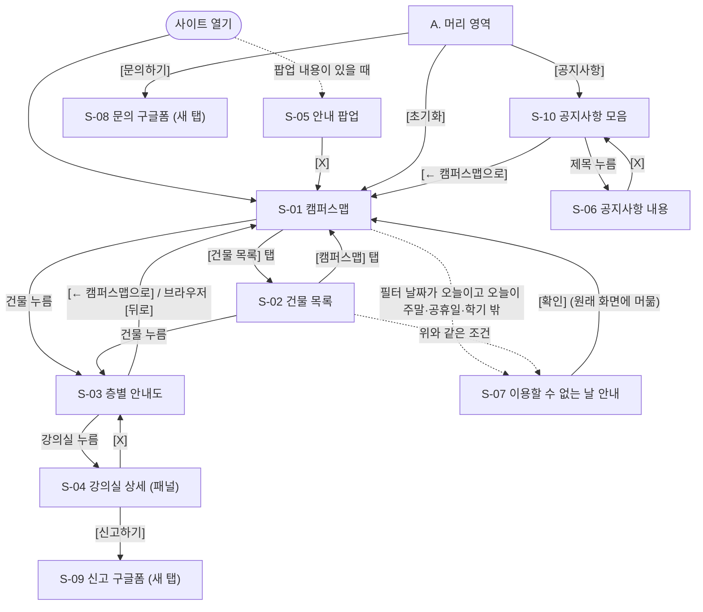

# 05 UI 디자인시스템 / IA

| 항목 | 내용 |
|---|---|
| 문서 유형 | UI 디자인시스템 / IA |
| 버전 | v0.1 |
| 작성일 | 2026-09-30 |
| 작성방식 | 신규 |
| 근거 문서 | `04_화면설계서.md` v0.3, `03_기능명세서.md` v0.8 |

> 이 문서는 사이트의 **모양 규칙**과 **정보 구조**를 적습니다.
> - 모양 규칙: 색·글꼴·간격 같은 기본값과, 단추·달력 같은 공통 부품의 모양입니다.
> - 정보 구조(IA, Information Architecture): 사이트의 메뉴와 화면을 어떻게 나누고 잇는지입니다.
> - 화면에 무엇이 있고 누르면 어떻게 되는지는 `04_화면설계서.md`가 정합니다. 이 문서는 그 화면이 **어떤 모양으로** 보이는지를 정합니다.
> - 화면은 04의 화면 번호(S-01~S-10)로, 기능은 03의 FR(기능 요구사항) 번호로 가리킵니다.
> - 04·03에 없는 기능은 새로 만들지 않았습니다.
> - 04와 어긋나거나 04에 없는 곳은 6.3 "04에 반영할 곳(역정합 예정)"에 모았습니다. 04는 이 문서에서 고치지 않습니다.
> - 이 문서에 쓰는 표시의 뜻은 04 머리말과 같습니다. 한 항목에는 표시를 하나만 씁니다.
>   - **확정**: 사용자가 정한 것입니다(02·03·04에서 정했거나, 이 문서를 쓰기 전에 사용자가 정함).
>   - **(확인 필요)**: 아직 정하지 않았거나 사실 확인이 안 된 것입니다.
>   - **제안값 — 사용자 확인 필요**: 이 문서에서 제안한 값입니다. 사용자가 확인한 뒤 확정합니다.
>   - **제안 — 목업에서 확인**: 이 문서에서 제안한 배치·모양입니다. 목업을 보고 확정합니다.
>   - **보류 — 목업에서 결정**: 04에서 보류한 것입니다. 이 문서도 정하지 않고, 후보별로 쓰일 규칙만 적습니다.
>   - **보류(03 NFR-013)**: 03에서 "나중에 추가"로 보류한 접근성 항목입니다.
>   - **"○○에서 정함"**: 뒤 문서(06·08·09·10 등)에서 정하기로 넘긴 것입니다.

> **사용자가 정한 것 (확정)**
> 1. 대표색은 **차분한 파랑 계열**입니다. 공실·수업중 같은 상태 색은 대표색과 헷갈리지 않게 따로 둡니다.
> 2. 테마는 **밝은 화면(라이트)만** 씁니다. 다크 모드는 범위 밖입니다.
> 3. 글꼴은 **Pretendard**(무료 한글 웹 글꼴)입니다.
> 4. 접근성은 **눈으로 보는 기본 기준만** 넣습니다. 키보드만으로 조작하기·화면 읽기 프로그램 대응은 보류입니다(03 NFR-013).

> **이 문서에 나오는 말**
> - **디자인 토큰**: 색·글자 크기·간격 같은 기본값에 붙인 이름입니다. 예: `color-primary` = 대표색 `#2B5C8A`. 화면을 만들 때 값 대신 이름을 쓰면, 값을 한 곳에서만 바꿔도 사이트 전체가 함께 바뀝니다.
> - **색 값(#2B5C8A 등)**: 색을 빨강·초록·파랑의 양으로 적은 번호입니다. 웹에서 색을 적는 기본 방법입니다.
> - **px(픽셀)**: 화면을 이루는 가장 작은 점 하나입니다. 크기를 잴 때 씁니다.
> - **rem**: 브라우저 기본 글자 크기(보통 16px)의 몇 배인지로 적는 크기 단위입니다. 1rem = 16px입니다. 학생이 브라우저 글자 크기를 키우면 rem으로 적은 글자도 함께 커집니다.
> - **반응형**: 화면 너비(PC·휴대폰)에 맞춰 배치가 알아서 바뀌는 것입니다.
> - **브레이크포인트**: 화면 너비가 이 값을 넘거나 밑돌 때 배치가 바뀌는 기준점입니다.
> - **WCAG**(Web Content Accessibility Guidelines, 웹 콘텐츠 접근성 지침): 장애가 있는 사람도 웹을 쓸 수 있게 국제 웹 표준 단체(W3C)가 만든 기준입니다. 이 문서는 2.2판의 **AA 등급**(여러 나라와 기관이 보통 목표로 삼는 중간 단계)을 목표로 합니다.
> - **대비율**: 글자 색과 바탕 색의 밝기 차이를 숫자로 나타낸 것입니다. 1:1(차이 없음)부터 21:1(검정 글자와 흰 바탕)까지입니다. 클수록 잘 읽힙니다.
> - **부품**: 여러 화면에서 되풀이해 쓰는 조각입니다. 예: 단추, 달력, 팝업.
> - **상태**: 같은 부품이 때에 따라 달라 보이는 모양입니다. 이 문서는 다섯 가지 이름을 씁니다.
>   - **평소**: 아무 일도 없을 때의 모양입니다.
>   - **마우스 올림**: 마우스 화살표를 부품 위에 올렸을 때입니다(PC만).
>   - **누름**: 마우스 단추나 손가락으로 누르고 있는 순간입니다.
>   - **고름**: 골라져 있는 상태입니다(예: 고른 날짜, 고른 탭).
>   - **못 누름**: 눌러도 반응하지 않는 상태입니다(예: 흐린 날짜).
> - **가림막**: 팝업 뒤 화면을 반쯤 어둡게 덮는 막입니다. 뒤 화면을 누를 수 없음을 알려 줍니다.
> - 화면·패널·팝업·모달·안내 창·탭·외부 화면의 뜻은 04 머리말과 같습니다.

## 1. 디자인 토큰

### 1.0 토큰 이름 규칙

- 토큰 이름은 영문 소문자와 `-`로 씁니다. 맨 앞 낱말이 종류입니다. 이 이름 규칙은 **제안값 — 사용자 확인 필요**입니다.

| 앞머리 | 종류 | 예 |
|---|---|---|
| `color-` | 색 | `color-primary` |
| `font-` | 글꼴(글꼴 이름·크기·굵기·줄 간격) | `font-size-md` |
| `space-` | 간격(부품 안팎의 빈 공간) | `space-4` |
| `size-` | 부품 크기(높이·너비·누르는 영역) | `size-target-touch` |
| `radius-` | 모서리 둥글기 | `radius-md` |
| `shadow-` | 그림자 | `shadow-2` |
| `z-` | 층(화면 위에 겹치는 순서) | `z-modal` |
| `motion-` | 움직임 시간 | `motion-normal` |
| `bp-` | 브레이크포인트 | `bp-desktop` |

- 이 장의 **값**은 모두 이 문서가 제안한 것입니다. 목업을 보고 바꿀 수 있습니다.
- 값을 바꾸면 5.3 대비율 계산을 다시 해야 합니다.

### 1.1 색

#### 1.1.1 대표색

| 토큰 | 쉬운 설명 | 값 | 쓰는 곳 | 표시 |
|---|---|---|---|---|
| (색 계열) | 차분한 파랑 계열 | — | 사이트의 대표색 | 확정 |
| `color-primary` | 대표색 | `#2B5C8A` | 고른 날짜·고른 교시 채움, 주 단추, 고른 탭 글자·밑줄, 오늘 테두리, 글자형 단추 글자 | 제안값 — 사용자 확인 필요 |
| `color-primary-hover` | 대표색(마우스 올림) | `#234D74` | 주 단추에 마우스를 올렸을 때 | 제안값 — 사용자 확인 필요 |
| `color-primary-pressed` | 대표색(누름) | `#1B3D5D` | 주 단추를 누르는 순간 | 제안값 — 사용자 확인 필요 |
| `color-primary-soft` | 옅은 대표색 | `#E7EEF6` | 달력 칸·교시 단추의 마우스 올림 바탕 | 제안값 — 사용자 확인 필요 |
| `color-text-on-primary` | 대표색 위 글자 | `#FFFFFF` | 고른 날짜·고른 교시·주 단추의 글자 | 제안값 — 사용자 확인 필요 |

**대표색 값 후보 비교** (흰 글자와의 대비율은 5.3과 같은 방법으로 계산)

| 후보 | 값 | 흰 글자 대비 | 느낌 | 표시 |
|---|---|---|---|---|
| A | `#2B5C8A` | 7.00:1 | 채도가 낮은 차분한 파랑입니다. 작은 글자에도 기준(4.5:1)을 넉넉히 넘습니다. | 제안값 — 사용자 확인 필요 (A를 제안) |
| B | `#1F4E79` | 8.66:1 | 더 진한 남색에 가깝습니다. 무겁고 딱딱해 보일 수 있습니다. | 제안값 — 사용자 확인 필요 |
| C | `#3A6EA5` | 5.31:1 | 더 밝고 선명합니다. 기준은 넘지만 여유가 적습니다. | 제안값 — 사용자 확인 필요 |

#### 1.1.2 바탕·글자·선

| 토큰 | 쉬운 설명 | 값 | 쓰는 곳 | 표시 |
|---|---|---|---|---|
| `color-bg` | 기본 바탕 | `#FFFFFF` | 가운데 구역, 팝업, 패널, 목록 줄 | 제안값 — 사용자 확인 필요 |
| `color-bg-subtle` | 옅은 회색 바탕 | `#F4F6F9` | C. 필터 영역, E. 바닥 영역 | 제안값 — 사용자 확인 필요 |
| `color-text` | 기본 글자 | `#1F2933` | 본문, 건물 이름, 날짜 숫자, 호실 번호 | 제안값 — 사용자 확인 필요 |
| `color-text-secondary` | 보조 글자 | `#52606D` | 교시 시작 시각, 요일 줄, 기준 표시, 바닥 영역, 목록 줄의 `>` 기호 | 제안값 — 사용자 확인 필요 |
| `color-text-disabled` | 흐린 글자 | `#A3ACB6` | 흐린 날짜(주말·공휴일·학기 밖), 못 누르는 [+] [-] 기호 | 제안값 — 사용자 확인 필요 |
| `color-border` | 옅은 선 | `#D5DBE2` | 목록 줄 구분선, 교시 단추 테두리, 구역 사이 선 | 제안값 — 사용자 확인 필요 |
| `color-border-strong` | 진한 선 | `#7B8794` | 보조 단추 테두리, 체크 칸 테두리 | 제안값 — 사용자 확인 필요 |
| `color-hover-bg` | 마우스 올림 바탕 | `#EEF2F6` | 목록 줄·보조 단추·글자형 단추·아이콘 단추에 마우스를 올렸을 때 | 제안값 — 사용자 확인 필요 |
| `color-pressed-bg` | 누름 바탕 | `#DCE4EE` | 위 부품과 달력 칸·교시 단추를 누르는 순간 | 제안값 — 사용자 확인 필요 |
| `color-scrim` | 가림막 | 검은 남색 `#0F172A`를 50% 투명하게 | S-05·S-06 팝업 뒤, S-07 안내 창 뒤 | 제안값 — 사용자 확인 필요 |

#### 1.1.3 상태 색

- **상태 색은 대표색(파랑)과 다른 색 계열을 씁니다**(확정). 파랑은 "고름"에 쓰기 때문입니다.
- 공실 / 수업중을 **어떤 모양으로 보일지는 보류**입니다(04 2.3). 아래 색은 어느 후보를 고르든 쓸 색입니다. 후보별 쓰임은 2.17에 적었습니다.

| 토큰 | 쉬운 설명 | 값 | 쓰는 곳 | 표시 |
|---|---|---|---|---|
| `color-free-text` | 공실 글자 | `#1B6B3A` (초록) | "공실" 글자 | 제안값 — 사용자 확인 필요 |
| `color-free-bg` | 공실 칸 바탕 | `#E5F4EA` (옅은 초록) | 공실 강의실 칸 바탕(색 칸 후보일 때) | 제안값 — 사용자 확인 필요 |
| `color-free-border` | 공실 칸 테두리 | `#3D9A62` | 공실 강의실 칸 테두리(색 칸 후보일 때) | 제안값 — 사용자 확인 필요 |
| `color-busy-text` | 수업중 글자 | `#8A4510` (주황빛 갈색) | "수업중" 글자 | 제안값 — 사용자 확인 필요 |
| `color-busy-bg` | 수업중 칸 바탕 | `#FCEEDF` (옅은 살구색) | 수업중 강의실 칸 바탕(색 칸 후보일 때) | 제안값 — 사용자 확인 필요 |
| `color-busy-border` | 수업중 칸 테두리 | `#C97A36` | 수업중 강의실 칸 테두리(색 칸 후보일 때) | 제안값 — 사용자 확인 필요 |
| (흐린 날짜) | 주말·공휴일·학기 밖 날짜 | `color-text-disabled` 글자, 바탕 없음 | 달력(2.3) | 제안값 — 사용자 확인 필요 |
| (고른 날짜) | 고른 날짜 | `color-primary` 채움 + `color-text-on-primary` 글자 | 달력(2.3) | 제안값 — 사용자 확인 필요 |
| (오늘) | 오늘 날짜 | `color-primary` 2px 테두리 | 달력(2.3) | 제안값 — 사용자 확인 필요 |
| `color-danger-text` | 오류 글자 | `#B42318` (빨강) | E-02 "정보를 불러오지 못했습니다…" | 제안값 — 사용자 확인 필요 |
| `color-danger-bg` | 오류 칸 바탕 | `#FDECEA` | E-02 문구 칸 | 제안값 — 사용자 확인 필요 |
| `color-notice-text` | 안내 글자 | `#243B53` (진한 회청색) | 필터 안내 문구, S-03 안내 문구 칸 | 제안값 — 사용자 확인 필요 |
| `color-notice-bg` | 안내 칸 바탕 | `#EEF2F7` | 위와 같음 | 제안값 — 사용자 확인 필요 |
| `color-notice-border` | 안내 칸 왼쪽 띠 | `#6B869F` | 위와 같음 | 제안값 — 사용자 확인 필요 |
| `color-banner-text` | 헤드 배너 글자 | `#1B3D5D` (`color-primary-pressed`와 같은 값) | B. 헤드 배너 | 제안값 — 사용자 확인 필요 |
| `color-banner-bg` | 헤드 배너 바탕 | `#E7EEF6` (`color-primary-soft`와 같은 값) | B. 헤드 배너 | 제안값 — 사용자 확인 필요 |

**공실 / 수업중 색 조합 후보 비교**

| 후보 | 공실 / 수업중 | 좋은 점 | 약한 점 | 표시 |
|---|---|---|---|---|
| ① | 초록 / 주황빛 갈색 | 초록은 "써도 됨", 주황은 "사용 중"으로 읽힙니다. 대표색(파랑)·오류(빨강)와 겹치지 않습니다. | 초록과 빨강을 잘 구별하지 못하는 사람(적록 색각 이상)에게는 두 색이 비슷해 보일 수 있습니다. 그래서 글자를 꼭 함께 씁니다(5.4). | 제안값 — 사용자 확인 필요 (①을 제안) |
| ② | 초록 / 회색 | 수업중이 "지금 못 씀"처럼 한눈에 보입니다. | 회색은 흐린 날짜(못 누름)에도 씁니다. 수업중 강의실도 누를 수 있는데, 못 누르는 것처럼 보입니다. | 제안값 — 사용자 확인 필요 |
| ③ | 초록 / 빨강 | 가장 흔한 조합입니다. | 오류(빨강)와 헷갈립니다. 적록 색각 이상인 사람에게 가장 불리합니다. | 제안값 — 사용자 확인 필요 |

#### 1.1.4 캠퍼스맵 색

- 캠퍼스맵을 무엇으로 만들지는 **보류**입니다(04 2.1). 아래 표의 "모든 후보" 토큰은 어느 후보든 씁니다.

| 토큰 | 쉬운 설명 | 값 | 쓰는 곳 | 표시 |
|---|---|---|---|---|
| `color-map-label-text` | 건물 이름 글자 | `color-text`와 같음 | 모든 후보. 지도 위 "공과대학 1호관(D2)" | 제안값 — 사용자 확인 필요 |
| `color-map-label-halo` | 건물 이름 둘레 흰 테두리 | `#FFFFFF`, 두께 3px | 모든 후보. 지도 그림 위에서도 글자가 읽히게 합니다. | 제안값 — 사용자 확인 필요 |
| `color-map-highlight` | 건물 강조(마우스 올림) | `color-primary` 2px 테두리 + `color-primary`를 25% 투명하게 채움 | 모든 후보. 누를 수 있는 건물에 마우스를 올렸을 때 | 제안 — 목업에서 확인 |
| `color-map-ground` 등 | 땅·건물·길 색 | 땅 `#EEF1EC`, 누를 수 없는 건물 `#D5DBE2`, 누를 수 있는 건물 `#C9D6E6`, 길 `#FFFFFF` | 후보 ③ "직접 만든 지도"를 고를 때만 씁니다. | 보류 — 목업에서 결정 |

### 1.2 글꼴

#### 1.2.1 글꼴 이름과 대신 글꼴 순서

| 토큰 | 값 | 표시 |
|---|---|---|
| `font-family-base` | `"Pretendard"` | 확정 |
| (대신 글꼴 순서) | `"Pretendard", -apple-system, BlinkMacSystemFont, "Apple SD Gothic Neo", "Malgun Gothic", "맑은 고딕", "Noto Sans KR", sans-serif` | 제안값 — 사용자 확인 필요 |

- 대신 글꼴은 Pretendard를 받지 못했을 때 **앞에서부터 차례로** 찾아 씁니다.
  1. `-apple-system`, `BlinkMacSystemFont`: 아이폰·맥의 기본 글꼴입니다.
  2. `Apple SD Gothic Neo`: 아이폰·맥의 기본 한글 글꼴입니다.
  3. `Malgun Gothic`, `맑은 고딕`: 윈도우의 기본 한글 글꼴입니다. 이름을 영문·한글 두 가지로 적습니다.
  4. `Noto Sans KR`: 기기에 깔려 있으면 씁니다.
  5. `sans-serif`: 위가 모두 없으면 기기의 기본 고딕체를 씁니다(안드로이드 기본 한글 글꼴 포함).
- 글꼴 파일을 받는 동안에는 대신 글꼴로 먼저 보여 줍니다. 다 받으면 Pretendard로 바뀝니다. 글자가 안 보이는 빈 시간을 없애기 위해서입니다. **(제안값 — 사용자 확인 필요)**
- Pretendard는 무료로 쓰고 함께 배포할 수 있는 글꼴 사용 허락(SIL 오픈 폰트 라이선스)을 따릅니다.
- 글꼴 파일을 사이트에 함께 넣을지, 외부 무료 배포 서버(CDN: 파일을 대신 전해 주는 서버)에서 받을지는 **08에서 정함**입니다.

#### 1.2.2 글자 크기 단계

| 토큰 | rem | px | 쓰는 곳 | 표시 |
|---|---|---|---|---|
| `font-size-xs` | 0.75rem | 12px | 교시 단추의 시작 시각("11:00"), E. 바닥 영역, 휴대폰의 기준 표시 | 제안값 — 사용자 확인 필요 |
| `font-size-sm` | 0.875rem | 14px | 기준 표시(PC), 달력 날짜·요일, 안내 문구, "공실"·"수업중" 글자, 헤드 배너, 건물 이름 글자(지도 위), S-04 항목 이름, 체크 칸 글자 | 제안값 — 사용자 확인 필요 |
| `font-size-md` | 1rem | 16px | 본문, 단추 글자, 목록 줄, 교시 이름("3교시"), 호실 번호, 팝업 내용, S-04 값 | 제안값 — 사용자 확인 필요 |
| `font-size-lg` | 1.125rem | 18px | 서비스 이름, 달 이름("2026년 10월"), 층 이름("3층") | 제안값 — 사용자 확인 필요 |
| `font-size-xl` | 1.25rem | 20px | 팝업 제목, S-04 건물 이름, S-10 "공지사항" 제목, 휴대폰의 S-03 건물 이름 | 제안값 — 사용자 확인 필요 |
| `font-size-2xl` | 1.5rem | 24px | S-03 건물 이름(PC) | 제안값 — 사용자 확인 필요 |

- 휴대폰에서도 글자를 PC보다 작게 줄이지 않습니다. 단, S-03 건물 이름만 24px에서 20px로 줄입니다. **(제안값 — 사용자 확인 필요)**

#### 1.2.3 굵기·줄 간격·숫자

| 토큰 | 값 | 쓰는 곳 | 표시 |
|---|---|---|---|
| `font-weight-regular` | 400 (보통) | 본문, 안내 문구, 목록 줄 | 제안값 — 사용자 확인 필요 |
| `font-weight-semibold` | 600 (조금 굵게) | 단추 글자, 교시 이름, 고른 탭, 오늘 날짜, 건물 이름 글자(지도 위) | 제안값 — 사용자 확인 필요 |
| `font-weight-bold` | 700 (굵게) | 제목, 고른 날짜, 호실 번호, 층 이름, "공실" 글자 | 제안값 — 사용자 확인 필요 |
| `font-line-tight` | 1.3 (글자 높이의 1.3배) | 제목, 단추처럼 한 줄인 곳 | 제안값 — 사용자 확인 필요 |
| `font-line-normal` | 1.5 | 본문, 안내 문구, 팝업 내용, 헤드 배너 | 제안값 — 사용자 확인 필요 |
| (숫자 폭 맞춤) | 숫자마다 같은 너비로 그림 | 교시 시각, 날짜, "13:00 시작" 같은 시각 | 제안값 — 사용자 확인 필요 |

- 숫자 폭을 맞추면 "11:00"과 "13:50"이 위아래로 가지런히 놓입니다.

### 1.3 간격

- 간격은 **4px 단위**로 씁니다. 같은 단위를 쓰면 화면이 가지런해 보입니다. **(제안값 — 사용자 확인 필요)**

| 토큰 | 값 | 쓰는 곳 | 표시 |
|---|---|---|---|
| `space-1` | 4px | 글자와 기호 사이(예: "305"와 "공실" 두 줄 사이) | 제안값 — 사용자 확인 필요 |
| `space-2` | 8px | 교시 단추 사이, 강의실 칸 사이, 체크 칸과 글자 사이 | 제안값 — 사용자 확인 필요 |
| `space-3` | 12px | 안내 문구 칸 안쪽, 목록 줄 위아래 안쪽 | 제안값 — 사용자 확인 필요 |
| `space-4` | 16px | 부품 사이, 필터 영역 안쪽, 목록 줄 좌우 안쪽, **휴대폰 화면 좌우 여백**(04 2.5·2.7과 같음) | 제안값 — 사용자 확인 필요 |
| `space-5` | 20px | 패널 안쪽 | 제안값 — 사용자 확인 필요 |
| `space-6` | 24px | 구역 사이, 층 묶음 사이, 팝업·안내 창 안쪽, PC 머리 영역 좌우 안쪽 | 제안값 — 사용자 확인 필요 |
| `space-8` | 32px | 큰 구역 사이(달력과 교시 단추 묶음 사이 등) | 제안값 — 사용자 확인 필요 |
| `space-10` | 40px | 빈 목록 문구 위 여백 | 제안값 — 사용자 확인 필요 |
| `space-12` | 48px | 불러오는 중 표시 위 여백 | 제안값 — 사용자 확인 필요 |

### 1.4 크기

| 토큰 | 값 | 쓰는 곳 | 표시 |
|---|---|---|---|
| `size-target-min` | 24px × 24px | 어떤 누르는 것도 이보다 작게 만들지 않습니다(WCAG 2.2 AA 최소 기준, 5.5). | 제안값 — 사용자 확인 필요 |
| `size-target-pc` | 32px × 32px | PC에서 누르는 것의 최소 크기 | 제안값 — 사용자 확인 필요 |
| `size-target-touch` | 44px × 44px | 휴대폰에서 누르는 것의 최소 크기 | 제안값 — 사용자 확인 필요 |
| `size-control-pc` | 높이 40px | PC 단추·탭·[X]·[+] [-] | 제안값 — 사용자 확인 필요 |
| `size-header-pc` / `size-header-mobile` | 높이 56px / 48px(첫 줄) | A. 머리 영역 | 제안값 — 사용자 확인 필요 |
| `size-filter-width` | 너비 320px | C. 필터 영역(PC). 04 2.0의 "약 320px"을 정한 값 | 제안값 — 사용자 확인 필요 |
| `size-panel-width` | 너비 360px | S-04 패널(PC). 04 2.4의 "약 360px"을 정한 값 | 제안값 — 사용자 확인 필요 |
| `size-sheet-height` | 화면 높이의 50% | S-04 패널(휴대폰). 04 2.4의 "절반쯤"을 정한 값 | 제안값 — 사용자 확인 필요 |
| `size-popup-width` | 너비 480px, 높이는 화면 높이의 80%까지 | S-05·S-06(PC). 04 2.5의 "약 480px"을 정한 값 | 제안값 — 사용자 확인 필요 |
| `size-alert-width` | 너비 320px | S-07(PC). 04 2.7의 "약 320px"을 정한 값 | 제안값 — 사용자 확인 필요 |
| `size-list-row-pc` / `size-list-row-mobile` | 높이 최소 48px / 최소 56px | 목록 줄(S-02·S-10) | 제안값 — 사용자 확인 필요 |
| `size-room-cell` | 너비 최소 88px × 높이 최소 56px | 강의실 칸(S-03) | 제안값 — 사용자 확인 필요 |
| `size-calendar-cell` | PC 40px × 40px / 휴대폰 44px 이상(화면 너비에 맞춰 7등분) | 달력 날짜 칸 | 제안값 — 사용자 확인 필요 |
| `size-period-button` | PC 높이 48px / 휴대폰 높이 52px, 너비는 3등분 | 교시 단추 | 제안값 — 사용자 확인 필요 |
| `size-spinner` | 24px, 선 두께 3px | 불러오는 중 표시 | 제안값 — 사용자 확인 필요 |

### 1.5 모서리 둥글기

| 토큰 | 값 | 쓰는 곳 | 표시 |
|---|---|---|---|
| `radius-sm` | 4px | 체크 칸, 안내 문구 칸 | 제안값 — 사용자 확인 필요 |
| `radius-md` | 8px | 단추, 달력 칸, 교시 단추, 강의실 칸 | 제안값 — 사용자 확인 필요 |
| `radius-lg` | 12px | 팝업, 안내 창, 휴대폰 S-04 패널의 위쪽 두 모서리 | 제안값 — 사용자 확인 필요 |
| `radius-full` | 완전히 둥글게 | 불러오는 중 표시(동그라미) | 제안값 — 사용자 확인 필요 |

### 1.6 그림자

| 토큰 | 값(쉬운 설명) | 쓰는 곳 | 표시 |
|---|---|---|---|
| `shadow-1` | 아주 옅고 짧은 그림자 (아래로 1px, 번짐 2px, 검정 8%) | 지도 위 [+] [-] 단추 | 제안값 — 사용자 확인 필요 |
| `shadow-2` | 중간 그림자 (아래로 4px, 번짐 12px, 검정 12%) | S-04 패널, 휴대폰 ≡ 메뉴 목록 | 제안값 — 사용자 확인 필요 |
| `shadow-3` | 진한 그림자 (아래로 12px, 번짐 32px, 검정 20%) | S-05·S-06 팝업, S-07 안내 창 | 제안값 — 사용자 확인 필요 |

- 그림자는 "위에 떠 있는 정도"를 보여 줍니다. 높이 뜰수록 진한 그림자를 씁니다.

### 1.7 층(겹치는 순서)

- 숫자가 클수록 위에 놓입니다. 같은 숫자끼리는 뒤에 연 것이 위입니다. **(제안값 — 사용자 확인 필요)**

| 토큰 | 값 | 무엇 | 관련 화면 |
|---|---|---|---|
| `z-base` | 0 | 캠퍼스맵, 목록, 층별 안내도 | S-01·S-02·S-03·S-10 |
| `z-map-label` | 10 | 지도 위 건물 이름 글자 | S-01 |
| `z-map-control` | 20 | 지도 위 [+] [-] 단추 | S-01 |
| `z-sticky` | 100 | S-03 머리 부분(스크롤해도 맨 위에 붙어 있음) | S-03 |
| `z-header` | 200 | A. 머리 영역 | 공통 |
| `z-panel` | 300 | S-04 강의실 상세 패널 | S-04 |
| `z-menu` | 400 | 휴대폰 ≡ 메뉴 목록 | 공통 |
| `z-scrim` | 500 | 가림막 | S-05·S-06·S-07 |
| `z-modal` | 510 | 팝업(모달) | S-05·S-06 |
| `z-alert` | 520 | 안내 창 | S-07 |

- S-05와 S-07이 한꺼번에 뜨는 일은 없습니다. S-05가 떠 있으면 뒤 화면(건물)을 누를 수 없기 때문입니다.

### 1.8 움직임 시간

| 토큰 | 값 | 쓰는 곳 | 표시 |
|---|---|---|---|
| `motion-fast` | 0.12초 | 마우스 올림·누름 때 색이 바뀌는 시간 | 제안값 — 사용자 확인 필요 |
| `motion-normal` | 0.2초 | 패널이 열리고 닫히는 시간, 휴대폰 필터·≡ 메뉴가 펼쳐지는 시간 | 제안값 — 사용자 확인 필요 |
| `motion-spin` | 1초에 한 바퀴 | 불러오는 중 표시가 도는 빠르기 | 제안값 — 사용자 확인 필요 |

## 2. 공통 부품 규칙

### 2.0 모든 부품에 쓰는 규칙

- **마우스 올림** 모양은 PC에서만 보입니다. 휴대폰에는 마우스가 없으므로 **누름** 모양이 그 역할을 합니다. **(제안값 — 사용자 확인 필요)**
- 누를 수 있는 것에 마우스를 올리면 마우스 모양이 **손가락**으로 바뀝니다. 누를 수 없는 것은 바뀌지 않습니다. 흐린 날짜에 마우스를 올려도 모양이 바뀌지 않는 것은 04 2.0 C에서 확정했습니다.
- 색이 바뀔 때는 `motion-fast`(0.12초) 동안 부드럽게 바꿉니다. **(제안값 — 사용자 확인 필요)**
- 표에 "해당 없음"이라고 적은 상태는 그 부품에 생기지 않는 상태입니다.

### 2.1 단추

**단추 종류**

| 종류 | 모양 | 쓰는 곳 (화면 · FR) | 표시 |
|---|---|---|---|
| 주 단추 | 대표색으로 채운 칸, 흰 글자(`font-size-md`, 600). 높이 40px(휴대폰 44px), 좌우 안쪽 16px, 모서리 `radius-md` | S-07 [확인] (FR-014, FR-018), E-02 [다시 시도] (FR-012) | 제안값 — 사용자 확인 필요 |
| 보조 단추 | 흰 바탕 + `color-border-strong` 1px 테두리, `color-text` 글자(600). 크기는 주 단추와 같음 | 머리 영역 [초기화] (FR-006), S-04 [신고하기] (FR-011, 패널 너비 가득), S-03 층 바로가기 [1층] [2층]… (FR-004, 높이 32px·휴대폰 44px) | 제안값 — 사용자 확인 필요 |
| 글자형 단추 | 바탕·테두리 없이 대표색 글자(600)만 | 머리 영역 [문의하기] (FR-010)·[공지사항] (FR-007), S-03·S-10 [← 캠퍼스맵으로] (FR-001), 헤드 배너 [닫기] (FR-008) | 제안값 — 사용자 확인 필요 |
| 아이콘 단추 | 그림 기호만 있는 네모 단추. 기호는 `color-text-secondary` | [X] 닫기: S-04·S-05·S-06 (FR-005, FR-009, FR-007). 달력 [<] [>]: 필터 영역 (FR-003). 휴대폰 ≡ 메뉴 (FR-007, FR-010) | 제안값 — 사용자 확인 필요 |
| 지도 확대 단추 [+] [-] | 흰 바탕 + `shadow-1`. [+]와 [-]를 위아래로 붙여 한 묶음으로 놓음. 가운데 구역 오른쪽 아래(04 2.1 그림) | S-01 (FR-001) | 제안값 — 사용자 확인 필요 |
| 휴대폰 필터 요약 줄 | "10/1(목) · 3교시 ▼" 한 줄 전체가 단추. 높이 48px, `color-bg-subtle` 바탕 | 휴대폰의 C. 필터 영역 (FR-003) | 제안값 — 사용자 확인 필요 |

**단추 크기**

| 단추 | PC | 휴대폰 | 표시 |
|---|---|---|---|
| 주·보조·글자형 단추 | 높이 40px | 높이 44px | 제안값 — 사용자 확인 필요 |
| [X] | 40px × 40px | 44px × 44px | 제안값 — 사용자 확인 필요 |
| [+] [-] | 각 40px × 40px | 각 44px × 44px | 제안값 — 사용자 확인 필요 |
| 달력 [<] [>] | 32px × 32px | 44px × 44px | 제안값 — 사용자 확인 필요 |
| ≡ 메뉴 | 해당 없음(PC에는 없음) | 44px × 44px | 제안값 — 사용자 확인 필요 |
| 헤드 배너 [닫기] | 높이 32px | 높이 44px | 제안값 — 사용자 확인 필요 |

**단추 상태** (표 전체 **제안값 — 사용자 확인 필요**)

| 종류 | 평소 | 마우스 올림 | 누름 | 고름 | 못 누름 |
|---|---|---|---|---|---|
| 주 단추 | `color-primary` 채움 | `color-primary-hover` 채움 | `color-primary-pressed` 채움 | 해당 없음 | 해당 없음(사이트에 못 누르는 주 단추가 없음) |
| 보조 단추 | 흰 바탕 + 진한 테두리 | `color-hover-bg` 바탕 | `color-pressed-bg` 바탕 | 해당 없음 | 해당 없음 |
| 글자형 단추 | 대표색 글자 | `color-hover-bg` 바탕 + 글자 밑줄 | `color-pressed-bg` 바탕 | 해당 없음 | 해당 없음 |
| 아이콘 단추 | 보조 글자색 기호 | `color-hover-bg` 바탕, 기호는 `color-text` | `color-pressed-bg` 바탕 | ≡ 메뉴가 펼쳐져 있을 때: `color-pressed-bg` 바탕 | 해당 없음. 달력 [<] [>]는 넘길 수 있는 달에 제한이 없어 늘 누를 수 있음(04 2.0 C 확정) |
| [+] [-] | 흰 바탕 + 보조 글자색 기호 | `color-hover-bg` 바탕 | `color-pressed-bg` 바탕 | 해당 없음 | 가장 작게 줄였을 때 [-], 가장 크게 키웠을 때 [+]: 기호를 `color-text-disabled`로 흐리게, 손가락 모양 없음 |
| 휴대폰 필터 요약 줄 | ▼ 기호 | 해당 없음(휴대폰) | `color-pressed-bg` 바탕 | 펼쳐져 있을 때: ▲ 기호 | 해당 없음 |

### 2.2 탭 [캠퍼스맵] [건물 목록]

- **쓰는 곳**: S-01·S-02 가운데 구역 왼쪽 위 (FR-001, FR-002). 위치는 04 2.1의 **제안 — 목업에서 확인**을 따릅니다.
- **모양**: 글자 아래에 밑줄이 있는 탭입니다. 탭 높이 44px, 글자 `font-size-md`. 탭 묶음 밑에 `color-border` 1px 선을 둡니다. **(제안값 — 사용자 확인 필요)**

| 상태 | 모양 |
|---|---|
| 평소 | `color-text-secondary` 글자, 굵기 400 |
| 마우스 올림 | `color-text` 글자 + `color-hover-bg` 바탕 |
| 누름 | `color-pressed-bg` 바탕 |
| 고름 | `color-primary` 글자, 굵기 600 + 밑에 `color-primary` 3px 밑줄 |
| 못 누름 | 해당 없음 |

- 위 상태 표는 **제안값 — 사용자 확인 필요**입니다.
- 고른 탭은 색·굵기·밑줄 세 가지로 구별합니다(5.4).

### 2.3 달력

- **쓰는 곳**: C. 필터 영역 ① (S-01·S-02·S-03·S-04·S-10에 공통으로 보임). FR-003, FR-014, FR-018.
- **구성**: 맨 위 달 이름 줄 "[<] 2026년 10월 [>]"(`font-size-lg`, 700), 그 밑 요일 줄 "일 월 화 수 목 금 토"(`font-size-sm`, `color-text-secondary`), 그 밑 날짜 칸 7칸 × 5~6줄.
- **날짜 칸**: PC 40px × 40px, 휴대폰은 화면 너비를 7로 나눈 크기(360px 화면에서 약 46px). 모서리 `radius-md`, 숫자 `font-size-sm`.
- **다른 달 날짜**: 그 달의 1일 앞과 말일 뒤 칸은 비워 둡니다. 앞·뒤 달 날짜를 흐리게 채우지 않습니다. 흐린 날짜(못 고름)와 헷갈리기 때문입니다. **(제안값 — 사용자 확인 필요)**
- **토·일 글자 색**: 토요일 파랑·일요일 빨강처럼 따로 칠하지 않습니다. 주말은 모두 흐린 날짜 모양입니다(04 확정: 주말은 흐리게). **(제안값 — 사용자 확인 필요)**

**날짜 칸 상태**

| 상태 | 언제 | 모양 | 표시 |
|---|---|---|---|
| 평소 | 고를 수 있는 평일(학기 안, 공휴일 아님) | `color-text` 숫자, 바탕 없음, 굵기 400 | 제안값 — 사용자 확인 필요 |
| 오늘 | 오늘 날짜(고르지 않았을 때) | `color-primary` 2px 테두리(칸 안쪽) + 숫자 굵기 600 | 제안값 — 사용자 확인 필요 |
| 고름 | 고른 날짜 | `color-primary`로 채움 + 흰 숫자(`color-text-on-primary`), 굵기 700 | 제안값 — 사용자 확인 필요 (04 "05에서 정함"을 여기서 정함) |
| 오늘 + 고름 | 오늘을 고른 경우(처음 열었을 때의 기본값) | 고름 모양 + 칸 바깥에 흰 틈 2px을 두고 `color-primary` 2px 테두리를 한 겹 더 두름 | 제안값 — 사용자 확인 필요 |
| 흐림(못 누름) | 주말, 공휴일(FR-030), 학기 밖(FR-023) 날짜 | `color-text-disabled` 숫자, 바탕 없음. 마우스를 올려도 모양·마우스 모양이 바뀌지 않음(04 확정). 세 가지 이유 모두 같은 모양(04 확정) | 제안값 — 사용자 확인 필요 |
| 마우스 올림 | 고를 수 있는 날짜에 마우스를 올림 | `color-primary-soft` 바탕 + 손가락 모양 | 제안값 — 사용자 확인 필요 |
| 누름 | 고를 수 있는 날짜를 누르는 순간 | `color-pressed-bg` 바탕 | 제안값 — 사용자 확인 필요 |

- 오늘이 주말·공휴일이거나 학기 밖일 때의 "오늘" 모양은 **보류**입니다(04 2.0 C). 후보별 규칙은 2.17에 적었습니다.
- 방학 달로 넘어가면 그 달의 날짜가 모두 흐림 모양이 됩니다(04 확정).

### 2.4 교시 단추 (3×3)

- **쓰는 곳**: C. 필터 영역 ② (FR-003, FR-012, FR-015). 1교시~9교시 단추 9개를 3칸 × 3줄로 놓습니다(04 2.0 C, 배치는 제안 — 목업에서 확인).
- **크기**: 필터 영역 너비를 3으로 나눔(단추 사이 8px). PC는 약 90px × 48px, 휴대폰 360px 화면에서는 약 104px × 52px입니다. **(제안값 — 사용자 확인 필요)**
- **글자**: 첫 줄 "3교시"(`font-size-md`, 600), 둘째 줄 "11:00"(`font-size-xs`, `color-text-secondary`, 숫자 폭 맞춤). 04의 "시작 시각을 작게 함께 적음"을 따릅니다. **(제안값 — 사용자 확인 필요)**

| 상태 | 모양 | 표시 |
|---|---|---|
| 평소 | 흰 바탕 + `color-border` 1px 테두리, 모서리 `radius-md` | 제안값 — 사용자 확인 필요 |
| 마우스 올림 | `color-primary-soft` 바탕 + 손가락 모양 | 제안값 — 사용자 확인 필요 |
| 누름 | `color-pressed-bg` 바탕 | 제안값 — 사용자 확인 필요 |
| 고름 | `color-primary`로 채움 + 두 줄 글자 모두 흰색 | 제안값 — 사용자 확인 필요 |
| 못 누름 | 해당 없음. 지난 교시도 고를 수 있습니다(04 확정). | 확정 |

- 교시를 비워 둔 때(E-06)는 9개 모두 평소 모양입니다. 필터 안내 문구(2.11)가 "교시를 골라 주세요"를 알립니다.

### 2.5 헤드 배너 (+ [닫기])

- **쓰는 곳**: B. 헤드 배너 (S-01·S-02·S-03·S-10). FR-008.
- **모양**: `color-banner-bg` 바탕, `color-banner-text` 글자(`font-size-sm`, 400, 줄 간격 1.5). 높이 최소 40px, 좌우 안쪽 PC 24px·휴대폰 16px. 밑에 `color-border` 1px 선. **(제안값 — 사용자 확인 필요)**
- **[닫기]**: 오른쪽 끝의 글자형 단추입니다(자리는 04의 제안 — 목업에서 확인).
- **배너를 누르면**: 반응하지 않습니다(04 확정). 그래서 배너 글자에는 마우스 올림 모양·손가락 모양이 없습니다.
- **문구가 길 때**: PC는 한 줄, 휴대폰은 두 줄까지 보입니다(휴대폰 두 줄은 04의 제안). 그보다 길면 끝을 "…"로 줄입니다. **(제안값 — 사용자 확인 필요)** 04에는 PC에서 넘칠 때의 처리가 없어 6.3에 적었습니다.

| 상태 | 모양 |
|---|---|
| 평소 | 위 모양 |
| 마우스 올림 / 누름 / 고름 / 못 누름 | 배너 자체는 해당 없음. [닫기]만 글자형 단추 상태(2.1)를 따름 |

### 2.6 팝업(모달) — S-05 안내 팝업, S-06 공지사항 내용

- **쓰는 곳**: S-05 (FR-009), S-06 (FR-007).
- **가림막**: 화면 전체를 `color-scrim`(1.1.2)으로 덮습니다(`z-scrim`).
- **가림막을 누르면**: 반응하지 않습니다(04 확정).
- **창 모양**: 흰 바탕, 모서리 `radius-lg`, 그림자 `shadow-3`, 안쪽 여백 24px. 너비 480px, 높이는 화면 높이의 80%까지입니다. **(제안값 — 사용자 확인 필요)**
- **제목 줄**: 제목(`font-size-xl`, 700)과 오른쪽 위 [X](아이콘 단추)를 한 줄에 둡니다. 제목이 길면 줄을 바꿉니다. 제목 글자가 [X]와 겹치지 않게 제목 오른쪽에 [X] 너비만큼 비웁니다. **(제안값 — 사용자 확인 필요)**
- **내용**: `font-size-md`, 줄 간격 1.5. 관리자가 시트에 적은 줄바꿈을 그대로 보여 줍니다. 내용이 길면 **내용만** 창 안에서 스크롤하고, 제목 줄과 밑부분은 제자리에 둡니다. **(제안값 — 사용자 확인 필요)**
- **밑부분(S-05만)**: 내용 밑에 `color-border` 1px 선을 긋고, 그 밑에 "오늘은 그만 보기" 체크 칸(2.13)을 둡니다(자리는 04 확정). 아래쪽 [닫기] 단추는 두지 않습니다(04 확정).
- **S-06**: "오늘은 그만 보기" 칸이 없습니다(04 확정). 올린 날짜를 보일지는 06에서 정함입니다. 보인다면 제목 밑에 `font-size-sm`, `color-text-secondary`로 둡니다.
- **그림**: 시트에 그림 칸을 둘지는 06에서 정함입니다. 둔다면 그림 너비는 창 너비를 넘지 않게 줄입니다.
- **휴대폰**: 좌우에 16px씩 비우고 화면 너비에 맞춥니다(04 2.5).

| 상태 | 모양 |
|---|---|
| 평소 | 위 모양. 창 자체에는 마우스 올림·누름·고름·못 누름 상태가 없음 |
| 창 안 부품 | [X]는 아이콘 단추 상태(2.1), 체크 칸은 2.13을 따름 |

### 2.7 안내 창 — S-07 이용할 수 없는 날 안내

- **쓰는 곳**: S-07 (FR-014, FR-018).
- **모양**: 흰 바탕, 모서리 `radius-lg`, 그림자 `shadow-3`, 안쪽 여백 24px, 너비 320px, 화면 가운데. **(제안값 — 사용자 확인 필요)**
- **문구**: `font-size-md`, `color-text`, 줄 간격 1.5. 두 문장은 줄을 나눠 적습니다(04 2.7 그림과 같음). 오류가 아니라 안내이므로 빨강을 쓰지 않습니다.
- **[확인]**: 주 단추, 창 오른쪽 아래.
- **뒤 화면**: 가림막(`color-scrim`)을 덮고, 가림막을 눌러도 반응하지 않게 합니다. **(제안 — 목업에서 확인)** 04에는 이 창이 모달인지 적혀 있지 않아 6.3에 적었습니다.
- **휴대폰**: 좌우 16px 여백을 두고 화면 가운데에 띄웁니다(04 2.7).

### 2.8 패널 — S-04 강의실 상세

- **쓰는 곳**: S-04 (FR-005, FR-011, FR-012, FR-016).

| 항목 | PC(1024px 이상) | 휴대폰(1024px 미만) | 표시 |
|---|---|---|---|
| 자리 | 가운데 구역 오른쪽에 붙음(04 확정 모양: 오른쪽 패널) | 화면 아래에서 올라옴(04 제안) | 제안 — 목업에서 확인 |
| 크기 | 너비 360px, 높이는 가운데 구역 높이 | 너비 화면 전체, 높이 화면의 50% | 제안값 — 사용자 확인 필요 |
| 모양 | 흰 바탕, 왼쪽에 `color-border` 1px 선 + `shadow-2` | 흰 바탕, 위쪽 두 모서리 `radius-lg`, 위쪽으로 `shadow-2` | 제안값 — 사용자 확인 필요 |
| 뒤 화면 | 가림막 없음. S-03을 계속 보고 누를 수 있음(04 제안: 모달 아님). S-03은 남은 너비로 줄고 강의실 칸은 줄바꿈으로 다시 놓임(가려지지 않음) | 가림막 없음(PC와 같게) | 제안 — 목업에서 확인 |
| [X] | 오른쪽 위, 40px | 오른쪽 위, 44px | 제안값 — 사용자 확인 필요 |
| 열리는 움직임 | 오른쪽에서 밀려 나옴(`motion-normal`) | 아래에서 밀려 올라옴(`motion-normal`) | 제안값 — 사용자 확인 필요 |
| 내용이 길 때 | 패널 안에서 스크롤 | 패널 안에서 스크롤 | 제안값 — 사용자 확인 필요 |

**패널 안 글자 순서와 모양** (순서는 04 2.4 그림을 따름, 모양은 **제안값 — 사용자 확인 필요**)

1. 건물 이름 "공과대학 1호관(D2)" — `font-size-xl`, 700
2. 호실·층 "305호 · 3층" — `font-size-md`, 600
3. 기준 줄 "10/1(목) · 3교시(11:00~11:50) 기준" — `font-size-sm`, `color-text-secondary`
4. 상태 "공실" / "수업중" — S-03 강의실 칸과 같은 모양(모양은 보류, 2.17)
5. 시각 "다음 수업 13:00 시작" / "수업중 · 12:50 끝" / "남은 수업 없음" — `font-size-md`
6. 수용 인원 — 2.14 표 모양
7. 휴강·보강·시험 미반영 안내 — `font-size-sm`, `color-text-secondary`
8. [신고하기] — 보조 단추, 패널 너비 가득

- 교시를 고르지 않았을 때(E-06)는 4·5 자리에 안내 문구 칸(2.11) "교시를 골라 주세요"를 둡니다.

### 2.9 목록 줄 — S-02 건물 목록, S-10 공지사항 모음

- **쓰는 곳**: S-02 건물 줄 (FR-002), S-10 공지 제목 줄 (FR-007).
- **크기**: 높이 PC 최소 48px, 휴대폰 최소 56px. 04 2.2의 "크기는 05에서 정함"을 여기서 정합니다. **(제안값 — 사용자 확인 필요)**
- **모양**: 흰 바탕, 좌우 안쪽 16px, 위아래 안쪽 12px. 글자 `font-size-md`, `color-text`. 오른쪽 끝에 `>` 기호(`color-text-secondary`), 세로 가운데. 줄 사이에 `color-border` 1px 선. **(제안값 — 사용자 확인 필요)**
- **긴 글자**: 줄을 바꿔 모두 보입니다. "…"로 자르지 않습니다. 줄 높이가 늘어납니다. **(제안값 — 사용자 확인 필요)**
- **누르는 영역**: 줄 전체입니다(글자만이 아님).
- **넓은 PC 화면**: 목록 너비는 최대 720px로 두어 한 줄이 너무 길어지지 않게 합니다. **(제안값 — 사용자 확인 필요)**
- **S-10 올린 날짜**: 06에서 정함입니다. 보인다면 제목 밑에 `font-size-xs`, `color-text-secondary`로 둡니다.

| 상태 | 모양 |
|---|---|
| 평소 | 흰 바탕 |
| 마우스 올림 | `color-hover-bg` 바탕 + 손가락 모양 |
| 누름 | `color-pressed-bg` 바탕 |
| 고름 | 해당 없음(누르면 바로 S-03 또는 S-06으로 넘어감) |
| 못 누름 | 해당 없음(불러오는 중에는 목록 대신 불러오는 중 표시가 보임, E-01) |

- 위 상태 표는 **제안값 — 사용자 확인 필요**입니다.
- 목록이 비었을 때(E-04, E-22)는 2.11의 "빈 목록" 모양을 씁니다.

### 2.10 강의실 칸 — S-03 층별 안내도

- **쓰는 곳**: S-03 층 묶음 안 (FR-004, FR-005, FR-012).
- 공실 / 수업중 **모양**과 층별 안내도 **그림 모양**은 보류입니다(2.17). 아래는 어느 후보든 지킬 기본 규칙입니다.
- **크기**: 너비 최소 88px, 높이 최소 56px. 휴대폰 누르는 영역 기준(44px)을 넘습니다. 모서리 `radius-md`. 칸 사이 8px. **(제안값 — 사용자 확인 필요)**
- **줄바꿈**: 한 층의 칸이 한 줄에 다 들어가지 않으면 다음 줄로 넘깁니다. 가로 스크롤은 없습니다(04 2.3 확정).
- **글자**: 첫 줄 호실 "305"(`font-size-md`, 700), 둘째 줄 상태 "공실" / "수업중"(`font-size-sm`). 상태 글자는 **늘 보입니다**(5.4). **(제안값 — 사용자 확인 필요)**
- **교시를 고르지 않았을 때(E-06)**: 호실만 보입니다. 흰 바탕 + `color-border` 테두리의 중립 모양입니다(04 확정: 공실 / 수업중을 보여 주지 않음).

| 상태 | 모양 | 표시 |
|---|---|---|
| 평소 | 공실 / 수업중 모양(2.17 후보에 따름) | 보류 — 목업에서 결정 |
| 마우스 올림 | 테두리를 `color-border-strong` 2px로 진하게 + 손가락 모양 | 제안값 — 사용자 확인 필요 |
| 누름 | 칸 전체를 검정 5%만큼 살짝 어둡게 덮음 | 제안값 — 사용자 확인 필요 |
| 고름 | S-04 패널에 열려 있는 강의실: `color-primary` 2px 테두리 | 제안 — 목업에서 확인 |
| 못 누름 | 해당 없음(모든 강의실 칸을 누를 수 있음) | 제안값 — 사용자 확인 필요 |

- "고름" 표시는 04에 없는 모양입니다. PC에서 패널을 연 채 다른 강의실을 누를 수 있어(04 2.4), 지금 어느 강의실을 보고 있는지 알리려는 것입니다. 6.3에 적었습니다.

### 2.11 안내 문구 칸

| 종류 | 쓰는 곳 (화면 · 예외 · FR) | 모양 | 표시 |
|---|---|---|---|
| 안내 | 필터 안내 문구(C ③, E-05·E-06, FR-014·FR-015), S-03 안내 문구 칸(E-06·E-11, FR-004·FR-015), S-04 "교시를 골라 주세요"(E-06) | `color-notice-bg` 바탕 + 왼쪽 4px `color-notice-border` 띠, `color-notice-text` 글자(`font-size-sm`, 줄 간격 1.5), 안쪽 여백 위아래 8px·좌우 12px, 모서리 `radius-sm`. 두 문구가 함께 나오면 한 칸 안에 두 줄로 적음(04 2.0 C) | 제안값 — 사용자 확인 필요 |
| 오류 | 가운데 구역 E-02 (FR-012) | `color-danger-bg` 바탕, `color-danger-text` 글자(`font-size-md`), 그 밑에 [다시 시도] 주 단추. 가운데 구역 가운데에 둠 | 제안값 — 사용자 확인 필요 |
| 빈 목록 | S-02 E-04 "아직 시간표가 등록되지 않았습니다"(FR-002), S-10 E-22 "등록된 공지사항이 없습니다"(FR-007) | 바탕 없음, `color-text-secondary` 글자(`font-size-md`), 목록 자리 가운데, 위 여백 40px | 제안값 — 사용자 확인 필요 |
| 기준 표시 자리 | 머리 영역 E-04 (FR-013) | 기준 표시와 같은 글자 모양(`font-size-sm`, `color-text-secondary`) | 제안값 — 사용자 확인 필요 |
| 고정 안내 한 줄 | S-03 머리 부분·S-04의 "휴강·보강·시험 일정은 반영되지 않습니다"(FR-016) | 칸 없이 `font-size-sm`, `color-text-secondary` 한 줄. 늘 보이는 문구라 눈에 띄는 칸을 쓰지 않음 | 제안값 — 사용자 확인 필요 |

- 안내 문구 칸은 알릴 것이 있을 때만 보입니다(04 2.0 C·2.3 제안). 없을 때는 자리를 비우지 않고 아래 내용이 위로 올라옵니다.

### 2.12 불러오는 중 표시

- **쓰는 곳**: 가운데 구역 E-01 (S-01·S-02·S-03, FR-012).
- **모양**: 가운데 구역 가운데(위 여백 48px)에 도는 동그라미(`size-spinner` 24px)를 둡니다. 동그라미는 `color-border` 바탕 원 위에 `color-primary` 조각이 돕니다(`motion-spin`). 그 밑에 "불러오는 중…"(`font-size-sm`, `color-text-secondary`). **(제안값 — 사용자 확인 필요)**
- **불러오는 동안**: 건물을 누를 수 없습니다(04 E-01 확정). 이때 건물에 마우스를 올려도 강조·손가락 모양이 없습니다. 필터는 평소대로 씁니다(04 확정).
- **공지 시트를 불러오는 동안**: 따로 표시하지 않습니다. 헤드 배너는 다 받은 뒤에 나타납니다. **(제안값 — 사용자 확인 필요)**

### 2.13 체크 칸 — "오늘은 그만 보기"

- **쓰는 곳**: S-05 밑부분 (FR-009).
- **모양**: 20px × 20px 네모, 모서리 `radius-sm`, 흰 바탕 + `color-border-strong` 2px 테두리. 오른쪽 8px 뒤에 "오늘은 그만 보기"(`font-size-sm`, `color-text`). **(제안값 — 사용자 확인 필요)**
- **누르는 영역**: 네모와 글자를 합친 줄 전체입니다. 높이 PC 32px, 휴대폰 44px. **(제안값 — 사용자 확인 필요)**

| 상태 | 모양 |
|---|---|
| 평소(체크 안 됨) | 빈 네모 |
| 마우스 올림 | 네모 테두리를 `color-text`로 진하게 + 손가락 모양 |
| 누름 | 네모 둘레에 `color-pressed-bg` 바탕 |
| 고름(체크됨) | 네모를 `color-primary`로 채우고 흰 ✓ 기호 |
| 못 누름 | 해당 없음 |

- 위 상태 표는 **제안값 — 사용자 확인 필요**입니다.

### 2.14 표 (정보 목록)

- 사이트에는 여러 줄·여러 칸으로 된 큰 표가 없습니다.
- S-04의 "수용 인원 약 40명(추정)"처럼 **이름과 값**을 짝지어 보일 때 이 규칙을 씁니다(FR-005).
- **모양**: 이름 칸 `font-size-sm`, `color-text-secondary` / 값 칸 `font-size-md`, `color-text`. 줄 사이 8px, 선은 긋지 않습니다. PC와 휴대폰이 같습니다. **(제안값 — 사용자 확인 필요)**
- S-04의 시각·수용 인원을 이 "이름·값" 모양으로 보일지, 04 2.4 그림처럼 한 문장("다음 수업 13:00 시작")으로 보일지는 **제안 — 목업에서 확인**입니다.
- 상태: 누를 수 없는 글자이므로 마우스 올림·누름·고름·못 누름이 없습니다.

### 2.15 캠퍼스맵 위 부품

- **쓰는 곳**: S-01 (FR-001).
- **건물 이름 글자**: `font-size-sm`, 600, `color-map-label-text` + 둘레 흰 테두리 3px(`color-map-label-halo`). 확대·축소해도 **화면에서 늘 같은 크기**로 보입니다. 04 2.1의 "확대해도 읽을 수 있게"(확정)를 지키는 방법입니다. **(제안값 — 사용자 확인 필요)**
- **건물 강조**: 누를 수 있는 건물에 마우스를 올리면 `color-map-highlight`로 강조하고 손가락 모양을 보입니다. 누를 수 없는 건물은 바뀌지 않습니다(04 2.1). 강조 모양은 **제안 — 목업에서 확인**입니다.
- **[+] [-]**: 2.1 "지도 확대 단추"를 따릅니다.

**건물 이름 글자가 겹칠 때** (04 2.1 "05에서 정함")

| 후보 | 방법 | 좋은 점 | 약한 점 |
|---|---|---|---|
| ① 숨기기 | 두 이름이 겹치면 하나만 보이고 나머지는 숨깁니다. 확대하면 다시 보입니다. | 글자가 겹쳐 읽을 수 없는 일이 없습니다. | 많이 줄이면 이름이 몇 개만 남습니다. |
| ② 번호만 | 일정 크기보다 줄이면 이름 대신 건물 번호("D2")만 보입니다. | 글자가 짧아져 겹침이 줄고, 모든 건물 위치를 볼 수 있습니다. | 번호만으로는 어느 건물인지 모르는 학생이 있습니다. |
| ③ 그대로 두기 | 겹쳐도 모두 보입니다. | 만들기 쉽습니다. | 글자 위에 글자가 겹쳐 읽을 수 없습니다. |

- **제안: ②와 ①을 차례로 씁니다.** **(제안값 — 사용자 확인 필요)**
  1. 이름끼리 겹치기 시작하는 크기까지 줄이면, 이름 대신 건물 번호("D2")만 보입니다.
  2. 번호끼리도 겹치면, 겹친 것 중 하나만 보이고 나머지는 숨깁니다.
  3. 무엇을 먼저 보일지: 누를 수 있는 건물(FR-029 영역이 있는 건물)을 먼저, 그다음 건물 번호 순(D1, D2 …)입니다.
  4. 다시 확대하면 숨긴 번호·이름이 차례로 돌아옵니다.
- 어느 크기에서 1단계로 바뀔지는 목업에서 캠퍼스맵 재료와 함께 봅니다.

### 2.16 입력창 — 사이트에는 없음

- 사이트 안에는 **학생이 글을 적는 칸이 없습니다.** 날짜·교시·건물은 모두 눌러서 고릅니다(04 2.0 C·2.1).
- 문의·신고는 **구글폼**(S-08·S-09)에서 적습니다(FR-010, FR-011).
- 구글폼은 구글이 만든 외부 화면입니다. 이 문서의 토큰·부품 규칙으로 **모양을 바꿀 수 없습니다.** 04 2.8·2.9에서 "구글폼 기본 모양을 그대로 씀"으로 확정했습니다.
- 구글폼 자체 설정에 있는 테마 색 고르기에서 대표색에 가까운 파랑을 고르면, 사이트와 느낌을 조금 맞출 수 있습니다. **(제안값 — 사용자 확인 필요)** 관리자가 폼을 만들 때 고릅니다.
- 나중에 사이트 안에 입력창이 생기면 이 절에 규칙을 더합니다.

### 2.17 보류 항목과 후보별 부품 규칙

- 04에서 **보류 — 목업에서 결정**으로 둔 항목입니다. 05도 정하지 않습니다.
- 후보마다 어떤 토큰·부품 규칙이 쓰일지만 적었습니다. 사용자가 목업을 보고 고르면, 해당 규칙만 남깁니다.

| 보류 항목 (04 위치 · FR) | 후보 | 후보별로 쓰일 토큰·부품 규칙 | 표시 |
|---|---|---|---|
| 공실 / 수업중 모양 (04 2.3·2.4 · FR-004, FR-012) | ① 색 칸 + 글자 | 칸 바탕 `color-free-bg` / `color-busy-bg`, 테두리 1px `color-free-border` / `color-busy-border`, 글자 `color-free-text` / `color-busy-text` | 보류 — 목업에서 결정 |
| | ② 글자만 | 칸은 흰 바탕 + `color-border` 테두리. 상태 글자만 `color-free-text` / `color-busy-text` | 보류 — 목업에서 결정 |
| | ③ 아이콘 + 글자 | ②의 칸 + 글자 앞 16px 기호. 공실 ○(빈 동그라미) / 수업중 ●(찬 동그라미)처럼 **모양이 다른** 기호를 씀. 기호 색은 글자 색과 같음 | 보류 — 목업에서 결정 |
| | 모든 후보 공통 | "공실" 글자는 700, "수업중" 글자는 400으로 굵기를 달리해 찾는 대상(공실)을 먼저 보이게 함 | 제안값 — 사용자 확인 필요 |
| 층별 안내도 그림 모양 (04 2.3 · FR-004) | ① 강의실 배치 그림 | 층마다 그린 배치도 위 자리에 강의실 칸(2.10)을 놓음. 복도 등 바탕 `color-bg-subtle`, 벽 `color-border`. 휴대폰 360px에서 가로 스크롤이 없으려면 그림을 화면 너비에 맞춰 줄여야 하며, 칸이 44px보다 작아지지 않는지 확인 필요 | 보류 — 목업에서 결정 |
| | ② 실제 지도 참고 | 위에서 본 건물 윤곽을 `color-border-strong` 1px 선으로 그리고 그 안에 강의실 칸을 놓음. 휴대폰 주의점은 ①과 같음 | 보류 — 목업에서 결정 |
| | ③ 목록 모양 | 층 이름("3층", `font-size-lg`, 700) 밑에 강의실 칸을 줄지어 놓고 줄바꿈. 층 묶음 사이 24px + `color-border` 선 | 보류 — 목업에서 결정 |
| 오늘이 주말·공휴일·학기 밖일 때 "오늘" 모양 (04 2.0 C ① · FR-003, FR-014, FR-018) | ① 흐린 모양 + "오늘" 테두리 | 흐림 숫자(`color-text-disabled`) + `color-primary` 2px 테두리 | 보류 — 목업에서 결정 |
| | ② 고른 모양 + 글자 | 고름 모양(`color-primary` 채움) + "운영하지 않는 날"(방학이면 "수업 기간 아님") 글자. 40px 칸에는 글자가 들어가지 않으므로 글자는 달력 밑 필터 안내 문구 칸(2.11)에 둠 | 보류 — 목업에서 결정 |
| | ③ 흐린 모양 + 골라진 테두리 | 흐림 숫자 + `color-primary-soft` 바탕 + `color-primary` 2px 테두리. 평소 "오늘" 모양(테두리만)과 구별되게 바탕을 더함 | 보류 — 목업에서 결정 |
| 캠퍼스맵 재료 (04 2.1 · FR-001, FR-029) | ① 학교 홈페이지 그림 | 그림 위에 건물 이름 글자(흰 테두리 3px)와 `color-map-highlight`. 바닥 영역에 캠퍼스맵 출처 한 줄(FR-017) | 보류 — 목업에서 결정 |
| | ② 사진 | 사진은 색이 복잡하므로 흰 테두리를 4px로 두껍게, 강조 채움을 35%로 진하게 | 보류 — 목업에서 결정 |
| | ③ 직접 만든 지도 | `color-map-ground` 등 1.1.4의 땅·건물·길 색 | 보류 — 목업에서 결정 |
| 최대 확대 크기 (04 2.1 · FR-001) | ① 3배 ② 4배 ③ 글자가 흐려지지 않는 만큼 | 어느 후보든 최대에 닿으면 [+]가 못 누름 모양(2.1). 가장 작게 줄였을 때는 [-]가 못 누름 모양 | 보류 — 목업에서 결정 |
| 기준 표시의 시·분 (04 2.0 A · FR-013) | ① 날짜만 ② 시·분까지 | 글자 모양은 같음(PC `font-size-sm`, 휴대폰 `font-size-xs`). ②는 휴대폰에서 한 줄에 들어가는지 확인 필요 | 보류 — 목업에서 결정 |
| 층을 알 수 없는 강의실 (04 2.3 · FR-004, FR-027) | ① 맨 아래 묶음 ② 맨 위 묶음 ③ 보여 주지 않음 | ①②는 "층 정보 없음" 묶음 이름을 층 이름과 같은 모양(`font-size-lg`, 700)으로. ③은 부품 없음 | 보류 — 목업에서 결정 |
| 건물 목록 정렬 (04 2.2 · FR-002) | ① 건물 번호 순 ② 가나다순 ③ 단과대학별 묶기 | ①②는 목록 줄(2.9)만. ③은 묶음 제목 줄이 더 필요함(`font-size-sm`, 700, `color-text-secondary`, `color-bg-subtle` 바탕, 누를 수 없음) | 보류 — 목업에서 결정 |
| [신고하기] 공통 메뉴 (04 2.0 A · FR-011) | ①~③ | 3.5에 적음 | 보류 — 목업에서 결정 |

## 3. IA (정보 구조)

### 3.1 메뉴 구조

- 사이트는 **한 페이지 안에서 가운데 구역만 바뀌는** 구조입니다(04 2.0). 여러 단계로 된 메뉴가 없습니다.
- 메뉴는 A. 머리 영역 하나뿐입니다(04 2.0 A).

```
사이트 (한 페이지)
├─ A. 머리 영역
│   ├─ 서비스 이름 (이름은 확인 필요, 04 2.0 A)
│   ├─ 기준 표시 "2026-2학기 시간표 기준 · 9/15 업데이트"   (FR-013)
│   ├─ [초기화]   → S-01 첫 화면                              (FR-006)
│   ├─ [문의하기] → S-08 문의 구글폼(새 탭)                   (FR-010)
│   └─ [공지사항] → S-10 공지사항 모음                        (FR-007)
├─ B. 헤드 배너 (있을 때만)  ─ [닫기]                          (FR-008)
├─ C. 필터 영역  ─ ① 달력  ② 교시 단추  ③ 필터 안내 문구       (FR-003, FR-014, FR-015, FR-018)
├─ D. 가운데 구역 ─ 아래 넷 중 하나만 보임
│   ├─ S-01 캠퍼스맵   ┐ [캠퍼스맵] [건물 목록] 탭으로 서로 바꿈
│   ├─ S-02 건물 목록  ┘
│   ├─ S-03 층별 안내도 ─ (그 위에) S-04 강의실 상세 패널
│   └─ S-10 공지사항 모음 ─ (그 위에) S-06 공지사항 내용 팝업
├─ (화면 위에 뜨는 것) S-05 안내 팝업, S-07 안내 창
└─ E. 바닥 영역 ─ 출처, 휴강·보강·시험 미반영 안내              (FR-016, FR-017)
```

**PC 메뉴** (1024px 이상)

| 자리 | 항목 | 부품 | 표시 |
|---|---|---|---|
| 머리 영역 왼쪽 | 서비스 이름 | 글자(`font-size-lg`, 700) | 제안값 — 사용자 확인 필요 |
| 머리 영역 가운데 | 기준 표시 | 글자(`font-size-sm`, `color-text-secondary`) | 제안 — 목업에서 확인 (04와 같음) |
| 머리 영역 오른쪽 | [초기화] [문의하기] [공지사항] | [초기화]는 보조 단추, 나머지는 글자형 단추 | 제안 — 목업에서 확인 (순서는 04와 같이 목업에서 확인) |

- [초기화]만 보조 단추(테두리 있음)로 둡니다. 화면 전체를 처음으로 되돌리는 단추라, 다른 링크형 메뉴와 구별하려는 것입니다. **(제안값 — 사용자 확인 필요)**

**휴대폰 메뉴** (1024px 미만, 04 2.0 A 제안을 따름)

| 자리 | 항목 | 표시 |
|---|---|---|
| 첫 줄 왼쪽 | 서비스 이름(넘치면 끝을 "…"로 줄임) | 제안 — 목업에서 확인 |
| 첫 줄 오른쪽 | [초기화](보조 단추) 그리고 맨 끝에 ≡ 메뉴 단추 | 제안 — 목업에서 확인 |
| ≡ 안 | [문의하기] [공지사항] | 제안 — 목업에서 확인 |
| 둘째 줄 | 기준 표시(`font-size-xs`) | 제안 — 목업에서 확인 |

- **≡ 메뉴가 열린 모양**: 머리 영역 바로 밑으로 내려오는 목록입니다. 흰 바탕, `shadow-2`, `z-menu`. 한 줄 높이 48px, 목록 줄(2.9)과 같은 상태 규칙을 씁니다. **(제안 — 목업에서 확인)**
- **≡ 메뉴를 닫는 방법**: ≡를 다시 누르거나, 메뉴 밖을 누르거나, 메뉴 항목을 누르면 닫힙니다. **(제안 — 목업에서 확인)** 04에는 닫는 방법이 없어 6.3에 적었습니다.

### 3.2 화면 계층

- 화면은 다섯 층으로 나뉩니다. 위 층일수록 아래 층 위에 겹쳐 뜹니다(1.7 층 순서).

| 층 | 종류 | 화면 | 어디 위에 뜨나 | 뒤 화면을 누를 수 있나 | 층 토큰 | 관련 FR |
|---|---|---|---|---|---|---|
| 1 | 바탕 틀(공통 구역) | A·B·C·E 영역 | — | — | `z-base`, `z-header` | FR-006, FR-008, FR-013, FR-016, FR-017 |
| 2 | 화면(가운데 구역) | S-01, S-02, S-03, S-10 | 바탕 틀의 D 자리 (한 번에 하나) | — | `z-base` | FR-001, FR-002, FR-004, FR-007 |
| 3 | 패널 | S-04 | S-03 위에만 | 예(모달 아님, 04 제안) | `z-panel` | FR-005 |
| 4 | 팝업(모달) | S-05, S-06 | S-05는 첫 화면 위, S-06은 S-10 위 | 아니오(04 확정) | `z-scrim`, `z-modal` | FR-009, FR-007 |
| 4 | 안내 창 | S-07 | S-01 또는 S-02 위 | 아니오로 제안(2.7, 제안 — 목업에서 확인) | `z-scrim`, `z-alert` | FR-014, FR-018 |
| 밖 | 외부 화면(새 탭) | S-08, S-09 | 브라우저 새 탭 | 사이트 탭은 그대로 남음(04 확정) | — | FR-010, FR-011 |

### 3.3 화면 이동 지도

- 04 1.1 "화면 이동 흐름"과 같은 내용을 그림으로 다시 그렸습니다. 새 이동은 더하지 않았습니다.
- 실선은 평소 이동, 점선은 조건이 맞을 때만 생기는 이동입니다.



- 그림에서 S-07의 [확인]은 S-01로만 그렸습니다. S-02에서 열었으면 S-02에 머뭅니다(04 2.7 확정).
- 머리 영역은 S-05·S-06·S-07이 떠 있지 않을 때 어느 화면에서든 누를 수 있습니다.

**이동 목록** (그림과 같은 내용을 표로 적음. 모두 04에서 온 것)

| 출발 | 누르는 것 | 도착 | 조건 | 04 근거 |
|---|---|---|---|---|
| 사이트 열기 | — | S-01 | 늘 | 1장 |
| 사이트 열기 | — | S-05 | 팝업 내용이 있고, "오늘은 그만 보기"로 닫지 않았을 때 | 2.5 |
| S-01 | [건물 목록] 탭 | S-02 | 늘 | 2.1 |
| S-02 | [캠퍼스맵] 탭 | S-01 | 늘 | 2.2 |
| S-01 / S-02 | 건물 누름 | S-03 | 필터 날짜가 쓸 수 있는 날일 때 | 2.1, 2.2 |
| S-01 / S-02 | 건물 누름 | S-07 | 필터 날짜가 오늘이고, 오늘이 주말·공휴일이거나 학기 밖일 때 | 2.7, E-07 |
| S-07 | [확인] | 원래 화면(S-01 / S-02) | 늘 | 2.7 |
| S-03 | 강의실 칸 | S-04 | 늘 | 2.3 |
| S-04 | [X] | S-03 | 늘 | 2.4 |
| S-04 | [신고하기] | S-09(새 탭) | 늘 | 2.4 |
| S-03 | [← 캠퍼스맵으로] / 브라우저 [뒤로] | S-01 | 필터 유지 | 2.3 |
| 머리 영역 | [문의하기] | S-08(새 탭) | 늘 | 2.0 A |
| 머리 영역 | [공지사항] | S-10 | S-03·S-04를 보고 있었으면 닫고 엶 | 2.10 |
| 머리 영역 | [초기화] | S-01 첫 화면 | 필터도 오늘·지금 교시로 | 2.0 A |
| S-10 | 제목 누름 | S-06 | 늘 | 2.10 |
| S-06 | [X] | S-10 | 늘 | 2.6 |
| S-10 | [← 캠퍼스맵으로] | S-01 | 필터 유지 | 2.10 |

### 3.4 화면마다 "돌아가는 길"

- 학생이 어느 화면에서든 길을 잃지 않게, 화면마다 돌아가는 방법을 모았습니다.
- "정하지 않음"은 04에 적혀 있지 않은 것입니다. 6.3에 모았습니다.

| 화면 | 브라우저 [뒤로] | [← 캠퍼스맵으로] | [초기화] | 닫기 단추 | 그 밖의 길 |
|---|---|---|---|---|---|
| S-01 캠퍼스맵 | 정하지 않음 | 해당 없음(이미 캠퍼스맵) | 필터·캠퍼스맵 위치·확대를 처음으로(04 확정) | — | — |
| S-02 건물 목록 | 정하지 않음 | 없음 | S-01 첫 화면 | — | [캠퍼스맵] 탭 → S-01 |
| S-03 층별 안내도 | S-01 (04 확정) | S-01, 필터 유지 | S-01 첫 화면 | — | [공지사항] → S-10 |
| S-04 강의실 상세 | 정하지 않음 | 없음(뒤의 S-03에 있음) | 패널을 닫고 S-01 첫 화면 | [X] → S-03 | [공지사항] → S-10(패널 닫힘) |
| S-05 안내 팝업 | 정하지 않음 | 없음 | 누를 수 없음(모달이 가림) | [X]로만 닫힘 → 뒤 화면 | — |
| S-06 공지사항 내용 | 정하지 않음 | 없음 | 누를 수 없음(모달이 가림) | [X]로만 닫힘 → S-10 | — |
| S-07 이용할 수 없는 날 안내 | 정하지 않음 | 없음 | 누를 수 없음(가림막을 쓸 때) | [확인] → 원래 화면 | — |
| S-08 문의 구글폼 | 새 탭이라 사이트와 무관 | 없음 | 없음 | 브라우저 탭 닫기 | 사이트 탭으로 돌아가면 그대로 남아 있음 |
| S-09 신고 구글폼 | 새 탭이라 사이트와 무관 | 없음 | 없음 | 브라우저 탭 닫기 | S-08과 같음 |
| S-10 공지사항 모음 | 정하지 않음 | S-01, 필터 유지(04 확정) | S-01 첫 화면 | — | — |

### 3.5 IA 보류 — [신고하기] 공통 메뉴

- 신고하기를 머리 영역에도 둘지는 **보류 — 목업에서 결정**입니다(04 2.0 A). 후보별 메뉴 모양만 적습니다.

| 후보 | 메뉴 모양 | 표시 |
|---|---|---|
| ① S-04에만 둠 | 메뉴는 3.1 그대로입니다. | 보류 — 목업에서 결정 |
| ② 머리 영역에도 둠 | PC 머리 영역 오른쪽에 글자형 단추 [신고하기]를 하나 더 둡니다. 휴대폰은 ≡ 메뉴 안에 한 줄을 더합니다. S-04와 같은 폼이 새 탭으로 열립니다. | 보류 — 목업에서 결정 |
| ③ 바닥 영역에 글자 연결 | E. 바닥 영역에 대표색 밑줄 글자로 둡니다. 크기는 `font-size-xs`, 누르는 영역은 휴대폰 44px 높이를 지킵니다. | 보류 — 목업에서 결정 |

## 4. 반응형·테마

### 4.1 브레이크포인트

**후보 비교**

| 후보 | 기준점 | 좋은 점 | 약한 점 |
|---|---|---|---|
| ① 1024px 하나 | 1024px 이상 PC 배치, 미만 휴대폰 배치 | PC 배치에 필요한 너비를 지킵니다. 필터 320px + S-03 최소 344px + S-04 패널 360px = 1024px입니다. 배치가 두 가지뿐이라 목업·점검이 쉽습니다. | 태블릿(768~1023px)도 휴대폰 배치로 보여 조금 넓게 남습니다. |
| ② 768px 하나 | 768px 이상 PC 배치 | 태블릿도 PC 배치로 봅니다. | 768px에서 S-04를 열면 S-03이 88px만 남아 강의실 칸이 한 칸도 못 들어갑니다(겹침, NFR-015 위반). |
| ③ 두 개(768px·1024px) | 가운데 너비용 배치를 따로 둠 | 태블릿에 가장 잘 맞습니다. | 04에 없는 배치가 하나 더 생깁니다. 목업·점검 일이 늘어납니다. |

| 토큰 | 값 | 뜻 | 표시 |
|---|---|---|---|
| `bp-desktop` | 1024px | 화면 너비 1024px 이상이면 PC 배치, 미만이면 휴대폰 배치 | 제안값 — 사용자 확인 필요 (①을 제안) |

- 설계 기준 너비는 PC **1280px**, 휴대폰 **360px**입니다(03 NFR-015, 04 머리말).
- 360px보다 좁은 화면은 03 NFR-015 기준 밖입니다. 깨지지 않게 애쓰지만 보장하지 않습니다.
- 1280px보다 넓은 화면에서는 필터 영역(320px)과 패널(360px)은 그대로 두고, 가운데 구역만 넓어집니다. **(제안값 — 사용자 확인 필요)**

### 4.2 PC 배치 규칙 (1024px 이상, 기준 1280px)

| 영역 | 크기 | 모양 | 표시 |
|---|---|---|---|
| A. 머리 영역 | 높이 56px, 너비 전체 | 흰 바탕, 밑에 `color-border` 선, 좌우 안쪽 24px | 제안값 — 사용자 확인 필요 |
| B. 헤드 배너 | 높이 최소 40px, 너비 전체 | 2.5 | 제안값 — 사용자 확인 필요 |
| C. 필터 영역 | 너비 320px, 남은 높이 전체 | `color-bg-subtle` 바탕, 안쪽 16px, 오른쪽에 `color-border` 선. 창 높이가 모자라면 필터 영역만 스크롤 | 제안값 — 사용자 확인 필요 |
| D. 가운데 구역 | 나머지 너비(1280px 화면에서 960px) | 흰 바탕. 목록·층별 안내도는 이 구역 안에서 스크롤(04 제안) | 제안값 — 사용자 확인 필요 |
| S-04 패널 | 너비 360px | 2.8. 열리면 S-03은 600px(1280px 화면 기준)로 줄어듦 | 제안값 — 사용자 확인 필요 |
| E. 바닥 영역 | 높이는 내용만큼 | `color-bg-subtle` 바탕, `font-size-xs`, `color-text-secondary`, 안쪽 위아래 12px·좌우 24px | 제안값 — 사용자 확인 필요 |

- PC 화면 전체는 **창 높이에 꽉 맞춘 틀**로 둡니다. 머리 영역은 늘 맨 위, 바닥 영역은 늘 맨 아래에 보이고, 가운데 구역과 필터 영역이 각각 스크롤합니다. **(제안 — 목업에서 확인)**

### 4.3 휴대폰 배치 규칙 (1024px 미만, 기준 360px)

- 04에 적힌 휴대폰 규칙을 그대로 따르고, 크기만 더했습니다.

| 영역 / 화면 | 04에 적힌 규칙 | 05에서 더한 크기·모양 | 표시 |
|---|---|---|---|
| 전체 | 한 줄로 위에서 아래로 쌓음. 순서 A → B → C(접은 요약 한 줄) → D → E (04 2.0) | 화면 좌우 여백 16px. 페이지 전체가 위아래로 스크롤 | 제안값 — 사용자 확인 필요 |
| A. 머리 영역 | 첫 줄 서비스 이름·[초기화]·≡, 그 밑 기준 표시 작은 글씨 (04 2.0 A) | 첫 줄 높이 48px, 기준 표시 `font-size-xs` | 제안값 — 사용자 확인 필요 |
| B. 헤드 배너 | 두 줄까지 (04 2.0 B) | 넘치면 "…" (2.5) | 제안값 — 사용자 확인 필요 |
| C. 필터 영역 | 접은 요약 한 줄 "10/1(목) · 3교시 ▼", 누르면 펼침 (04 2.0 C) | 요약 줄 높이 48px. 달력 칸 44px 이상, 교시 단추 높이 52px | 제안값 — 사용자 확인 필요 |
| C. 필터 안내 문구 | (04에 없음) | 필터를 접어 두어도 안내 문구(E-05·E-06)는 요약 줄 바로 밑에 보이게 함. 접으면 안내가 가려지기 때문 | 제안 — 목업에서 확인 |
| C. 교시를 비운 요약 줄 | (04에 없음) | "10/1(목) · 교시를 골라 주세요 ▼"처럼 보임 | 제안값 — 사용자 확인 필요 |
| S-01 캠퍼스맵 | 너비 전체, 높이 화면의 약 60% (04 2.1) | [+] [-] 44px | 제안값 — 사용자 확인 필요 |
| S-02·S-10 목록 | 너비 전체, 줄 높이 넉넉히 (04 2.2·2.10) | 줄 높이 최소 56px | 제안값 — 사용자 확인 필요 |
| S-03 층별 안내도 | 너비 전체, 강의실 칸 줄바꿈, 가로 스크롤 없음 (04 2.3) | 360px 화면에서 한 줄에 칸 3개(88px × 3 + 사이 8px × 2 = 280px, 여백 안 328px에 들어감) | 제안값 — 사용자 확인 필요 |
| S-04 강의실 상세 | 아래에서 올라오는 패널, 화면 절반, 위쪽 [X] (04 2.4) | 2.8 | 제안값 — 사용자 확인 필요 |
| S-05·S-06·S-07 | 좌우 16px 여백, 화면 가운데 (04 2.5·2.6·2.7) | 팝업 높이는 화면 높이의 80%까지, 넘으면 안에서 스크롤 | 제안값 — 사용자 확인 필요 |
| E. 바닥 영역 | 작은 글씨로 줄바꿈 (04 2.0 E) | `font-size-xs` | 제안값 — 사용자 확인 필요 |

### 4.4 가로 넘침·겹침 막기 규칙 (03 NFR-015)

- 긴 글자(건물 이름, 공지 제목, 배너)는 줄을 바꿉니다. 한국어는 **낱말 단위로** 줄을 바꿔 "공과대/학"처럼 낱말 중간이 끊기지 않게 합니다. **(제안값 — 사용자 확인 필요)**
- 달력 7칸·교시 3칸은 고정 px가 아니라 **화면 너비를 나눠** 크기를 정합니다.
- 강의실 칸은 줄바꿈합니다(2.10).
- 그림(캠퍼스맵, 팝업 안 그림)은 들어 있는 칸의 너비를 넘지 않게 줄입니다.
- 이 규칙을 지켰는지는 360px 화면에서 가로 스크롤·겹침이 0건인지로 점검합니다. 점검 방법은 **10에서 정함**입니다.

### 4.5 테마

| 항목 | 내용 | 표시 |
|---|---|---|
| 쓰는 테마 | 밝은 화면(라이트) 하나만 씁니다. | 확정 |
| 다크 모드 | 어두운 바탕에 밝은 글자로 바꾸는 다크 모드는 **범위 밖**입니다. | 확정 |
| 기기가 다크 모드일 때 | 휴대폰·PC를 다크 모드로 설정해도 사이트는 밝은 화면 그대로 보입니다. 브라우저에 "이 사이트는 밝은 화면만 씀"을 알려 둡니다. | 제안값 — 사용자 확인 필요 |
| 브라우저 강제 어둡게 | 일부 휴대폰 브라우저에는 사이트 색을 억지로 어둡게 바꾸는 기능이 있습니다. 이 기능을 사이트가 막을 수 있는지는 기기에서 확인해야 합니다. | (확인 필요) |
| 나중에 다크 모드를 더할 때 | 토큰 이름을 "파랑"처럼 색이름이 아니라 "대표색·바탕·글자"처럼 **역할**로 지어 두었습니다. 값만 바꾸면 됩니다. | 제안값 — 사용자 확인 필요 |

## 5. 접근성 기본 기준

### 5.1 범위

- 03 NFR-013에서 접근성은 보류입니다(마우스 조작 기준).
- 이 문서는 **눈으로 보는 기본 기준 네 가지만** 넣습니다(확정). 목표는 WCAG 2.2 AA입니다.

| 기준 | WCAG 2.2 항목 | 이 문서 절 | 표시 |
|---|---|---|---|
| 글자 크기 최소값 | 1.4.4 글자 크기 바꾸기 | 5.2 | 확정(넣기로 함) · 값은 5.2 |
| 색 대비 | 1.4.3 글자 대비, 1.4.11 글자 아닌 부품 대비 | 5.3 | 확정(넣기로 함) · 값은 5.3 |
| 색만으로 구별하지 않기 | 1.4.1 색 쓰기 | 5.4 | 확정(넣기로 함) |
| 누르는 영역 최소 크기 | 2.5.8 누르는 대상 크기(최소) | 5.5 | 확정(넣기로 함) · 값은 5.5 |
| 키보드·화면 읽기 프로그램 등 | — | 5.6 | 보류(03 NFR-013) |

### 5.2 글자 크기 최소값

| 규칙 | 값 | 표시 |
|---|---|---|
| 가장 작은 글자 | 12px(`font-size-xs`). 교시 시작 시각, 바닥 영역, 휴대폰 기준 표시에만 씁니다. | 제안값 — 사용자 확인 필요 |
| 누르는 것의 이름·안내 문구 | 14px 이상 | 제안값 — 사용자 확인 필요 |
| 본문·단추 | 16px | 제안값 — 사용자 확인 필요 |
| 휴대폰 | PC보다 작게 줄이지 않습니다(1.2.2). | 제안값 — 사용자 확인 필요 |
| 글자 크기 단위 | rem으로 적어, 학생이 브라우저 글자 크기를 키우면 함께 커지게 합니다. | 제안값 — 사용자 확인 필요 |
| 브라우저 확대 | 브라우저를 200%로 확대해도 글자가 잘리거나 겹치지 않게 합니다(WCAG 1.4.4). | 제안값 — 사용자 확인 필요 |

### 5.3 색 대비

**기준** (WCAG 2.2 AA)

| 대상 | 기준 | 이 문서의 적용 |
|---|---|---|
| 보통 글자 | 4.5:1 이상 | 모든 글자에 적용 |
| 큰 글자(24px 이상, 또는 굵은 약 19px 이상) | 3:1 이상 | 더 엄격하게 큰 글자에도 4.5:1을 적용 |
| 글자 아닌 부품 모양(오늘 테두리, 단추·체크 칸 테두리, 탭 밑줄 등) | 3:1 이상 | 적용 |
| 못 누르는 부품(흐린 날짜 등) | WCAG 기준에서 빠짐(면제) | 참고값만 적음 |

- **계산 방법**: WCAG 2.2의 상대 휘도 공식(색을 빨강·초록·파랑 밝기로 풀고 각각 0.2126·0.7152·0.0722를 곱해 더함)으로 두 색의 밝기 L을 구하고, (밝은 쪽 L + 0.05) ÷ (어두운 쪽 L + 0.05)를 파이썬 스크립트로 계산해 소수 둘째 자리까지 적었습니다.
- 표의 값은 1.1의 제안값으로 계산했습니다. 색 값을 바꾸면 다시 계산합니다.

| # | 앞 색(글자·테두리) | 뒤 색(바탕) | 쓰는 곳 | 대비율 | 목표 | 결과 |
|---|---|---|---|---|---|---|
| C-01 | `color-text` #1F2933 | `color-bg` #FFFFFF | 본문 글자 / 흰 바탕 | 14.76:1 | 4.5:1 이상 | 통과 |
| C-02 | `color-text` #1F2933 | `color-bg-subtle` #F4F6F9 | 본문 글자 / 필터 영역 바탕 | 13.63:1 | 4.5:1 이상 | 통과 |
| C-03 | `color-text-secondary` #52606D | `color-bg` #FFFFFF | 보조 글자(교시 시작 시각·바닥 영역) / 흰 바탕 | 6.46:1 | 4.5:1 이상 | 통과 |
| C-04 | `color-text-secondary` #52606D | `color-bg-subtle` #F4F6F9 | 보조 글자 / 필터 영역 바탕 | 5.96:1 | 4.5:1 이상 | 통과 |
| C-05 | `color-text` #1F2933 | `color-hover-bg` #EEF2F6 | 본문 글자 / 마우스 올림 바탕 | 13.12:1 | 4.5:1 이상 | 통과 |
| C-06 | `color-text` #1F2933 | `color-pressed-bg` #DCE4EE | 본문 글자 / 누름 바탕 | 11.51:1 | 4.5:1 이상 | 통과 |
| C-07 | `color-text` #1F2933 | `color-primary-soft` #E7EEF6 | 날짜·교시 글자 / 마우스 올림 바탕(옅은 대표색) | 12.62:1 | 4.5:1 이상 | 통과 |
| C-08 | `color-text-on-primary` #FFFFFF | `color-primary` #2B5C8A | 고른 날짜·고른 교시·주 단추 글자 | 7.00:1 | 4.5:1 이상 | 통과 |
| C-09 | `color-text-on-primary` #FFFFFF | `color-primary-hover` #234D74 | 주 단추 마우스 올림 글자 | 8.80:1 | 4.5:1 이상 | 통과 |
| C-10 | `color-text-on-primary` #FFFFFF | `color-primary-pressed` #1B3D5D | 주 단추 누름 글자 | 11.22:1 | 4.5:1 이상 | 통과 |
| C-11 | `color-primary` #2B5C8A | `color-bg` #FFFFFF | 글자형 단추·고른 탭 글자 / 흰 바탕 | 7.00:1 | 4.5:1 이상 | 통과 |
| C-12 | `color-primary` #2B5C8A | `color-bg-subtle` #F4F6F9 | 글자형 단추 / 필터 영역 바탕 | 6.46:1 | 4.5:1 이상 | 통과 |
| C-13 | `color-primary` #2B5C8A | `color-primary-soft` #E7EEF6 | 대표색 글자 / 옅은 대표색 바탕 | 5.98:1 | 4.5:1 이상 | 통과 |
| C-14 | `color-banner-text` #1B3D5D | `color-banner-bg` #E7EEF6 | 헤드 배너 글자 / 배너 바탕 | 9.59:1 | 4.5:1 이상 | 통과 |
| C-15 | `color-free-text` #1B6B3A | `color-free-bg` #E5F4EA | 공실 글자 / 공실 칸 바탕 | 5.75:1 | 4.5:1 이상 | 통과 |
| C-16 | `color-free-text` #1B6B3A | `color-bg` #FFFFFF | 공실 글자 / 흰 바탕(글자만 후보) | 6.54:1 | 4.5:1 이상 | 통과 |
| C-17 | `color-busy-text` #8A4510 | `color-busy-bg` #FCEEDF | 수업중 글자 / 수업중 칸 바탕 | 6.27:1 | 4.5:1 이상 | 통과 |
| C-18 | `color-busy-text` #8A4510 | `color-bg` #FFFFFF | 수업중 글자 / 흰 바탕(글자만 후보) | 7.14:1 | 4.5:1 이상 | 통과 |
| C-19 | `color-danger-text` #B42318 | `color-danger-bg` #FDECEA | 오류 글자 / 오류 칸 바탕 | 5.75:1 | 4.5:1 이상 | 통과 |
| C-20 | `color-danger-text` #B42318 | `color-bg` #FFFFFF | 오류 글자 / 흰 바탕 | 6.57:1 | 4.5:1 이상 | 통과 |
| C-21 | `color-notice-text` #243B53 | `color-notice-bg` #EEF2F7 | 안내 문구 글자 / 안내 칸 바탕 | 10.23:1 | 4.5:1 이상 | 통과 |
| C-22 | `color-primary` #2B5C8A | `color-bg` #FFFFFF | 오늘 표시 테두리·고른 탭 밑줄(부품) / 흰 바탕 | 7.00:1 | 3.0:1 이상 | 통과 |
| C-23 | `color-primary` #2B5C8A | `color-bg-subtle` #F4F6F9 | 오늘 표시 테두리 / 필터 영역 바탕 | 6.46:1 | 3.0:1 이상 | 통과 |
| C-24 | `color-border-strong` #7B8794 | `color-bg` #FFFFFF | 보조 단추·체크 칸 테두리(부품) / 흰 바탕 | 3.66:1 | 3.0:1 이상 | 통과 |
| C-25 | `color-border-strong` #7B8794 | `color-bg-subtle` #F4F6F9 | 보조 단추 테두리 / 필터 영역 바탕 | 3.38:1 | 3.0:1 이상 | 통과 |
| C-26 | `color-free-border` #3D9A62 | `color-bg` #FFFFFF | 공실 칸 테두리(부품) / 흰 바탕 | 3.50:1 | 3.0:1 이상 | 통과 |
| C-27 | `color-busy-border` #C97A36 | `color-bg` #FFFFFF | 수업중 칸 테두리(부품) / 흰 바탕 | 3.32:1 | 3.0:1 이상 | 통과 |
| C-28 | `color-notice-border` #6B869F | `color-bg` #FFFFFF | 안내 칸 왼쪽 띠(부품) / 흰 바탕 | 3.79:1 | 3.0:1 이상 | 통과 |
| C-29 | `color-text-disabled` #A3ACB6 | `color-bg` #FFFFFF | 흐린 날짜 글자 / 흰 바탕 (못 누름: 기준 면제, 참고값) | 2.30:1 | 면제 | 면제 |
| C-30 | `color-text-disabled` #A3ACB6 | `color-bg-subtle` #F4F6F9 | 흐린 날짜 글자 / 필터 영역 바탕 (면제, 참고값) | 2.12:1 | 면제 | 면제 |

- **결과**: 점검 28건 모두 통과, 면제 2건입니다.
- 흐린 날짜(C-29·C-30)는 기준에서 빠지지만, 숫자는 읽을 수 있게 너무 옅게 하지 않았습니다. 평소 날짜(C-02, 13.63:1)와 밝기 차이가 커서 한눈에 구별됩니다.
- 가림막·지도 강조색은 투명한 색이라 표에 넣지 않았습니다. 글자가 아니며, 위에 놓인 글자의 대비는 표의 흰 바탕 값으로 봅니다.
- 캠퍼스맵 위 건물 이름은 지도 그림 색이 정해지지 않아 계산할 수 없습니다. 흰 테두리(halo)로 글자 둘레를 흰색으로 만들어 C-01과 비슷한 대비를 노립니다. 캠퍼스맵 재료를 정한 뒤 다시 확인합니다(보류 — 목업에서 결정).

### 5.4 색만으로 구별하지 않기

| 구별할 것 | 색 말고 함께 쓰는 것 | 표시 |
|---|---|---|
| 공실 / 수업중 | "공실"·"수업중" **글자를 늘 함께** 보입니다(04 2.3 권장과 같음). 공실 글자는 굵게(700), 수업중은 보통(400). 초록과 주황빛 갈색은 적록 색각 이상이 있는 사람에게 비슷해 보일 수 있기 때문입니다. | 제안값 — 사용자 확인 필요 |
| 고른 날짜 | 채움 + 흰 숫자 + 굵기 700. 밝기 차이가 커서 색을 구별하지 못해도 보입니다. | 제안값 — 사용자 확인 필요 |
| 오늘 | 테두리 모양 | 제안값 — 사용자 확인 필요 |
| 흐린 날짜 | 밝기가 크게 낮음(2.30:1 대 13.63:1) + 마우스 올림 변화 없음 + 손가락 모양 없음 | 제안값 — 사용자 확인 필요 |
| 고른 탭 | 밑줄 + 굵기 + 색 | 제안값 — 사용자 확인 필요 |
| 고른 교시 | 채움 + 흰 글자 | 제안값 — 사용자 확인 필요 |
| 오류 | 빨강 + 문구 + [다시 시도] 단추 | 제안값 — 사용자 확인 필요 |
| 안내 | 바탕 + 왼쪽 띠 + 문구 | 제안값 — 사용자 확인 필요 |
| 고른 강의실(S-04에 열린 것) | 테두리 두께(2px) | 제안 — 목업에서 확인 |

### 5.5 누르는 영역 최소 크기

- WCAG 2.2 AA의 최소 기준은 **24px × 24px**입니다(`size-target-min`).
- 이 문서는 더 넉넉하게 **PC 32px 이상, 휴대폰 44px 이상**을 목표로 합니다. 손가락은 마우스 화살표보다 굵기 때문입니다. **(제안값 — 사용자 확인 필요)**

| 부품 | PC | 휴대폰 | 표시 |
|---|---|---|---|
| 달력 날짜 칸 | 40 × 40px | 약 46 × 46px(360px 화면) | 제안값 — 사용자 확인 필요 |
| 달력 [<] [>] | 32 × 32px | 44 × 44px | 제안값 — 사용자 확인 필요 |
| 교시 단추 | 약 90 × 48px | 약 104 × 52px(360px 화면) | 제안값 — 사용자 확인 필요 |
| 주·보조·글자형 단추 | 높이 40px | 높이 44px | 제안값 — 사용자 확인 필요 |
| 층 바로가기 단추 | 높이 32px | 높이 44px | 제안값 — 사용자 확인 필요 |
| [X] | 40 × 40px | 44 × 44px | 제안값 — 사용자 확인 필요 |
| [+] [-] | 각 40 × 40px | 각 44 × 44px | 제안값 — 사용자 확인 필요 |
| 탭 | 높이 44px | 높이 44px | 제안값 — 사용자 확인 필요 |
| ≡ 메뉴 | — | 44 × 44px | 제안값 — 사용자 확인 필요 |
| 휴대폰 필터 요약 줄 | — | 높이 48px, 너비 전체 | 제안값 — 사용자 확인 필요 |
| 헤드 배너 [닫기] | 높이 32px | 높이 44px | 제안값 — 사용자 확인 필요 |
| 목록 줄 | 높이 48px 이상 | 높이 56px 이상 | 제안값 — 사용자 확인 필요 |
| 강의실 칸 | 88 × 56px 이상 | 88 × 56px 이상 | 제안값 — 사용자 확인 필요 |
| 체크 칸(글자 포함 줄) | 높이 32px | 높이 44px | 제안값 — 사용자 확인 필요 |
| 캠퍼스맵 건물 | 건물 영역 크기를 따름 | 건물 영역 크기를 따름 | 보류 — 목업에서 결정 |

- 캠퍼스맵 건물은 지도를 줄이면 작아집니다. 작은 건물은 확대해서 누르거나 S-02 목록에서 고를 수 있습니다(04 2.1·2.2).

### 5.6 보류한 접근성 항목

| 항목 | 쉬운 설명 | 표시 |
|---|---|---|
| 키보드만으로 조작하기 | 마우스 없이 Tab 키 등으로 옮겨 다니며 누르는 것입니다. | 보류(03 NFR-013) |
| 화면 읽기 프로그램 대응 | 화면 글자를 소리로 읽어 주는 프로그램이 사이트를 알맞게 읽도록 하는 것입니다. | 보류(03 NFR-013) |
| 초점 표시 | 키보드로 고른 곳에 보이는 테두리입니다. 키보드 대응과 함께 보류합니다. 다만 브라우저가 기본으로 그리는 초점 테두리를 일부러 지우지는 않습니다. | 보류(03 NFR-013) |
| 움직임 줄이기 | 기기에서 "움직임 줄이기"를 켠 사람에게 패널 움직임·도는 표시를 줄여 주는 것입니다. | 보류(03 NFR-013) |

## 6. 추적표

### 6.1 04에서 넘겨받은 항목

| 04(또는 03) 위치 | 넘겨받은 것 | 05에서 정한 곳 | 05의 결과 | 표시 |
|---|---|---|---|---|
| 04 머리말 | 색·글꼴·간격 같은 모양 규칙 | 1장 전체 | 토큰 이름과 값 | 제안값 — 사용자 확인 필요 |
| 04 2.0 C ① "고른 날짜" | 고른 날짜 모양 | 2.3 | 대표색 채움 + 흰 숫자 굵기 700 | 제안값 — 사용자 확인 필요 |
| 04 2.1 "글자가 겹칠 때" | 건물 이름 글자 겹침 처리 | 2.15 | 먼저 번호만 보이고, 그래도 겹치면 하나만 보임 | 제안값 — 사용자 확인 필요 |
| 04 2.2 휴대폰 | 목록 줄 높이 | 2.9, 5.5 | 휴대폰 56px 이상, PC 48px 이상(S-10에도 같게 씀) | 제안값 — 사용자 확인 필요 |
| 03 FR-001 예외, 02 | 최대 확대 크기(04·05에서 함께 정함) | 2.17 | 04에서 보류이므로 05도 보류. 최대에 닿으면 [+] 못 누름 모양 | 보류 — 목업에서 결정 |
| 04 2.0 C ① "오늘 표시" (제안 — 목업에서 확인) | 오늘 모양 | 2.3 | 대표색 2px 테두리 + 굵기 600 | 제안값 — 사용자 확인 필요 |
| 04 2.1 "건물 강조 모양" (제안 — 목업에서 확인) | 마우스 올림 강조 | 1.1.4, 2.15 | 대표색 테두리 + 25% 채움 | 제안 — 목업에서 확인 |
| 04 2.0·2.4·2.5·2.7 "약 ○○px" | 필터·패널·팝업·안내 창 너비 | 1.4 | 320 / 360 / 480 / 320px | 제안값 — 사용자 확인 필요 |
| 04 2.3·2.4 보류 | 공실 / 수업중 모양 | 1.1.3, 2.17 | 색은 제안, 모양은 보류 유지 | 보류 — 목업에서 결정 |

### 6.2 FR ↔ 부품 매핑

| FR | 기능 이름 | 쓰는 부품 (05 절) | 화면 |
|---|---|---|---|
| FR-001 | 캠퍼스맵에서 건물 고르기 | 탭(2.2), 캠퍼스맵 위 부품: 건물 이름·강조(2.15), [+] [-](2.1), 불러오는 중(2.12), [← 캠퍼스맵으로] 글자형 단추(2.1) | S-01, S-03, S-10 |
| FR-002 | 건물 목록에서 건물 고르기 | 탭(2.2), 목록 줄(2.9), 빈 목록(2.11) | S-02 |
| FR-003 | 날짜·교시 필터 | 달력(2.3), 교시 단추(2.4), 휴대폰 필터 요약 줄(2.1) | S-01, S-02, S-03, S-04, S-10 |
| FR-004 | 층별 안내도로 공실 보기 | 강의실 칸(2.10), 층 바로가기 보조 단추(2.1), 안내 문구 칸(2.11) | S-03 |
| FR-005 | 강의실 상세 정보 | 패널(2.8), 표(2.14), [X](2.1) | S-04 |
| FR-006 | 초기화 | [초기화] 보조 단추(2.1, 3.1) | 공통(머리 영역) |
| FR-007 | 공지사항 보기 | [공지사항] 글자형 단추(2.1), ≡ 메뉴(3.1), 목록 줄(2.9), 팝업(2.6), 빈 목록(2.11) | S-10, S-06 |
| FR-008 | 배너 표시 | 헤드 배너 + [닫기](2.5) | S-01, S-02, S-03, S-10 |
| FR-009 | 팝업 표시 | 팝업(2.6), 체크 칸(2.13), [X](2.1) | S-05 |
| FR-010 | 문의하기 | [문의하기] 글자형 단추(2.1), ≡ 메뉴(3.1), 외부 화면 안내(2.16) | S-08 |
| FR-011 | 신고하기 | [신고하기] 보조 단추(2.1, 2.8), 외부 화면 안내(2.16), 공통 메뉴 후보(3.5) | S-04, S-09 |
| FR-012 | 공실 판정 | 강의실 칸 상태 색(1.1.3, 2.10), 불러오는 중(2.12), 오류 칸 + [다시 시도](2.11) | S-03, S-04 |
| FR-013 | 기준 표시 | 머리 영역 기준 표시 글자(3.1, 2.11) | 공통(머리 영역) |
| FR-014 | 수업 기간 아님 안내 | 달력 흐린 날짜(2.3), 안내 문구 칸(2.11), 안내 창(2.7) | S-01, S-02, S-07 |
| FR-015 | 수업 시간 밖 안내 | 안내 문구 칸(2.11), 교시 단추 비움(2.4), 강의실 칸 중립 모양(2.10) | S-01~S-04, S-10 |
| FR-016 | 휴강·보강·시험 미반영 안내 | 고정 안내 한 줄(2.11), 바닥 영역(4.2) | S-03, S-04 |
| FR-017 | 출처 표시 | 바닥 영역 글자(4.2) | S-01, S-02, S-03, S-10 |
| FR-018 | 주말·공휴일 미운영 안내 | 달력 흐린 날짜(2.3), 안내 창(2.7) | S-01, S-02, S-07 |
| FR-019~FR-030 | 관리자 기능 | 사이트 안에 화면이 없어 부품이 없습니다(04 4.2). 결과가 보이는 곳: FR-020 → 헤드 배너·팝업·목록 줄, FR-023·FR-030 → 달력 흐린 날짜, FR-027·FR-028 → 강의실 칸·층 이름·표, FR-029 → 캠퍼스맵 위 부품 | — |

### 6.3 04에 반영할 곳(역정합 예정)

- 이 문서를 쓰며 찾은, 04 v0.3에 없거나 04와 맞춰야 할 곳입니다.
- 04는 이 문서에서 고치지 않습니다. 사용자가 확인한 뒤 04를 고칠 때 이 목록을 씁니다.

| # | 04 위치 | 04 v0.3 내용 | 05에서 제안한 것 / 확인할 것 | 05 위치 |
|---|---|---|---|---|
| R-01 | 2.7 S-07 | 모달인지, 창 바깥을 누르면 어떻게 되는지 없음 | 가림막을 덮고 바깥 누름은 반응 없음(S-05·S-06과 같게) | 2.7, 3.2 |
| R-02 | 2.3만 [뒤로] 정의 | 브라우저 [뒤로]는 S-03에서만 정함(S-01로 감) | S-02·S-04·S-05·S-06·S-07·S-10에서 [뒤로]를 누르면 어떻게 할지 정해야 함. 만드는 방법은 08에서 정함 | 3.4 |
| R-03 | 2.0 B 헤드 배너 | PC에서 문구가 한 줄보다 길 때 처리 없음 | PC 한 줄, 넘치면 "…"로 줄임(배너는 누를 수 없어 나머지를 볼 길이 없음 — 관리자가 짧게 쓰는 규칙이 함께 필요) | 2.5 |
| R-04 | 2.3·2.4 | PC에서 패널을 연 채 다른 강의실을 누를 수 있으나, 지금 열린 강의실 표시가 없음 | S-03 강의실 칸에 "고름" 모양(대표색 2px 테두리)을 둠 | 2.10 |
| R-05 | 2.4 휴대폰 | 아래 패널이 열릴 때 뒤 화면을 가리는지 없음 | PC와 같게 가림막 없음 | 2.8 |
| R-06 | 2.0 A 휴대폰 | ≡ 메뉴가 열린 모양과 닫는 방법이 없음 | 머리 영역 밑으로 내려오는 목록. ≡ 다시 누름·메뉴 밖 누름·항목 누름으로 닫힘 | 3.1 |
| R-07 | 2.0 C 휴대폰 | 필터를 접으면 필터 안내 문구(E-05·E-06)가 보이는지 없음. 교시를 비웠을 때의 요약 줄 문구 없음 | 접어도 안내 문구는 요약 줄 밑에 보임. 교시를 비우면 "10/1(목) · 교시를 골라 주세요 ▼" | 4.3 |
| R-08 | 머리말·2.0 | PC 1280px·휴대폰 360px만 있고, 배치가 바뀌는 기준점이 없음 | 1024px 미만은 휴대폰 배치 | 4.1 |
| R-09 | 2.1 휴대폰 | 캠퍼스맵이 화면의 약 60%를 쓰고 한 손가락 끌기가 지도 옮기기임 | 지도 위에서 끌면 페이지가 스크롤되지 않아, 지도 아래 내용(바닥 영역)으로 내려가기 어려울 수 있음. 목업에서 확인 필요 | 4.3 |
| R-10 | 2.0 A | 서비스 이름을 누르면 어떻게 되는지 없음 | 정하지 않음. [초기화]와 같게 할지 반응 없게 할지 (확인 필요) | 3.1 |
| R-11 | 2.1 | 건물 이름 글자를 눌렀을 때 건물을 누른 것으로 볼지 없음 | 정하지 않음. 글자가 건물 위에 겹쳐 있어 같은 동작으로 보는 것이 자연스러움 (확인 필요) | 2.15 |
| R-12 | 2.0 C 달력 | 1일 앞·말일 뒤 칸(다른 달 날짜) 처리 없음 | 비워 둠(흐린 날짜와 헷갈리지 않게) | 2.3 |
| R-13 | 2.1 [+] [-] | 확대·축소 끝에 닿았을 때 단추 모양 없음 | 끝에 닿은 쪽 단추를 못 누름 모양으로 | 2.1 |

## 변경이력

| 일자 | 버전 | 변경 내용 |
|---|---|---|
| 2026-09-30 | v0.1 | 최초 작성 — 04 화면설계서 v0.3·03 기능명세서 v0.8 근거. 사용자 결정(대표색 차분한 파랑, 라이트 테마만, Pretendard, 눈으로 보는 접근성 기본 기준) 반영. 디자인 토큰(색·글꼴·간격·크기·모서리·그림자·층·움직임), 공통 부품 규칙 17종, IA(메뉴·화면 계층·화면 이동 지도·돌아가는 길), 반응형(브레이크포인트 1024px 제안)·테마, 접근성 기본 기준(대비율 계산표 30건), 04에서 넘겨받은 항목·FR↔부품 매핑·04 역정합 목록(R-01~R-13) 작성 |
